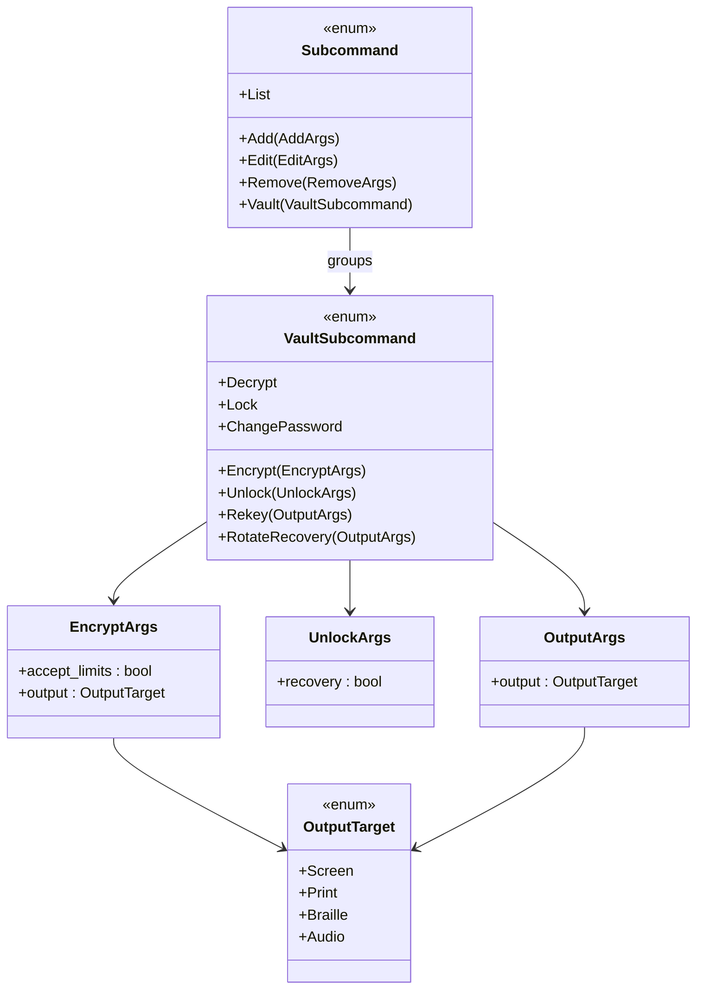

# 詳細設計書 — CLI vault サブコマンド（`cli-subcommands`）

<!-- 親: docs/features/vault-encryption/detailed-design/index.md -->
<!-- 配置先: docs/features/vault-encryption/detailed-design/cli-subcommands.md -->
<!-- 主担当: Sub-F (#44)。Sub-A〜E で凍結された IPC V2 ハンドラ + 応答スキーマ + MSG 指針 + 契約 C-19/C-20/C-22〜C-32 を CLI 経路で具現化する。 -->
<!-- 依存: Sub-E `vek-cache-and-ipc.md`（IPC V2 ハンドラ）、Sub-D `repository-and-migration.md`（DecryptConfirmation / RecoveryDisclosure）、Sub-A〜B `password.md` / `crypto-types.md`（MasterPassword / Vek） -->
<!-- 横断的変更: 本書は vault-encryption feature の詳細設計だが、`daemon-ipc` feature の `IpcResponse::Records` 拡張（`protection_mode` 同梱）と双方向参照する。 -->
<!-- Rev1（工程2 内部レビュー後）: ペガサス致命指摘 ① で `vault recovery-show` を廃止し `vault encrypt/rekey/rotate-recovery` の `--output` フラグ統合へ整理、② で終了コード SSoT 表を独立節に凍結。服部指摘で CLI 攻撃面のセキュリティ設計章を新設、ペテルギウス指摘で env seam / 型整合 / C-37 grep gate を再設計。 -->

## 対象型

- `shikomi_cli::cli::Subcommand::Vault(VaultSubcommand)`（**Sub-F 新規**、clap 派生型）
- `shikomi_cli::cli::VaultSubcommand` enum（**Sub-F 新規**、**7** サブコマンド variant、`recovery-show` は廃止して `encrypt/rekey/rotate-recovery` の `--output` フラグに統合）
- `shikomi_cli::usecase::vault::{encrypt, decrypt, unlock, lock, change_password, rekey, rotate_recovery}`（**Sub-F 新規**、**7** usecase）
- `shikomi_cli::presenter::{success, error, warning, prompt}`（**既存**、Sub-F で MSG-S03〜S20 文言経路を追加）
- `shikomi_cli::presenter::recovery_disclosure`（**Sub-F 新規**、24 語表示 + zeroize 連鎖専用 presenter、`--output` フラグの 4 経路に分岐）
- `shikomi_cli::presenter::mode_banner`（**Sub-F 新規**、`[plaintext]` / `[encrypted, locked]` / `[encrypted, unlocked]` / `[unknown]` バナー、REQ-S16）
- `shikomi_cli::io::ipc_client::IpcClient`（**既存**、handshake V2 確認 + send_request / recv_response、Sub-F は V2 variant 5 件を呼出す利用側）
- `shikomi_cli::input::{password_prompt, mnemonic_prompt, decrypt_confirmation_prompt}`（**Sub-F 新規**、TTY 非エコー読取 + paste 抑制 + `subtle::ConstantTimeEq` + `/dev/tty` 強制経路）
- `shikomi_cli::accessibility::{print_pdf, braille_brf, audio_tts}`（**Sub-F 新規**、MSG-S18 代替経路、すべて `--output` フラグ経由で起動）
- `shikomi_core::ipc::IpcResponse::Records`（**横断的変更**、`Vec<RecordSummary>` → `{ records, protection_mode }` 構造体化、`#[non_exhaustive]` 経路で後方互換、`daemon-ipc` feature と双方向同期）

## モジュール配置と責務

```
crates/shikomi-cli/src/                    ~ Sub-F で大規模拡張
  cli.rs                                   ~  Subcommand に Vault(VaultSubcommand) を追加
  lib.rs                                   ~  run() の match 分岐に vault 7 variant を追加
  input/                                   + Sub-F 新規（既存 input.rs を分冊化、Boy Scout）
    mod.rs                                 +
    password.rs                            +  TTY 非エコー読取 + /dev/tty 強制 + 強度ゲート前段
    mnemonic.rs                            +  24 語入力プロンプト + bip39 検証
    decrypt_confirmation.rs                +  DECRYPT 二段確認 + paste 抑制 + ConstantTimeEq
  presenter/
    mod.rs                                 ~
    recovery_disclosure.rs                 +  24 語 1 度表示 + Drop zeroize 連鎖（C-19）+ 4 経路分岐
    mode_banner.rs                         +  保護モードバナー（REQ-S16、ANSI カラー + 文字二重符号化）
    cache_relocked_warning.rs              +  MSG-S20 連結表示 + 再 unlock 案内（C-32）
  usecase/
    mod.rs                                 ~
    vault/                                 + Sub-F 新規サブモジュール
      mod.rs                               +
      encrypt.rs                           +  vault encrypt --output
      decrypt.rs                           +  vault decrypt
      unlock.rs                            +  vault unlock（password / --recovery 二経路）
      lock.rs                              +  vault lock
      change_password.rs                   +  vault change-password
      rekey.rs                             +  vault rekey --output + cache_relocked 分岐
      rotate_recovery.rs                   +  vault rotate-recovery --output + cache_relocked 分岐
  accessibility/                           + Sub-F 新規（MSG-S18）
    mod.rs                                 +
    output_target.rs                       +  --output フラグ enum (Screen/Print/Braille/Audio) + 自動切替
    print_pdf.rs                           +  PDF 出力（umask 077 強制 + /tmp 一時ファイル限定）
    braille_brf.rs                         +  BRF 出力（同上）
    audio_tts.rs                           +  OS TTS パイプ（録音抑制 env サニタイズ）
  i18n/                                    + Sub-F 新規
    mod.rs                                 +
    locales/                               +
      ja-JP/messages.toml                  +  日本語文言辞書（MSG-S01〜S20）
      en-US/messages.toml                  +  英語文言辞書（同上）
crates/shikomi-core/src/ipc/               ~ 横断的変更（daemon-ipc feature 側 SSoT、本書は消費側）
  response.rs                              ~  IpcResponse::Records 構造体化、protection_mode 同梱
  protocol.rs                              ~  ProtectionModeBanner enum 新設
crates/shikomi-daemon/src/                 ~ Sub-F が Sub-E への Boy Scout 要請（§env seam 参照）
  cache/lifecycle.rs                       ~  IdleTimer に env var seam 追加（debug ビルド限定）
  ipc/v2_handler/rekey.rs                  ~  既存 FORCE_RELOCK_FAILURE AtomicBool に env var seam 追加（同上）
  bin/shikomi_daemon.rs                    ~  起動時の env allowlist sanity check（C-40）
```

**Clean Architecture の依存方向**:

- shikomi-cli は shikomi-core（IPC スキーマ）と shikomi-infra（`PersistenceError` 等の透過のみ）に依存。**Sub-F で shikomi-infra への新規依存追加なし**（CLI は IPC 経由でのみ daemon と対話、vault に直接触らない、Phase 2 規定）
- `subtle` crate は既存 dev-dependencies → Sub-F で main dependency に昇格（C-20 二段確認 + paste 抑制で利用、`tech-stack.md` §4.7 凍結値内）
- `bip39` crate は既存 shikomi-core 経由で間接利用、CLI からの直接 import なし（Sub-A 24 語入力検証経路は `MnemonicValidator` trait 抽象を介す、Boy Scout で trait 化を Sub-F 提案）
- `printpdf` / `liblouis` 等の追加 crate は MSG-S18 経路で必要。Sub-F PR レビューで `tech-stack.md` §4.7 に minor pin で追加（候補比較は §設計判断 §アクセシビリティ crate 選定 + §セキュリティ設計 §新規依存の監査）

## 設計判断: vault サブコマンドのグループ化（3 案比較）

| 案 | 説明 | 採否 |
|---|------|------|
| **A: トップレベル `Subcommand::Encrypt` / `Decrypt` / ...** | 既存 `Add` / `List` / `Edit` / `Remove` と同じ階層に 7 variant を平坦に追加 | **却下**: 既存 V1 サブコマンド（CRUD）と Sub-F V2 サブコマンド（vault 管理）が同列に並び、責務領域の境界が CLI で見えない。`shikomi --help` が肥大化、grep 容易性も劣化 |
| **B: `Subcommand::Vault(VaultSubcommand)` でグループ化（採用）** | `shikomi vault {encrypt,decrypt,unlock,lock,change-password,rekey,rotate-recovery}` のサブコマンドネスト | **採用**: 責務領域が CLI 構造で明確化、`shikomi vault --help` で 7 サブコマンドが一覧化される。Issue #44 仕様の「vault 管理サブコマンド」と命名整合、田中ペルソナにも理解しやすい |
| **C: 別バイナリ `shikomi-vault` として独立** | shikomi-cli とは別 crate / 別バイナリで vault 管理ツールを独立 | **却下**: ユーザが 2 つの実行ファイルを使い分ける必要があり UX 劣化。配布も複雑化 |

**採用根拠**: B 案が Issue #44 仕様と一致、CLI 構造で責務領域を明示し、`shikomi vault --help` が単一エントリ点として機能する。

## 設計判断: 24 語の出力経路（`recovery-show` 廃止 + `--output` フラグ統合、ペガサス致命指摘 ① 解消）

旧設計（Rev0）は `vault encrypt` 完了後に別プロセス起動の `vault recovery-show` で 24 語を再表示する経路を持ったが、**プロセスをまたいだ in-process state 共有は技術的に不可能**（disclosure は daemon 内に閉じる、CLI は短命プロセス）。視覚障害ユーザが `--braille` 経路を取れない致命矛盾を解消するため、以下の方針に整理:

| 案 | 説明 | 採否 |
|---|------|------|
| **A: `vault encrypt --output {screen\|print\|braille\|audio}` 統合（採用）** | 24 語を生成する全サブコマンド（encrypt / rekey / rotate-recovery）に `--output` フラグを統合し、生成と同時に出力経路を選択。`recovery-show` サブコマンドは**廃止**| **採用**: プロセス境界問題を構造的に解消、24 語が IPC 応答として帰ってきた直後に Sub-F が **同一プロセス内で**出力経路に流す。アクセシビリティ経路もすべての 24 語生成サブコマンドで利用可、田中ペルソナ + 視覚障害ペルソナの両方に対応 |
| **B: `IpcRequest::RecoveryShow` variant 新設で daemon に disclosure キャッシュ** | daemon 内に 1 度だけ disclosure をキャッシュし、CLI からの問合せで返却 | **却下**: daemon 内に**長寿命の秘密値**を作る経路は脅威モデル §7.0 / Sub-A 「滞留時間最小化」と正面衝突。disclosure キャッシュが clear されるタイミング（idle / OS shutdown / explicit ack）も追加設計必要、複雑化 |
| **C: 旧設計（recovery-show 別プロセス起動）** | encrypt → 別プロセス recovery-show で再表示 | **却下**: ペガサス致命指摘で実装不可能と確定（プロセス間 in-process state 共有なし）|

**採用根拠**: A 案が Sub-A「滞留時間最小化」+ アクセシビリティ + シンプルさを同時達成。`vault encrypt --output braille > /tmp/recovery.brf` のようなリダイレクトは §セキュリティ設計 で `umask 077` + `/tmp` 限定経路 + 削除責務をユーザに明示する。

## 設計判断: 24 語の zeroize 経路（C-19 同型、4 段防衛）

`IpcResponse::Encrypted.disclosure` / `RecoveryRotated.words` / `Rekeyed.words` の `Vec<SerializableSecretBytes>` を CLI 層で受領した後、以下の 4 段防衛で zeroize 連鎖を強制する:

| 段 | 強制方法 | 対象 |
|---|------|------|
| (a) | `presenter::recovery_disclosure::display(words: Vec<SerializableSecretBytes>, target: OutputTarget)` で**所有権を消費**、関数内で出力経路（Screen/Print/Braille/Audio）に書き出し → 関数戻り直前に `mem::replace(&mut words, vec![])` で取り出して即 Drop | `Vec<SerializableSecretBytes>` |
| (b) | `SerializableSecretBytes::Drop` 実装で内包バッファを `zeroize`（Sub-A `RecoveryWords` 同型、Sub-E daemon 側でも同経路、Sub-A `Vek` 哲学継承）| `SerializableSecretBytes` |
| (c) | `tracing::debug!` / `info!` / `error!` のいずれにも `words` の Debug 出力を含めない（`SerializableSecretBytes::Debug = REDACTED` 固定、Sub-A 同型）| ログ経路全面 |
| (d) | `--print` / `--braille` / `--audio` 経路で外部プロセスにパイプする場合も、本プロセス内バッファは Drop 連鎖 zeroize、外部プロセスの責務は MSG-S18 案内で明示（録音禁止プレイヤー優先順位、§セキュリティ設計 §TTS dictation 学習対策）| 外部プロセス境界 |

## 設計判断: `cache_relocked: false` 経路の CLI 表示分岐（C-32 整合）

ペガサス工程5 致命指摘で凍結された Lie-Then-Surprise 防止を CLI 層で具現化する:

1. `IpcResponse::Rekeyed { records_count, words, cache_relocked }` または `RecoveryRotated { words, cache_relocked }` を usecase が受領
2. `presenter::recovery_disclosure::display(words, output_target)` で **24 語を先に出力**（rekey/rotate_recovery の主目的を尊重、`ux-and-msg.md` §cache_relocked: false §文言の不変条件 (c)）
3. **`cache_relocked == true` 時**: MSG-S07 / S19 完了文言のみ → 終了コード 0
4. **`cache_relocked == false` 時**: MSG-S07 / S19 完了文言 + `presenter::cache_relocked_warning::display` で MSG-S20 連結表示 + 「次の操作前に `shikomi vault unlock` を再度実行してください」案内 → 終了コード 0（C-31、operation 成功）
5. **C-32 能動的提示**: CLI が **次の操作を呼ぶ前にユーザに再 unlock を促す**責務。Sub-F 工程3 では「メッセージ末尾の案内文のみ」（静的提示）で実装し、インタラクティブ TTY での自動 unlock プロンプト（`--auto-relock` フラグ）は工程5 UX レビュー後の Boy Scout 候補

## 設計判断: 保護モードバナー実装（REQ-S16）

| 案 | 説明 | 採否 |
|---|------|------|
| **A: 別 IPC `Status` variant を追加して `vault status` で問い合わせ** | `IpcRequest::Status` / `IpcResponse::Status { protection_mode, cache_state }` を新設 | **却下**: `shikomi list` 実行ごとに 2 往復 IPC が必要（status + records）、レイテンシ劣化 |
| **B: `IpcResponse::Records` を構造体化して `protection_mode` を同梱（採用）** | `Records(Vec<RecordSummary>)` → `Records { records: Vec<RecordSummary>, protection_mode: ProtectionModeBanner }` | **採用**: 1 往復で `list` 実行可能、`#[non_exhaustive]` 経路で V1 互換性は serde の Default + skip_serializing_if で吸収。`daemon-ipc` feature 側 `protocol-types.md` も Sub-F PR で双方向同期 |
| **C: CLI が vault.db のヘッダを直接読む** | shikomi-infra `SqliteVaultRepository` 等を CLI 層で再利用 | **却下**: Phase 2 規定「CLI は vault に直接触らない」違反 |

**採用根拠**: B 案が Tell-Don't-Ask 整合、daemon が「保護モードを教える」責務を持ち、CLI は受領して presenter で表示するのみ。

### `ProtectionModeBanner` enum

`shikomi-core::ipc::ProtectionModeBanner` を新設（`#[non_exhaustive]`）:

| variant | 表示文字 | ANSI カラー | 二重符号化（色覚多様性） |
|---|---|---|---|
| `Plaintext` | `[plaintext]` | 灰色（cyan dim）| 文字単独で「平文」と判別可 |
| `EncryptedLocked` | `[encrypted, locked]` | 橙色（yellow）| 文字単独で「Locked」と判別可 |
| `EncryptedUnlocked` | `[encrypted, unlocked]` | 緑色（green）| 文字単独で「Unlocked」と判別可 |
| `Unknown` | `[unknown]` | 赤色（red）| Fail-Secure 経路、終了コード 3 で fail fast（REQ-S16） |

`#[non_exhaustive]` の cross-crate 利用に備え、`shikomi-cli` 側 `match` には**defensive fail-secure `_` arm を許可**（Sub-E TC-E-S01 と同型、Sub-D Rev3 ペテルギウス凍結方針を継承）。`_` arm は `ProtectionModeBanner::Unknown` と同等の fail-secure 経路に流し、新 variant 追加時にコンパイルエラーで気付かなくても安全側に倒す。

`NO_COLOR` 環境変数 / 非 TTY / `--quiet` 時はカラー無効化、文字のみ表示。

## clap 派生型構造（Subcommand 拡張）



clap の `#[command(subcommand)]` ネスト機構を利用。`OutputTarget` は `clap::ValueEnum` 派生で `--output screen` / `--output print` / `--output braille` / `--output audio` の 4 値を排他指定（既定 `Screen`）。`SHIKOMI_ACCESSIBILITY=1` 環境変数 / OS スクリーンリーダー検出時は **`Screen` 既定を `Braille` に上書き**（accessibility::output_target::resolve で env / OS 判定 → 自動切替、明示 `--output` フラグは常に最優先）。

## 終了コード SSoT（独立節、ペガサス致命指摘 ② 解消）

CLI 全サブコマンドの終了コード割当を本節に**唯一の真実源**として凍結する。`requirements.md` / `processing-flows.md` / `test-design/sub-f-cli-subcommands.md` は本表を**参照**するのみで、個別箇所での再定義を禁止する（ドリフト防止）。

| 終了コード | 名称 | 該当 MSG / 状態 | 該当フロー |
|------|---|--------|--------|
| **0** | `EX_OK` (sysexits.h) | 成功 | 全成功経路（`cache_relocked == false` でも 0、C-31/C-36） |
| **1** | 一般エラー | MSG-S08（弱パスワード）/ MSG-S12（24 語認識失敗）/ MSG-S13（マイグレーション失敗）/ MSG-S10（AEAD 改竄）/ paste-suspected（C-34）/ recovery-already-disclosed（C-35）/ その他内容を含めない | F-F1〜F-F7 共通 |
| **2** | パスワード違い | MSG-S09(a) `IpcError::BackoffActive { wait_secs }` / `Crypto { reason: "wrong-password" }` | F-F3 unlock |
| **3** | vault Locked / 保護モード Unknown | MSG-S09(c) `IpcError::VaultLocked` / バナー `Unknown` (REQ-S16 Fail-Secure) | F-F8 既存 CRUD ロック時 / `usecase::list` モード判定不能 |
| **4** | プロトコル非互換 | MSG-S15 `IpcError::ProtocolDowngrade` / handshake バージョン不整合 | 全フロー共通（handshake 段で fail fast） |
| **5** | RecoveryRequired | MSG-S09(a) リカバリ経路誘導 `IpcError::RecoveryRequired` | F-F3 unlock（password 経路で発火、`--recovery` 経路への移行案内） |
| **64** | `EX_USAGE` (sysexits.h) | MSG-S09(b) daemon 接続不能 / clap argument error | 全フロー前段（daemon socket 不在 / 引数エラー）|
| **78** | `EX_CONFIG` (sysexits.h) | 設定エラー（i18n 辞書ファイル不在 / vault-dir 不正等）| 全フロー前段 |

**重要**: `BackoffActive` は **2**、`RecoveryRequired` は **5** で凍結。テスト設計側のドリフト（旧記述で BackoffActive=5 と記載）は本表を SSoT として修正必要（マユリ test-design 側で同期、§Sub-F → テスト担当への引継ぎ参照）。

## 処理フロー詳細（F-F1〜F-F8、ペテルギウス指摘 4 解消）

ハイレベルフロー（番号付き）は `basic-design/processing-flows.md` §F-F1〜F-F8 を SSoT とする。本書では各フローの **clap 派生型 / IPC variant / presenter / 終了コード** の対応のみ表化:

| Flow ID | サブコマンド | clap variant | IPC Request | IPC Response（成功）| presenter | 終了コード（成功 / 失敗）|
|---|---|---|---|---|---|---|
| **F-F1** | `vault encrypt --output` | `Vault(Encrypt(EncryptArgs))` | `Encrypt { master_password, accept_limits }` | `Encrypted { disclosure }` | `recovery_disclosure::display(disclosure, target)` + MSG-S01 / S06 / S16 / S18 | 0 / 1 |
| **F-F2** | `vault decrypt` | `Vault(Decrypt)` | `Decrypt { master_password, confirmation }` | `Decrypted` | `success::display(MSG-S02)` | 0 / 1 |
| **F-F3** | `vault unlock` | `Vault(Unlock(UnlockArgs))` | `Unlock { master_password, recovery: Option<RecoveryMnemonic> }` | `Unlocked` | `success::display(MSG-S03)` | 0 / 2 / 5 |
| **F-F4** | `vault lock` | `Vault(Lock)` | `Lock` | `Locked` | `success::display(MSG-S04)` | 0 |
| **F-F5** | `vault change-password` | `Vault(ChangePassword)` | `ChangePassword { old, new }` | `PasswordChanged` | `success::display(MSG-S05)` | 0 / 1 |
| **F-F6** | `vault rekey --output` | `Vault(Rekey(OutputArgs))` | `Rekey { master_password }` | `Rekeyed { records_count, words, cache_relocked }` | `recovery_disclosure::display(words, target)` + MSG-S07 + （`cache_relocked == false` 時）`cache_relocked_warning::display` | 0（C-31/C-36）|
| **F-F7** | `vault rotate-recovery --output` | `Vault(RotateRecovery(OutputArgs))` | `RotateRecovery { master_password }` | `RecoveryRotated { words, cache_relocked }` | 同上 + MSG-S19 | 0（同上）|
| **F-F8** | 既存 `add/list/edit/remove` ロック時挙動 + `list` バナー | （変更なし、既存 V1 variant）| 既存 `ListRecords` / `AddRecord` 等 | `Records { records, protection_mode }` / `IpcError::VaultLocked` | `mode_banner::display(protection_mode)` + MSG-S09(c)（Locked 時）| 0 / 3 |

旧 F-F フロー（Rev0、合計 9 件）から **8 件**に整理。`recovery-show` の F-F6 は廃止し、F-F6/F-F7/F-F8 は 1 つずつ繰り上げ番号変更。

## 既存サブコマンドのロック時挙動（REQ-S16 整合、F-F8 詳細）

| usecase | 暗号化モード Locked 検出方法 | 表示 MSG | 終了コード |
|---|---|---|---|
| `usecase::add` | `IpcResponse::Error(IpcErrorCode::VaultLocked)` 受信 | MSG-S09(c) + `vault unlock` 誘導 | 3 |
| `usecase::list` | `IpcResponse::Error(IpcErrorCode::VaultLocked)` 受信 | 同上 | 3 |
| `usecase::edit` | 同上 | 同上 | 3 |
| `usecase::remove` | 同上 | 同上 | 3 |
| `usecase::list`（成功時、`Records.protection_mode` 受領）| - | `mode_banner::display(protection_mode)` 先頭行 + レコード一覧 | 0 |

ロック時のメッセージにレコード内容 / ID / ラベルを**含めない**（情報漏洩防止、Issue #44 仕様）。

## アクセシビリティ代替経路（MSG-S18、WCAG 2.1 AA）

`vault {encrypt, rekey, rotate-recovery} --output` フラグの実装方針:

| 経路 | 出力先 | 実装方針 | crate 候補（§セキュリティ設計 §新規依存の監査 で凍結）|
|---|---|---|---|
| `--output screen` （既定）| stdout 直接 + ANSI フォーマット | TTY 非 isatty 時はカラー無効化、`NO_COLOR` env 尊重 | 追加 crate なし |
| `--output print` | stdout（PDF バイナリ）| ハイコントラスト PDF（黒地白文字、最大 36pt、各語に番号付与）。リダイレクト先は `umask 077` + `/tmp` 限定 + 削除責務をユーザに案内 | `printpdf` v0.7+（major pin、§セキュリティ設計参照） |
| `--output braille` | stdout（`.brf` テキスト）| Braille Ready Format、Grade 2 英語点字標準。同上のディスク永続化対策 | `liblouis` FFI bindings（unsafe 経路、§セキュリティ設計 §liblouis FFI 監査参照） |
| `--output audio` | OS TTS への直接パイプ | macOS `say` / Windows `SAPI` (PowerShell) / Linux `espeak`、env サニタイズで dictation 学習抑制 | `std::process::Command` のみ（追加 crate なし）|

**自動切替経路**: `SHIKOMI_ACCESSIBILITY=1` 環境変数 / OS スクリーンリーダー検出（macOS `defaults read com.apple.universalaccess` / Windows `Narrator.exe` プロセス検出 / Linux Orca DBus 経路）/ 明示フラグのいずれかで `--output screen` 既定を `Braille` に上書き（明示 `--output` フラグは常に最優先）。

## セキュリティ設計（CLI 攻撃面、服部指摘解消）

CLI は `shikomi` の最前線攻撃面として shell history / TTY scrollback / TTS dictation / 一時ファイル / env 等の経路を持つ。Sub-0 脅威モデル §7 / §8 の延長線上で **Sub-F 専用の攻撃面対処**を以下に凍結する。Sub-0 `sub-0-threat-model.md` への追補は §脅威モデル追補（CLI 攻撃面）参照。

### shell history / 履歴漏洩防衛

| 攻撃経路 | 対処策 | 不変条件 |
|---|---|---|
| `~/.bash_history` / `~/.zsh_history` / fish history | パスワード / 24 語を**コマンド引数として受け付けない**。`shikomi vault encrypt --password X` のような直接フラグは clap 派生型に**定義しない**。stdin / プロンプトのみ | C-38 |
| 標準入力リダイレクト（`echo pw \| shikomi vault unlock`）| `/dev/tty` を **明示的に open** してパスワード読込（`is-terminal` で TTY 判定 → 非 TTY 時は `CliError::NonInteractivePassword` で fail fast、stdin パイプ受付を拒否）| 同上 |
| `HISTFILE` / `HISTSIZE` 環境変数 | shikomi プロセスは history 制御を持たないが、`shikomi vault --help` で「**パスワードはプロンプト入力のみ。引数渡しは提供しません**」を明示し UX 教育 | 同上 |

### TTY scrollback / terminal 履歴対策

| 攻撃経路 | 対処策 |
|---|---|
| terminal emulator の scrollback バッファに 24 語残存 | `--output screen` 経路の冒頭で **OSC 1337 / `tput clear` 相当のヒント表示**（「24 語表示後に Cmd+K / Ctrl+L で scrollback クリア推奨」を MSG-S06 警告に追加）。terminal 側の永続化制御は不可能領域として **MSG-S06 で明示**（受容前提）|
| `script` コマンド / asciinema / tmux logging 経由 | 上記同等、ユーザに**録画録音中の表示を避ける**よう MSG-S16（限界説明）の (3) で凍結（既存）|
| core dump / `/proc/<pid>/mem` 経由 | shikomi-cli プロセスは `prctl(PR_SET_DUMPABLE, 0)` を起動時に呼び core dump 抑制（Linux）。macOS は `setrlimit(RLIMIT_CORE, 0)`、Windows は `SetErrorMode(SEM_NOGPFAULTERRORBOX)`（C-41）|

### `--output print` / `--output braille` の一時ファイル / リダイレクト対策

| 攻撃経路 | 対処策 |
|---|---|
| `> recovery.pdf` リダイレクトでディスク永続化 | shikomi 自身は umask を変更しないが、**`--output {print,braille}` 実行時に MSG-S18 案内で**「出力ファイルは `chmod 600` 相当、保管後 `shred` / `secure delete` 推奨」を凍結（受容前提、ユーザ責務）|
| `/tmp` 経由の中間ファイル | shikomi-cli は **中間ファイルを作らない**（PDF / BRF はメモリ上で生成して stdout に直接書出、ユーザのリダイレクト先以外にディスクヒットしない）。`printpdf` 等の crate が中間ファイルを使う場合は memory-only mode を強制 |
| プロセス間で 24 語が渡る経路 | `--output audio` の OS TTS パイプは subprocess の stdin に流す `Stdio::piped()` のみ、ファイル経由は採用しない |

### `--output audio` TTS dictation 学習対策

| OS / TTS | 対処策 |
|---|---|
| macOS `say` | subprocess 起動時の env から `__CF_USER_TEXT_ENCODING` 等を保持しつつ、`com.apple.speech.synthesis.userInfo` の dictation 蓄積 prefs を `defaults read` で確認しユーザ警告（実質的にユーザ受容前提、MSG-S18 で凍結）|
| Windows SAPI（PowerShell）| `[System.Speech.Synthesis.SpeechSynthesizer]::new()` の `Speak` 呼出で十分、レジストリ `HKCU\Software\Microsoft\Speech` は dictation 学習に未関与 |
| Linux `espeak` | `espeak --stdout` で音声 PCM を直接生成し、ユーザの音声サーバ（PulseAudio / PipeWire）にパイプ。録音抑制の OS レベル制御は不可能領域、MSG-S18 で受容前提を明示 |

**全経路共通**: subprocess の env を allowlist で sanity check（`PATH` / `HOME` / `LANG` 等の必須最小限のみ pass、shikomi 内部 env は除外、C-40 と整合）。

### 新規依存の監査（liblouis FFI / printpdf / sys-locale / toml）

`tech-stack.md` §4.7 に新規依存 4 件を追加（Sub-F PR で minor pin で凍結、CVE / メンテ確認の表は §tech-stack 参照）:

| crate | 用途 | 監査ポイント |
|---|---|---|
| `printpdf` v0.7+（major pin）| `--output print` PDF 生成 | unsafe 経路なし、純 Rust。GitHub Advisory DB / RustSec で CVE 履歴ゼロ確認、1 年以内 commit 確認 |
| `liblouis-rs`（または同等 FFI bindings）| `--output braille` BRF 生成 | **unsafe FFI 経路、liblouis（C ライブラリ）にリンク**。シンプルな代替: `printpdf` 同様純 Rust の自前 wordlist 変換テーブル（24 語の Grade 2 英語点字は 24 行のテーブルで完全表現可能、軽量）。Sub-F PR で **自前テーブル方式を優先採用**、liblouis FFI は採用しない（unsafe 経路を増やさない設計判断）|
| `sys-locale` v0.3+（minor pin）| `SHIKOMI_LOCALE` 未指定時の OS ロケール検出 | 既存 `tech-stack.md` 候補内、unsafe 経路なし、CVE ゼロ |
| `toml` v0.8+（minor pin）| i18n 辞書 `messages.toml` 読込 | 既存ワークスペース内利用済、追加リスクなし |

**Sub-F PR レビューで `tech-stack.md` §4.7 に上記 4 行を minor/major pin で確定追加**（Boy Scout）。

## env seam（Sub-E への Boy Scout 要請、ペテルギウス致命3 解消）

テスト設計（TC-F-E01 / TC-F-I06c）が要求する **fault-injection seam** の env var 経路を、Sub-E daemon 実装に追加する Boy Scout 要請を以下に凍結する。Sub-E 設計書 SSoT 上での env seam は不在（`FORCE_RELOCK_FAILURE` は AtomicBool、`IdleTimer::DEFAULT_THRESHOLD` は const 定数）。Sub-F 工程3 の銀時実装で **Sub-E daemon の以下 2 箇所を遡及追記**する:

| ファイル | 追加 seam | 既定値 | env var 名 | 不変条件 |
|---|---|---|---|---|
| `crates/shikomi-daemon/src/cache/lifecycle.rs` | `IdleTimer::with_thresholds(cache, threshold, poll_interval)` 既存メソッドを daemon 起動時の env var で上書き可能化 | 15min / 60s | `SHIKOMI_DAEMON_IDLE_THRESHOLD_SECS` / `SHIKOMI_DAEMON_POLL_INTERVAL_SECS` | C-40（debug ビルド限定 + allowlist sanity check） |
| `crates/shikomi-daemon/src/ipc/v2_handler/rekey.rs` | 既存 `FORCE_RELOCK_FAILURE: AtomicBool` への env var 連動 init を `shikomi_daemon::bin::shikomi_daemon::main` 起動時に実装 | false | `SHIKOMI_DAEMON_FORCE_RELOCK_FAIL` (`1` で AtomicBool::store(true))| 同上 |
| `crates/shikomi-daemon/src/bin/shikomi_daemon.rs` | 起動時の env allowlist sanity check（fail-fast: 不明な `SHIKOMI_DAEMON_*` 名で起動拒否）| - | - | C-40 |

**C-40 不変条件**: env var seam は **`#[cfg(debug_assertions)]`** で囲み release ビルドにはコンパイルされない（既存 `FORCE_RELOCK_FAILURE` の AtomicBool seam と同方針）。`shikomi-daemon` は `publish=false` の internal crate、攻撃者が release 本番バイナリに env を仕込んでも seam は実体不在で攻撃不能。allowlist sanity check で**未知の `SHIKOMI_DAEMON_*` env が起動時に検出されたら fail-fast**、攻撃者の env 仕込みでの予期せぬ動作変更を構造的に拒否する。

## i18n 戦略責務分離（Sub-F 確定）

| 階層 | 責務 | 実装場所 |
|------|------|----|
| **Sub-A** | 英語 raw `WeakPasswordFeedback`（zxcvbn 由来）を運ぶ純粋データ構造 | `shikomi-core::crypto::password::WeakPasswordFeedback` |
| **Sub-D** | MSG-S08 翻訳辞書キー定義（`weak_password.warning_key` 等）| `password.md` §i18n 戦略責務分離 |
| **Sub-E** | MSG-S03 / S04 / S05 / S07 / S09 / S15 / S19 / S20 の翻訳キー定義 + 文言指針 | `requirements.md` MSG 表 + `ux-and-msg.md` |
| **Sub-F** | i18n 翻訳辞書 `messages.toml` 実装 + `shikomi_cli::i18n::Localizer` ロード経路 + ロケール選択（`SHIKOMI_LOCALE` env / `sys-locale` crate / fallback to en-US）| `shikomi-cli/src/i18n/locales/{ja-JP,en-US}/messages.toml` |

**辞書ファイル形式**: TOML（`toml` crate v0.8+ で読込、`tech-stack.md` §4.7 既存依存）。キーは MSG ID + 経路サフィックス（`s07_cli` / `s07_gui` / `s07_completed_records_count` 等）。フォールバック順: 指定ロケール → `en-US` → ハードコード fallback（C-33、キー欠落時のパニック禁止）。

## 不変条件・契約（Sub-F 新規 C-33〜C-41）

| 契約 | 強制方法 | 検証手段 |
|---|---|---|
| **C-33**: i18n 辞書キー欠落時もパニックさせず英語 fallback で fail-soft（Sub-F 新規）| `shikomi_cli::i18n::Localizer::translate(key)` が `String` を返し、欠落時は `format!("[missing:{key}]")` を返す | ユニットテスト（TC-F-U01）|
| **C-34**: `vault decrypt` 二段確認 paste 抑制 — **入力時刻差 < 30ms で fail fast、>= 30ms で通過**（Sub-F 新規、ペテルギウス指摘5 機械化）| `decrypt_confirmation::prompt` が連続入力時刻差 (`Instant::elapsed()`) を計測、`< 30ms` で `CliError::PasteSuspected` 即返却、`>= 30ms` で通常入力扱い | integration test（TC-F-I02b、`expectrl` PTY で 20ms / 50ms / 30ms 跨ぎ 3 段検証）|
| **C-35**: `disclose` 後の 24 語再表示は daemon 側で構造的に拒否（Sub-F 新規、C-19 整合、recovery-show 廃止後も意味維持）| daemon 側 `RecoveryDisclosure::disclose` が所有権消費で 1 度のみ呼ばれ、2 度目は `IpcErrorCode::Internal { reason: "recovery-already-disclosed" }` 返却 | integration test: encrypt → encrypt 再実行（既存暗号化 vault に対して）→ 既存 `MigrationError::AlreadyEncrypted` 経路（既存）|
| **C-36**: `cache_relocked: false` 経路で終了コード 0、Err 終了コードを返さない（Sub-F 新規、C-31 整合）| `usecase::vault::rekey` / `rotate_recovery` が `Rekeyed { cache_relocked: false }` 受領時に `Ok(ExitCode::SUCCESS)` を返す | integration test（TC-F-I07c）|
| **C-37**: 保護モードバナーは `usecase::list` の出力経路で**必須呼出**（Sub-F 新規、REQ-S16 強制、ペテルギウス指摘7 再設計）| `usecase::list::execute` の戻り値経路で `presenter::mode_banner::display(records.protection_mode)` の呼出を**型レベルで強制**（`presenter::list::display` 関数のシグネチャに `protection_mode: ProtectionModeBanner` を必須引数として持たせ、Default 値を持たせない設計）| grep 静的検査（TC-F-S02、`presenter::list::display` 呼出箇所すべてに `protection_mode` 引数渡しが含まれること、`mode_banner::display` の呼出経路が `usecase::list` から到達可能であることを cross-crate grep で機械検証）|
| **C-38**: パスワード / 24 語入力は `/dev/tty` 経由のみ、stdin パイプ拒否（Sub-F 新規、服部指摘5）| `input::password::prompt` / `input::mnemonic::prompt` が TTY 判定（`is-terminal::IsTerminal::is_terminal`）→ 非 TTY 時に `CliError::NonInteractivePassword` で fail fast | integration test（TC-F-I12、`echo pw \| shikomi vault unlock` → 終了コード 1） |
| **C-39**: 24 語出力先 `--output` フラグは排他指定、`screen` 既定 + アクセシビリティ自動切替（Sub-F 新規）| `clap::ValueEnum` 派生で 4 値排他、`accessibility::output_target::resolve` で env / OS 判定 → 自動切替 | unit test（TC-F-U03）|
| **C-40**: env seam は debug ビルド限定 + allowlist sanity check（Sub-F 新規、服部指摘6 + ペテルギウス致命3）| `#[cfg(debug_assertions)]` で env 読込コード自体を release から除外、daemon 起動時に未知の `SHIKOMI_DAEMON_*` env を fail-fast | grep 静的検査（TC-F-S05、`#[cfg(debug_assertions)]` で env 読込が囲まれていることを機械検証）|
| **C-41**: shikomi-cli プロセスは core dump 抑制（Sub-F 新規、服部指摘 core dump）| 起動時に Linux `prctl(PR_SET_DUMPABLE, 0)` / macOS `setrlimit(RLIMIT_CORE, 0)` / Windows `SetErrorMode` を呼出 | unit test（TC-F-U10、起動関数のシグネチャ存在確認）|

## 双方向同期（daemon-ipc feature への横断的変更）

| daemon-ipc 側ファイル | 同期内容 |
|---|---|
| `requirements.md` | `IpcResponse::Records` 構造体化、`ProtectionModeBanner` enum 追加 |
| `detailed-design/protocol-types.md` | 構造体化詳細、後方互換性方針（`#[non_exhaustive]` + serde Default）|
| `test-design/integration.md` | V1 client が新構造体応答を decode できる後方互換 TC 追加 |

**SSoT 凍結**: `IpcResponse` / `IpcRequest` / `IpcError` の variant 列挙は **`daemon-ipc/detailed-design/protocol-types.md` を SSoT** とし、本書は消費側として参照する。Sub-D Rev3 で凍結した「実装直読 + grep gate」原則を継承（Sub-F 静的検査 `sub-f-static-checks.sh` で `IpcRequest` variant 数を実装と一致確認）。

## 脅威モデル追補（CLI 攻撃面、Sub-0 凍結への参照）

Sub-0 `sub-0-threat-model.md` の L1〜L4 capability matrix に **CLI 攻撃面 §7.0CLI / §8.1CLI** を追補する。本書 §セキュリティ設計（CLI 攻撃面）が SSoT、Sub-0 側は要約参照のみ。Sub-F PR で `sub-0-threat-model.md` への追補も同期更新する（テスト担当が test-design 修正と並行）。

| 攻撃面 | L1〜L4 | 対処策 SSoT 参照 |
|---|---|---|
| shell history / TTY scrollback / core dump | L1（同ユーザ別プロセス）| 本書 §shell history / §TTY scrollback / C-38 / C-41 |
| 一時ファイル `/tmp` / `> recovery.pdf` リダイレクト | L1 | 本書 §`--output print/braille` |
| TTS dictation / espeak 録音抑制 | L1 | 本書 §`--output audio` TTS dictation 学習対策 |
| env 仕込みでの seam 発火 | L1（同ユーザ）| 本書 §env seam + C-40 |
| 新規 unsafe FFI 経路（liblouis）| 全層共通 | 本書 §新規依存の監査（liblouis 不採用） |

## Sub-F → 後続への引継ぎ

### テスト担当（涅マユリ）への引継ぎ

本 Rev1 修正で **test-design/sub-f-cli-subcommands.md** の以下 7 箇所を同期修正必要:

1. **TC-F-U07**: `ProtectionModeBanner` の cross-crate match で **defensive fail-secure `_` arm を許可**（本書 §`ProtectionModeBanner` enum 凍結方針と整合）
2. **TC-F-U12**: 引数を **`Vec<SerializableSecretBytes>`** に統一（型不整合解消、`[String; 24]` ではない）
3. **TC-F-U03**: paste 抑制閾値を `< 30ms = Err` / `>= 30ms = Ok` で機械化（C-34）
4. **TC-F-A03**: 録音判定アルゴリズム明記（OS 依存の不可能境界を明示し、scope 縮小: 「TTS 起動時の env サニタイズ + dictation 学習 prefs 確認のみ機械検証、録音可能アプリ検出は MSG-S18 案内で受容前提」へ修正）
5. **F-F フロー番号**: F-F1〜F-F8（recovery-show 廃止により全体 1 件減）に統一
6. **終了コード**: `BackoffActive == 2` / `RecoveryRequired == 5` を本書 §終了コード SSoT 参照で確定
7. **TC-F-A* `recovery-show` 関連 TC**: `vault encrypt --output {print,braille,audio}` への **再構築**（recovery-show 廃止）

### Sub-F 工程3 銀時への引継ぎ

1. **Sub-E daemon への Boy Scout 追記**（§env seam）: `IdleTimer::with_thresholds` の env var 連動 + `FORCE_RELOCK_FAILURE` の env var init + 起動時 allowlist sanity check（C-40）
2. **`recovery-show` サブコマンド実装しない**（廃止、`encrypt/rekey/rotate-recovery --output` への統合）
3. **`tech-stack.md` §4.7 に `printpdf` / `sys-locale` 追加 + liblouis FFI 不採用方針記載**（自前 wordlist 変換テーブル）
4. **shikomi-cli プロセス起動時の core dump 抑制呼出（C-41）**: `prctl` / `setrlimit` / `SetErrorMode`

### 後続 GUI feature への引継ぎ

1. **Tauri WebView 起動経路**: `shikomi_cli::usecase::vault::*` を `shikomi_gui` から呼出可能にするため、`pub` 公開範囲を Sub-F PR で確定（Boy Scout）
2. **MSG-S17 GUI バッジ**: 後続 GUI feature で実装、本書では `requirements.md` MSG-S17 の TBD のまま
3. **i18n 辞書共有**: `messages.toml` を CLI / GUI 両方で参照、辞書ファイル配置を `shared/i18n/` 等に再配置する Boy Scout を後続 GUI feature 工程2 で検討
