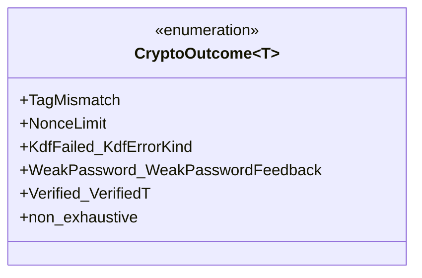
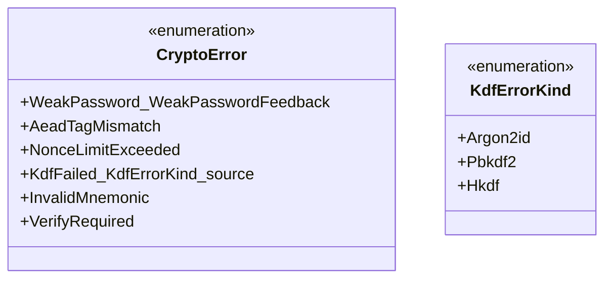

# 詳細設計書 — エラー型・リカバリ・契約サマリ（`errors-and-contracts`）

<!-- 親: docs/features/vault-encryption/detailed-design/index.md -->
<!-- 配置先: docs/features/vault-encryption/detailed-design/errors-and-contracts.md -->
<!-- 主担当: Sub-A (#39)。Sub-B〜F は本分冊の §後続 Sub TBD ブロックに追記。 -->

## 対象型

- `shikomi_core::crypto::recovery::RecoveryMnemonic`
- `shikomi_core::crypto::verified::CryptoOutcome<T>` enum
- `shikomi_core::error::DomainError`（拡張、Boy Scout Rule）
- `shikomi_core::error::CryptoError`（新規列挙型、**Sub-C で `AeadTagMismatch` 発火経路詳細を追記**）
- `shikomi_core::vault::VekProvider` trait（既存、Sub-B で精緻化、**Sub-C で `derive_new_wrapped_*` の AES-GCM wrap 経路確定 + `unwrap_vek_with_*` 追加**）
- 契約 C-1〜C-13 サマリ（`index.md` §不変条件・契約サマリ への補強・対応マッピング）+ **Sub-C 新規 C-14〜C-16**（AEAD 検証失敗時 Plaintext 構築禁止 / AEAD 鍵可視性ポリシー / AEAD 中間バッファ zeroize）

## `RecoveryMnemonic`

### 型定義

- `pub struct RecoveryMnemonic { words: SecretBox<Zeroizing<[String; 24]>> }` — 24 語固定長
- 各 `String` は BIP-39 wordlist 内の単語（検証は Sub-B の `bip39` crate 連携で実施、Sub-A では「24 語の文字列であること」のみ強制）

### コンストラクタ

| 関数名 | 可視性 | シグネチャ概要 | 不変条件 |
|-------|------|------------|--------|
| `RecoveryMnemonic::from_words` | `pub` | `[String; 24]` を受取り `Result<RecoveryMnemonic, CryptoError>` | 配列長は型で 24 強制。各単語の BIP-39 wordlist 検証 / チェックサム検証は Sub-B（`bip39` crate）に委譲（Sub-A の `from_words` は文字列長 / ASCII 性のみ軽量検証） |

### KDF 入力アクセサ（shikomi-infra への正規経路）

- `expose_words(&self) -> &[String; 24]`: **`pub`**、Sub-B `Bip39Pbkdf2Hkdf::derive_kek_recovery` への入力として shikomi-infra から呼び出される**正規経路**。可視性ポリシーは `password.md` §可視性ポリシー差別化（鍵バイト = `pub(crate)` / KDF 入力 = `pub` の差別化）を参照。**外部 bin crate からの直接呼出は禁止**だが、これは型レベル強制ではなく**設計契約 + PR レビューで担保**（Sub-B Rev2 工程5 服部・ペテルギウス指摘で `_within_crate` 接尾辞を削除し可視性 `pub` を明文化）

### Drop 契約

- `Zeroizing<[String; 24]>` の `Drop` で各 `String` のヒープバッファが zeroize される
- **再構築不可**: 一度 `Drop` した `RecoveryMnemonic` は復元不能（永続化されない、Sub-0 REQ-S13 「初回 1 度のみ表示」契約を Sub-A 型レベルで担保）

### 提供トレイト

- `Debug`: **`[REDACTED MNEMONIC]` 固定文字列**（CI grep で文字列リテラルを検証）
- `Drop`: 上記

### 禁止トレイト

- `Clone` / `Copy` / `Display` / `serde::Serialize` / `serde::Deserialize` / `PartialEq` / `Eq`: いずれも未実装
  - `Clone` 未実装は特に重要：誤コピーで滞留延長を禁止、Sub-0 REQ-S13 の「再表示不可」契約と整合
  - `Display` 未実装：誤フォーマットで 24 語が画面共有 / ログに漏れる事故を**コンパイル時禁止**

## `CryptoOutcome<T>` enum

### バリアント定義

| バリアント | 用途 | 関連 MSG |
|---------|------|---------|
| `TagMismatch` | AEAD 認証タグ検証失敗（vault.db 改竄の可能性） | MSG-S10 |
| `NonceLimit` | `NonceCounter::increment` 上限到達 | MSG-S11 |
| `KdfFailed(KdfErrorKind)` | Argon2id / PBKDF2 / HKDF 計算失敗 | MSG-S09 「KDF 失敗」カテゴリ |
| `WeakPassword(WeakPasswordFeedback)` | `MasterPassword::new` 構築失敗 | MSG-S08 |
| `Verified(Verified<T>)` | 正常系（AEAD 検証成功 + 平文取得） | MSG-S03 等の成功系 |

### 設計意図

- **目的**: Sub-C / Sub-D 実装で `match` 暗号アーム第一パターンを強制するための列挙型
- **記述順序**: `TagMismatch` / `NonceLimit` / `KdfFailed` / `WeakPassword` / `Verified(Verified<T>)` の **失敗バリアント先頭** で並べる。`Verified` 第一パターンの実装は clippy lint または PR レビューで却下（Boy Scout Rule）
- **ジェネリクス**: `T = Plaintext` を主用途、汎用化のため `T` でパラメタライズ
- **`#[non_exhaustive]`**: 将来 Sub-B〜F でバリアント追加時に `match` の網羅警告で漏れを検出する
- **`Display`**: 各バリアントを `MSG-S0X` 系識別子に対応する文字列で出力（i18n は呼び出し側、`password.md` §i18n 戦略責務分離 と同じく Sub-D 担当）

## `DomainError`（拡張、Boy Scout Rule）

### 既存 variant の扱い

- `DomainError::NonceOverflow` を **`DomainError::NonceLimitExceeded` に rename**（Sub-0 凍結の文言と整合）
- `#[error("nonce counter limit exceeded; rekey required")]` に文言更新

### 新規 variant

| variant | `#[error(...)]` 文言 | 用途 |
|--------|------------------|------|
| `DomainError::Crypto(CryptoError)` | `#[error(transparent)]` | 暗号系エラーを内包 |

## `CryptoError` 新規列挙型

| variant | `#[error(...)]` 文言 | 説明 |
|--------|------------------|------|
| `WeakPassword(Box<WeakPasswordFeedback>)` | `#[error("weak password rejected by strength gate")]` | `MasterPassword::new` 構築失敗（Sub-A 実装で `Box` 化、`clippy::result_large_err` 解消） |
| `AeadTagMismatch` | `#[error("AEAD authentication tag verification failed")]` | AEAD 復号タグ不一致（**Sub-C 発火経路詳細**: `AesGcmAeadAdapter::decrypt_record` または `unwrap_vek` 内の `aes_gcm::aead::AeadInPlace::decrypt_in_place_detached` が `Err(aes_gcm::Error)` を返した時に変換。GMAC タグ不一致 / AAD 不一致 / nonce-key 取り違え / ciphertext 改竄のいずれでも本 variant に統一、内部詳細は秘匿。MSG-S10「vault.db 改竄の可能性」に変換） |
| `NonceLimitExceeded` | `#[error("nonce counter exceeded {limit}; rekey required")]` | `NonceCounter::increment` 上限到達（`limit = 1u64 << 32`）。**Sub-C 連携**: `AesGcmAeadAdapter::encrypt_record` は本 variant を**自身では発火させない**（呼出側 = Sub-D の責務、`nonce-and-aead.md` §nonce_counter 統合契約）。Sub-D の vault リポジトリ層が `encrypt_record` 呼出前に `NonceCounter::increment()?` を実行し、`Err(NonceLimitExceeded)` を捕捉して MSG-S11「nonce 上限到達、`vault rekey` 実行」に変換 |
| `KdfFailed { kind: KdfErrorKind, source: Box<dyn std::error::Error + Send + Sync> }` | `#[error("KDF computation failed: {kind:?}")]` | Sub-B の Argon2id / PBKDF2 / HKDF 失敗を内包（詳細 source 型は本書 §`KdfErrorKind` 各 variant の source 型 参照） |
| `InvalidMnemonic` | `#[error("invalid BIP-39 mnemonic: wordlist mismatch or checksum failure")]` | **Sub-B 新規 variant**: `bip39::Mnemonic::parse_in` 失敗（wordlist 不一致 / checksum 不一致 / 単語数不正）。Sub-D の `vault unlock --recovery` で MSG-S12 に変換 |
| `VerifyRequired` | `#[error("Plaintext requires Verified<_> wrapper")]` | テスト経路で `Plaintext` を `Verified` 経由なしで構築しようとした場合の runtime 検出（通常は型レベルで防がれる） |

### `KdfErrorKind` 各 variant の source 型詳細（**Sub-B で確定**）

| variant | 発火条件 | source 型（boxed） |
|--------|---------|-----------------|
| `KdfErrorKind::Argon2id` | `argon2::Argon2::hash_password_into` が `Err(argon2::Error)` を返した（Params 構築失敗 / メモリ不足 / 出力長不正等） | `argon2::Error`（`std::error::Error + Send + Sync` を満たす、`Box::new` で内包） |
| `KdfErrorKind::Pbkdf2` | `bip39::Mnemonic::to_seed` 内部の PBKDF2 失敗（`bip39` crate v2 では実質発生しないが将来の lib 仕様変更に備えて variant 保持） | `bip39::Error` または将来追加の `pbkdf2::Error`（`Box::new` で内包） |
| `KdfErrorKind::Hkdf` | `hkdf::Hkdf::<Sha256>::expand` が出力長エラー（`okm.len() > 255 * Hash::OutputSize` 超過時） | `hkdf::InvalidLength`（`Box::new` で内包） |

**Sub-B 実装契約**:

- `KdfErrorKind` は `#[derive(Debug, Clone, Copy, PartialEq, Eq)]`（変換用途のため `Clone` / `Copy` 許可、秘密値ではない）
- `source` は **必ず `Box<dyn std::error::Error + Send + Sync>` で包む**（`thiserror::Error` の `#[source]` attribute と整合、`Display` チェーンで原因辿れる）
- `KdfFailed` のメッセージは `kind` のみ表示（`source` の details は `error::Error::source()` で別経路取得）— 秘密値が `source` 文字列に滲まない構造保証

## `VekProvider` trait（既存、Sub-A 精緻化 + Sub-B 具象実装）

- 既存の `new_vek` / `reencrypt_all` / `derive_new_wrapped_pw` / `derive_new_wrapped_recovery` は維持
- 引数型の `&SecretBytes` を **`&Vek` に置き換える**（Sub-A 新規 `Vek` 型導入に伴う精度向上、Boy Scout Rule）
- **Sub-B 具象実装の場所**: `shikomi_infra::crypto::vek_provider::Argon2idHkdfVekProvider` として shikomi-infra に新設
- **Sub-B 具象実装シグネチャ**:
  - `pub struct Argon2idHkdfVekProvider { argon2: Argon2idAdapter, bip39_hkdf: Bip39Pbkdf2Hkdf, rng: Rng, new_vek: Vek }`
  - `impl Argon2idHkdfVekProvider { pub fn new(rng: &Rng) -> Self { Self { argon2: Argon2idAdapter::default(), bip39_hkdf: Bip39Pbkdf2Hkdf, rng: *rng, new_vek: rng.generate_vek() } } }`
  - `impl VekProvider for Argon2idHkdfVekProvider { ... }` — 既存 trait を実装
- **責務**:
  - `new_vek(&self) -> &Vek`: 構築時に `Rng::generate_vek` で生成した `Vek` への参照を返す（Sub-A 既存 `Vault::rekey_with` に適合）
  - `derive_new_wrapped_pw(&self, vek: &Vek, password: &MasterPassword, salt: &KdfSalt) -> Result<WrappedVek, CryptoError>`: Argon2idAdapter で KEK_pw 導出 → Sub-C の AES-GCM wrap で `WrappedVek` 構築（Sub-C 完成後に追記）
  - `derive_new_wrapped_recovery(&self, vek: &Vek, mnemonic: &RecoveryMnemonic) -> Result<WrappedVek, CryptoError>`: Bip39Pbkdf2Hkdf で KEK_recovery 導出 → AES-GCM wrap（同上）
  - `reencrypt_all(&mut self, records: &mut [Record], new_vek: &Vek) -> Result<(), CryptoError>`: Sub-C / Sub-D で結合
- **Sub-C / Sub-D での追記対象**: 上記 `derive_new_wrapped_*` / `reencrypt_all` の `WrappedVek` 構築経路（AES-GCM wrap 部分）は Sub-C 完成後に本書 + `nonce-and-aead.md` で確定

## 不変条件・契約サマリ補強（C-1〜C-13）

`index.md` §不変条件・契約サマリ の表に対応する**検証実装方針**を以下に補強する。

| 契約 | 検証実装方針（Sub-A test-design.md と同期） |
|-----|----------------------------------------|
| **C-1** Drop zeroize | `secrecy::SecretBox<Zeroizing<...>>` と `SecretBytes` の `Drop` 実装が標準で zeroize する。本契約は型構築の選択肢として担保され、Sub-A test-design.md TC-A-U01 で `Drop` 後のメモリ走査により回帰検証 |
| **C-2** Clone 不可 | `#[derive(Clone)]` を全 Tier-1 揮発型に**書かない**。compile_fail doc test で `let _ = vek.clone();` が拒否されることを確認 |
| **C-3** Debug `[REDACTED ...]` 固定 | `impl Debug for Vek` を手書きし `f.write_str("[REDACTED VEK]")` のみ実行。`format!("{:?}", vek)` の戻り値が固定文字列であることをユニットテスト（TC-A-U03） |
| **C-4** Display 不可 | `impl Display` を**書かない**。compile_fail doc test で `println!("{}", vek)` が拒否される |
| **C-5** Serialize 不可 | `serde::Serialize` を**実装しない**。compile_fail doc test で `serde_json::to_string(&vek)` 等が拒否される |
| **C-6** Kek 混合不可 | phantom-typed + Sealed trait。compile_fail doc test で `header_aead::HeaderAeadKey::from_kek_pw(&kek_recovery)` が拒否される（型不一致） |
| **C-7** Verified 構築 pub(crate) | `pub(crate) fn new_from_aead_decrypt`。外部 crate からの `Verified::new_from_aead_decrypt` 呼出が compile_fail（指摘 #4 対応で「呼び出し側主張マーカー」契約も `nonce-and-aead.md` で明示） |
| **C-8** MasterPassword 強度ゲート | `MasterPassword::new(s, &dyn PasswordStrengthGate)` シグネチャ。テストで `AlwaysRejectGate` / `AlwaysAcceptGate` を渡して経路網羅 |
| **C-9** NonceCounter 上限 | `if self.count >= LIMIT { Err(NonceLimitExceeded) } else { ... }`。`#[must_use]` 付与。ユニットテストで `LIMIT - 1` まで OK、`LIMIT` で `Err` |
| **C-10** NonceBytes::from_random 失敗しない | 引数 `[u8; 12]` の型レベル長さ強制。回帰テスト程度 |
| **C-11** WrappedVek 境界条件 | `WrappedVek::new` 内の `if ciphertext.is_empty() { ... }` / `if ciphertext.len() < 32 { ... }` 分岐。境界値テスト |
| **C-12** RecoveryMnemonic 24 語 | 引数 `[String; 24]` の型レベル長さ強制。各単語の BIP-39 wordlist 検証は Sub-B 連携 |
| **C-13** NonceOverflow → NonceLimitExceeded rename | grep + cargo check。CI で `NonceOverflow` 文字列が `shikomi-core/src/` 配下に残存していないことを確認 |
| **C-14** AEAD 検証失敗時に `Plaintext` を構築しない（Sub-C 新規） | `AesGcmAeadAdapter::decrypt_record` / `unwrap_vek` 内で `decrypt_in_place_detached` が `Err` を返した場合、`verify_aead_decrypt(\|\| ...)` クロージャに到達しない（早期 return）。タグ不一致 → `CryptoError::AeadTagMismatch` のみ、`Plaintext::new_within_module` 呼出ゼロ | property test（タグ書換 / AAD 書換 / nonce 書換 / ciphertext 書換 4 系列）で `Verified<Plaintext>` が**返らない**ことを assert（Sub-C テスト TC-C-U05〜U08） |
| **C-15** AEAD 鍵バイトの可視性ポリシー差別化維持（Sub-C 新規） | `AeadKey::with_secret_bytes` クロージャインジェクション経由で shikomi-infra に `&[u8;32]` を渡す。`Vek::expose_within_crate` / `HeaderAeadKey::expose_within_crate` の `pub(crate)` 可視性は**変更しない**（Sub-B Rev2 凍結契約維持） | grep: `crates/shikomi-infra/src/crypto/aead/` 配下で `expose_within_crate` 直接呼出が 0 件、`with_secret_bytes` 経由のみ。CI 静的検証 |
| **C-16** AEAD 中間バッファ zeroize（Sub-C 新規） | `encrypt_in_place_detached` / `decrypt_in_place_detached` の入力 `buf` を `Zeroizing<Vec<u8>>` で囲む。`with_secret_bytes` クロージャを抜けるとき Drop で zeroize | grep: `crates/shikomi-infra/src/crypto/aead/aes_gcm.rs` 内で `Zeroizing<Vec<u8>>` の使用、`Vec::new()` で生 `Vec<u8>` を中間バッファに使う経路 0 件 |

## `VekProvider::derive_new_wrapped_*` の AES-GCM wrap 経路（**Sub-C 確定**）

Sub-B で予告した `Argon2idHkdfVekProvider::derive_new_wrapped_pw` / `derive_new_wrapped_recovery` の `WrappedVek` 構築経路を Sub-C で確定する。

| メソッド | シグネチャ | 内部経路 |
|---|---|---|
| `derive_new_wrapped_pw` | `(&self, vek: &Vek, password: &MasterPassword, salt: &KdfSalt) -> Result<WrappedVek, CryptoError>` | (1) `let kek_pw = self.argon2.derive_kek_pw(password, salt)?;` （Sub-B）、(2) `let nonce = self.rng.generate_nonce_bytes();` （Sub-B `Rng`）、(3) `let aead = AesGcmAeadAdapter::default();` （Sub-C）、(4) `aead.wrap_vek(&kek_pw, &nonce, vek)?` で `WrappedVek` 構築。**KEK_pw は手順 4 完了で scope 抜け Drop zeroize**（滞留 < 1 秒、L2 対策）|
| `derive_new_wrapped_recovery` | `(&self, vek: &Vek, mnemonic: &RecoveryMnemonic) -> Result<WrappedVek, CryptoError>` | (1) `let kek_recovery = self.bip39_hkdf.derive_kek_recovery(mnemonic)?;` （Sub-B）、(2) `let nonce = self.rng.generate_nonce_bytes();`、(3) `let aead = AesGcmAeadAdapter::default();`、(4) `aead.wrap_vek(&kek_recovery, &nonce, vek)?` で `WrappedVek` 構築 |

**`AeadKey` trait 経由のクロージャインジェクション**: `AesGcmAeadAdapter::wrap_vek` は `key: &impl AeadKey` を受け取るため、`Kek<KekKindPw>` / `Kek<KekKindRecovery>` 両方に `AeadKey` impl を追加する必要がある（Sub-C で Boy Scout、`crypto-types.md` の `Kek<Kind>` セクションに impl 行を追加）。

## `unwrap_vek_with_password` / `unwrap_vek_with_recovery`（Sub-C 確定 + Sub-D 結合）

vault unlock 経路の VEK 復元関数。Sub-C で adapter 経路を確定、Sub-D の `repository-and-migration.md` で vault リポジトリへの統合を確定する。

| 関数 | シグネチャ | 内部経路 |
|---|---|---|
| `unwrap_vek_with_password` | `(&self, password: &MasterPassword, salt: &KdfSalt, wrapped: &WrappedVek) -> Result<Vek, CryptoError>` | (1) `let kek_pw = self.argon2.derive_kek_pw(password, salt)?;`、(2) `let verified = AesGcmAeadAdapter::default().unwrap_vek(&kek_pw, wrapped)?;`、(3) `let bytes: [u8;32] = verified.into_inner().expose_secret().try_into().map_err(\|_\| CryptoError::AeadTagMismatch)?;`、(4) `Ok(Vek::from_array(bytes))` |
| `unwrap_vek_with_recovery` | `(&self, mnemonic: &RecoveryMnemonic, wrapped: &WrappedVek) -> Result<Vek, CryptoError>` | 同様、KEK 経路のみ `Bip39Pbkdf2Hkdf::derive_kek_recovery` に置換 |

**長さ検証の Fail Fast**: 上記手順 3 の `try_into` は VEK の長さ 32B を AEAD 検証成功**後**にも構造チェックする。AEAD 検証成功でも 32B 以外の場合は **構造異常 = 別経路の改竄または実装バグ**として `CryptoError::AeadTagMismatch` で fail fast（攻撃者が長さを意図的に変えた場合の挙動を tag 不一致と同じカテゴリに収束、内部詳細を漏らさない）。

## 後続 Sub-D〜F の TBD ブロック（本分冊からの追記指針）

各 Sub の設計工程で以下を本分冊に READ → EDIT で追記する（`index.md` §後続 Sub-D〜F TBD ブロック の方針と整合）。

- **Sub-B（完了）**: `KdfErrorKind::Argon2id` / `KdfErrorKind::Pbkdf2` / `KdfErrorKind::Hkdf` の各 source エラー型詳細、`VekProvider` の `Argon2idHkdfVekProvider` 具象実装シグネチャ確定
- **Sub-C（完了）**: `CryptoError::AeadTagMismatch` の発火経路詳細（`AesGcmAeadAdapter::{encrypt_record, decrypt_record, wrap_vek, unwrap_vek}`）、`verify_aead_decrypt(|| ...)` クロージャ内での `aes_gcm::aead::AeadInPlace::decrypt_in_place_detached` 呼出パターン、`AeadKey` trait 経由のクロージャインジェクション、`derive_new_wrapped_*` の AES-GCM wrap 経路、`unwrap_vek_with_*` の Vek 復元 + 長さ検証 Fail Fast
- **Sub-D**: `CryptoError::WeakPassword` から MSG-S08 への変換層、`warning=None` / i18n 戦略（`password.md` §`warning=None` 契約 / §i18n 戦略責務分離 を実装に落とし込む）。`HeaderAeadKey::AeadKey` impl 追加（Boy Scout）。vault リポジトリ層での `NonceCounter::increment` 統合
- **Sub-E**: VEK キャッシュ寿命と `Drop` 連鎖の統合、IPC V2 でのエラー variant マッピング
- **Sub-F**: CLI サブコマンドからの `CryptoOutcome<T>` ハンドリング、終了コード割当、MSG-S11 nonce 上限到達文言確定
