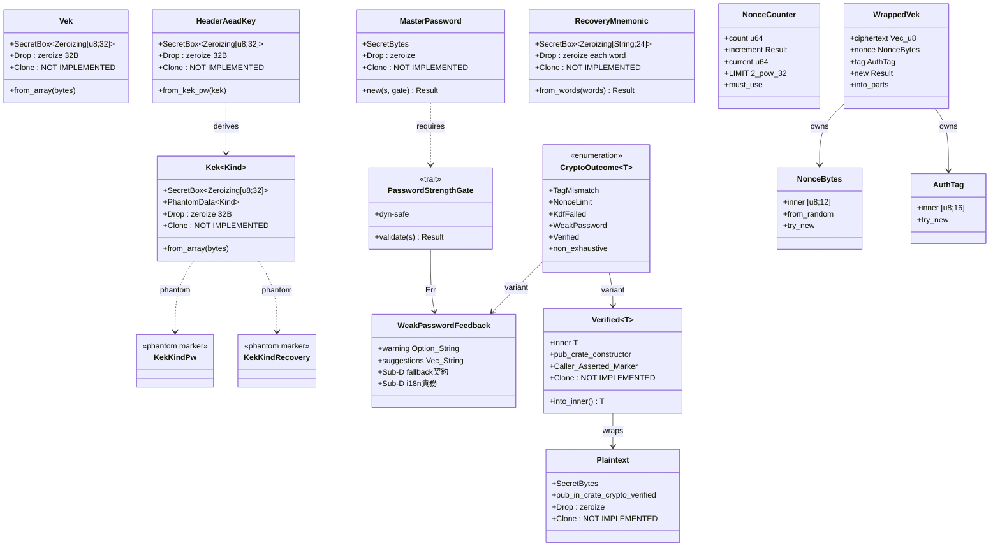

# 詳細設計書（インデックス）

<!-- 基本設計書とは別ディレクトリ。統合禁止 -->
<!-- feature: vault-encryption / Epic #37 -->
<!-- 配置先: docs/features/vault-encryption/detailed-design/index.md -->
<!-- 本ディレクトリは Sub-A (#39) Rev1 で `detailed-design.md` を分割した結果。
     Sub-B〜F の本文は各 Sub の設計工程で本ディレクトリ内の各分冊を READ → EDIT で追記する。
     新規分冊が必要になった場合は本 index.md からの索引を更新すること。 -->

## 記述ルール（必ず守ること）

詳細設計に**疑似コード・サンプル実装（python/ts/go等の言語コードブロック）を書くな**。
ソースコードと二重管理になりメンテナンスコストしか生まない。

## 分冊構成（Sub-C 完了時点、**Sub-B の 6 分冊を維持、新規分冊なし**）

| 分冊 | 主担当範囲 | 主な対象型・契約 |
|-----|---------|--------------|
| [`crypto-types.md`](./crypto-types.md) | 鍵階層型（Sub-A） | `Vek` / `Kek<KekKindPw>` / `Kek<KekKindRecovery>` / `HeaderAeadKey`（**Sub-C で `AeadKey` impl 追加 Boy Scout**） |
| [`password.md`](./password.md) | パスワード認証境界（Sub-A trait + Sub-B `ZxcvbnGate` 実装） | `MasterPassword` / `PasswordStrengthGate` trait / `WeakPasswordFeedback`（**`warning=None` 契約 + i18n 責務分離**） / **`ZxcvbnGate`（Sub-B 新規）** |
| [`nonce-and-aead.md`](./nonce-and-aead.md) | nonce / AEAD 境界（Sub-A 型 + **Sub-C 実装結合 + `AeadKey` trait + `AesGcmAeadAdapter`**） | `NonceCounter`（責務再定義） / `NonceBytes::from_random` / `WrappedVek` / `AuthTag` / `Verified<T>` / `Plaintext` / `verify_aead_decrypt`（**呼び出し側主張マーカー契約 + 可視性 `pub(in crate::crypto::verified)`**） / **`AeadKey` trait（Sub-C、クロージャインジェクション）** / **`AesGcmAeadAdapter`（Sub-C、`encrypt_record` / `decrypt_record` / `wrap_vek` / `unwrap_vek` 4 メソッド + NIST CAVP KAT + AAD 26B 規約 + nonce_counter 統合契約）** |
| [`errors-and-contracts.md`](./errors-and-contracts.md) | エラー型 / リカバリ / 契約サマリ（Sub-A 型 + Sub-B `KdfErrorKind` 詳細 + `InvalidMnemonic` variant + **Sub-C `AeadTagMismatch` 発火経路 + `derive_new_wrapped_*` AES-GCM wrap 経路 + `unwrap_vek_with_*`**） | `RecoveryMnemonic` / `CryptoOutcome<T>` / `CryptoError` / `DomainError` 拡張 / `VekProvider`（**Sub-B 具象 `Argon2idHkdfVekProvider` + Sub-C で wrap/unwrap 経路確定**） / 設計判断の補足 / **契約 C-1〜C-16 サマリ表（Sub-C で C-14〜C-16 追加）** |
| **[`kdf.md`](./kdf.md)（Sub-B 新規）** | KDF アダプタ（shikomi-infra） | `Argon2idAdapter`（`m=19456, t=2, p=1`、RFC 9106 KAT、criterion p95 1 秒） / `Bip39Pbkdf2Hkdf`（24 語 → seed → KEK_recovery、HKDF info `b"shikomi-kek-v1"`、trezor + RFC 5869 KAT） / `Argon2idParams::FROZEN_OWASP_2024_05` const |
| **[`rng.md`](./rng.md)（Sub-B 新規）** | CSPRNG 単一エントリ点（shikomi-infra） | `Rng`（`rand_core::OsRng` + `getrandom` バックエンド） / `generate_kdf_salt` / `generate_vek` / `generate_nonce_bytes` / `generate_mnemonic_entropy`（Sub-0 凍結文言「KdfSalt::generate() 単一コンストラクタ」の Clean Arch 整合的物理実装） |

**Sub-C で新規分冊を追加しない理由**: AEAD 設計は既存 `nonce-and-aead.md` の延長線上にある（`Verified<T>` / `Plaintext` / `verify_aead_decrypt` クロージャマーカーがすべて Sub-C `AesGcmAeadAdapter` に直結）。`aead-adapter.md` を別ファイルに切り出すと **Verified<T> 契約と AEAD 実装が物理的に分離**し、設計の縦串整合（型契約 → 実装具象）が崩れる。1 分冊 400 行以内のソフトキャップを超えない範囲で `nonce-and-aead.md` 内に集約する判断（Boy Scout Rule、不要な分冊増加を回避）。

```
ディレクトリ構造:
docs/features/vault-encryption/detailed-design/
  index.md                   # 本ファイル（分冊索引 + 全 public API クラス図 + データ構造表）
  crypto-types.md            # Vek / Kek<Kind> / HeaderAeadKey
  password.md                # MasterPassword / PasswordStrengthGate / WeakPasswordFeedback / ZxcvbnGate
  nonce-and-aead.md          # Verified<T> / Plaintext / NonceCounter / NonceBytes / WrappedVek / AuthTag
  errors-and-contracts.md    # RecoveryMnemonic / CryptoError / CryptoOutcome / VekProvider 具象 / 契約サマリ
  kdf.md                     # Argon2idAdapter / Bip39Pbkdf2Hkdf / Argon2idParams const  [Sub-B 新規]
  rng.md                     # Rng (OsRng 単一エントリ点) / generate_*  [Sub-B 新規]
```

**分割方針**:

- 1 分冊あたり原則 **400 行以内**を目標とし、超過したら更に分割を検討（Sub-B〜F 拡張への余地を確保）
- **サフィックス分割禁止**（`crypto-types-vek.md` のような形は不可）。型グループでファイル分け
- 各分冊は冒頭に「対象型・主担当 Sub」を明示し、独立して読めるようにする（Boy Scout Rule の継承）

## クラス設計（詳細・全 public API 統合 Mermaid 図）

各型のメソッドシグネチャ詳細は分冊参照。本図は型相互の関係を示す全体俯瞰。



## データ構造（全分冊横断）

| 名前 | 型 | 用途 | デフォルト値 | 詳細分冊 |
|------|---|------|------------|---------|
| `Vek` 内部表現 | `SecretBox<Zeroizing<[u8; 32]>>` | VEK 本体（AES-256 鍵） | コンストラクタで明示供給（CSPRNG 経由 / unwrap 結果経由） | `crypto-types.md` |
| `Kek<Kind>` 内部表現 | `(SecretBox<Zeroizing<[u8; 32]>>, PhantomData<Kind>)` | KEK 本体（KDF 出力） | コンストラクタで明示供給 | `crypto-types.md` |
| `HeaderAeadKey` 内部表現 | `SecretBox<Zeroizing<[u8; 32]>>` | ヘッダ AEAD タグ検証用鍵 | `Kek<KekKindPw>` から `from_kek_pw` で派生 | `crypto-types.md` |
| `MasterPassword` 内部表現 | `SecretBytes` | ユーザ入力パスワード | コンストラクタで明示供給（強度ゲート通過後のみ） | `password.md` |
| `WeakPasswordFeedback` フィールド | `{ warning: Option<String>, suggestions: Vec<String> }` | zxcvbn の `feedback` 構造をそのまま運ぶ。**`warning=None` 時の代替警告文責務は Sub-D**、**i18n 層は Sub-D 担当**（Sub-A は英語 raw のみ運ぶ） | `PasswordStrengthGate::validate` の `Err` 内 | `password.md` |
| `RecoveryMnemonic` 内部表現 | `SecretBox<Zeroizing<[String; 24]>>` | BIP-39 24 語 | コンストラクタで明示供給（BIP-39 検証通過後のみ、Sub-B で詳細化） | `errors-and-contracts.md` |
| `Plaintext` 内部表現 | `SecretBytes`、コンストラクタ可視性は **`pub(in crate::crypto::verified)` 限定** | レコード復号後の平文 | `Verified<Plaintext>::into_inner()` 経由でのみ取り出し可 | `nonce-and-aead.md` |
| `Verified<T>` 内部表現 | `T`（ジェネリクス）。**呼び出し側主張マーカー**（型システムは AEAD 検証実行を保証しない、契約レベルの保証） | AEAD 検証済みマーカ | `pub(crate) fn new_from_aead_decrypt(t: T)` でのみ構築 | `nonce-and-aead.md` |
| `NonceCounter::count` | `u64` | この VEK での暗号化回数 | `0`（`NonceCounter::new()`） | `nonce-and-aead.md` |
| `NonceCounter::LIMIT` | `u64` 定数 | 上限値 | `1u64 << 32`（= $2^{32}$） | `nonce-and-aead.md` |
| `NonceBytes::inner` | `[u8; 12]` | per-record AEAD nonce | コンストラクタ供給（`from_random` / `try_new`） | `nonce-and-aead.md` |
| `WrappedVek::ciphertext` | `Vec<u8>` | AEAD 暗号文 | `WrappedVek::new` | `nonce-and-aead.md` |
| `WrappedVek::tag` | `AuthTag([u8; 16])` | GCM 認証タグ | `WrappedVek::new` | `nonce-and-aead.md` |
| `KdfSalt::inner` | `[u8; 16]` | Argon2id 入力 salt | 既存維持（`KdfSalt::try_new`） | `errors-and-contracts.md`（既存型のため軽量参照） |

## ビジュアルデザイン

該当なし — 理由: UIなし

## 不変条件・契約サマリ（Sub-A の検証可能条件）

| 契約 | 強制方法 | 検証手段 | 詳細分冊 |
|-----|--------|--------|---------|
| C-1: Tier-1 揮発型は `Drop` 時 zeroize される | 内部 `SecretBox<Zeroizing<...>>` / `SecretBytes` の `Drop` 経路 | ユニットテスト: `Drop` 後のメモリパターン検証 | `crypto-types.md` / `password.md` / `errors-and-contracts.md` |
| C-2: Tier-1 揮発型は `Clone` 不可 | `Clone` 未実装 | compile_fail doc test | 同上 |
| C-3: Tier-1 揮発型は `Debug` で秘密値を出さない | `Debug` 実装が `[REDACTED ...]` 固定 | ユニットテスト: `format!("{:?}", vek)` の戻り値検証 | 同上 |
| C-4: Tier-1 揮発型は `Display` 不可 | `Display` 未実装 | compile_fail doc test | 同上 |
| C-5: Tier-1 揮発型は `serde::Serialize` 不可 | `Serialize` 未実装 | compile_fail doc test | 同上 |
| C-6: `Kek<KekKindPw>` と `Kek<KekKindRecovery>` は混合不可 | phantom-typed + Sealed trait | compile_fail doc test | `crypto-types.md` |
| C-7: `Verified<T>` は AEAD 復号関数からのみ構築可 | コンストラクタ `pub(crate)` 可視性 | 外部 crate からの構築 compile_fail doc test | `nonce-and-aead.md` |
| C-8: `MasterPassword::new` は `PasswordStrengthGate::validate` 通過必須 | コンストラクタが `&dyn PasswordStrengthGate` を要求 | ユニットテスト: `AlwaysRejectGate` で `Err(WeakPassword)` を確認、`AlwaysAcceptGate` で `Ok(MasterPassword)` | `password.md` |
| C-9: `NonceCounter::increment` は上限到達で `Err(NonceLimitExceeded)` | `if count >= LIMIT` 分岐 + `#[must_use]` | ユニットテスト: `LIMIT - 1` まで OK、`LIMIT` で `Err` | `nonce-and-aead.md` |
| C-10: `NonceBytes::from_random` は失敗しない（型レベル長さ強制） | 引数 `[u8; 12]` | コンパイラ強制（テスト不要だが回帰テストで `from_random([0u8;12])` が構築できることを確認） | `nonce-and-aead.md` |
| C-11: `WrappedVek::new` は ciphertext 空 / 短すぎを拒否 | `ciphertext.is_empty()` / `ciphertext.len() < 32` | ユニットテスト: 各境界条件 | `nonce-and-aead.md` |
| C-12: `RecoveryMnemonic::from_words` は 24 語固定（型レベル） | 引数 `[String; 24]` | コンパイラ強制 | `errors-and-contracts.md` |
| C-13: 既存 `DomainError::NonceOverflow` は `NonceLimitExceeded` に rename されている | grep + cargo check | CI で variant 名の一致検証 | `errors-and-contracts.md` |
| **C-14**: AEAD 検証失敗時に `Plaintext` を構築しない（Sub-C 新規） | `AesGcmAeadAdapter::decrypt_record` / `unwrap_vek` 内で `decrypt_in_place_detached` の `Err` 時に `verify_aead_decrypt` クロージャに到達しない | property test（タグ / AAD / nonce / ciphertext 4 系列書換）で `Verified<Plaintext>` 不在を assert | `nonce-and-aead.md` / `errors-and-contracts.md` |
| **C-15**: AEAD 鍵バイトの可視性ポリシー差別化維持（Sub-C 新規） | `AeadKey::with_secret_bytes` クロージャインジェクション経由でのみ shikomi-infra に `&[u8;32]` を渡す。`Vek` / `HeaderAeadKey::expose_within_crate` は `pub(crate)` 維持 | grep: shikomi-infra `aead/` 配下で `expose_within_crate` 直接呼出が 0 件 | `nonce-and-aead.md` / `crypto-types.md` |
| **C-16**: AEAD 中間バッファ zeroize（Sub-C 新規） | `encrypt_in_place_detached` / `decrypt_in_place_detached` の入力 `buf` を `Zeroizing<Vec<u8>>` で囲む | grep: shikomi-infra `aead/aes_gcm.rs` で `Zeroizing<Vec<u8>>` 使用、生 `Vec<u8>` の中間バッファ 0 件 | `nonce-and-aead.md` |

## 後続 Sub-B〜F の TBD ブロック

各 Sub の設計工程で本ディレクトリ内の対応分冊を READ → EDIT で以下を追記する。

- **Sub-B（完了、本書 Rev により本項目は履歴）**: KDF アダプタの詳細クラス図（`Argon2idAdapter` / `Bip39Pbkdf2Hkdf`）、`PasswordStrengthGate` の `ZxcvbnGate` 実装詳細、KAT データ取得経路、CSPRNG 単一エントリ点 `Rng` → **新規 `kdf.md` + `rng.md` を追加**、`password.md` に `ZxcvbnGate` 章追加、`errors-and-contracts.md` に `KdfErrorKind` source 型詳細 + `InvalidMnemonic` variant + `Argon2idHkdfVekProvider` 具象 を追加
- **Sub-C（完了、本書 Rev により本項目は履歴）**: AEAD アダプタの詳細設計（`AesGcmAeadAdapter` の 4 メソッド + NIST CAVP KAT + AAD 26B 規約 + nonce_counter 統合契約 + AEAD 復号後の VEK 復元経路）、`AeadKey` trait（クロージャインジェクション、Sub-B Rev2 可視性ポリシー差別化との整合）、`verify_aead_decrypt` ラッパ関数の呼び出し経路の補強、`derive_new_wrapped_*` の AES-GCM wrap 経路、`unwrap_vek_with_*` の VEK 復元 + 長さ検証 Fail Fast、契約 C-14〜C-16 追加 → **`nonce-and-aead.md` 拡張**（新規分冊なし、`aead-adapter.md` 不要）+ `errors-and-contracts.md` 補強 + `crypto-types.md` で `Vek` / `Kek<_>` への `AeadKey` impl 追記（Boy Scout）
- **Sub-D**: `EncryptedSqliteVaultRepository` の SQLite スキーマ、平文⇄暗号化マイグレーション手順、`vault encrypt` 入口の `MasterPassword::new` 経路、ヘッダ独立 AEAD タグの永続化フォーマット、**`HeaderAeadKey::AeadKey` impl 追加**（Sub-C で予告した Boy Scout 完成）、vault リポジトリ層での **`NonceCounter::increment` 統合**（Sub-C `nonce-and-aead.md` §nonce_counter 統合契約 を実装に落とし込む） → 新規 `repository-and-migration.md`
- **Sub-E**: VEK キャッシュの `tokio::sync::RwLock<Option<Vek>>` 設計、IPC V2 `IpcRequest` variant 追加、アンロック失敗バックオフ実装、`change-password` の `wrapped_VEK_by_pw` 単独更新フロー → 新規 `vek-cache-and-ipc.md`
- **Sub-F**: `shikomi vault {encrypt, decrypt, unlock, lock, change-password, recovery-show, rekey}` の clap サブコマンド構造、IPC V2 リクエスト発行経路、MSG-S* 文言テーブル → 新規 `cli-subcommands.md`
