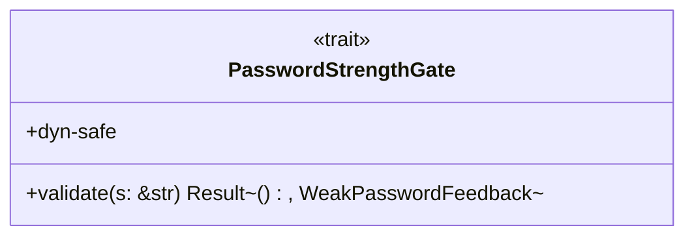

# 詳細設計書 — パスワード認証境界（`password`）

<!-- 親: docs/features/vault-encryption/detailed-design/index.md -->
<!-- 配置先: docs/features/vault-encryption/detailed-design/password.md -->
<!-- 主担当: Sub-A (#39) で trait + Feedback 構造体、Sub-D (#42) で zxcvbn 実装。 -->

## 対象型

- `shikomi_core::crypto::password::MasterPassword`
- `shikomi_core::crypto::password::PasswordStrengthGate` trait
- `shikomi_core::crypto::password::WeakPasswordFeedback`

## `MasterPassword`

### 型定義

- `pub struct MasterPassword { inner: SecretBytes }`

### コンストラクタ

| 関数名 | 可視性 | シグネチャ概要 | 不変条件 |
|-------|------|------------|--------|
| `MasterPassword::new` | `pub` | `(s: String, gate: &dyn PasswordStrengthGate) -> Result<MasterPassword, CryptoError>` | `gate.validate(&s)` が `Ok(())` を返した場合のみ `MasterPassword` を構築。`Err` の場合 `CryptoError::WeakPassword(WeakPasswordFeedback)` を返し、入力 `s` は呼び出し直後に `zeroize` 推奨（呼び出し側責務、Sub-D 設計時に明示） |

### 公開しない経路

- `expose_secret_bytes_within_crate(&self) -> &[u8]`: `pub(crate)`、Sub-B の Argon2id 入力に渡す経路用

### 提供トレイト

- `Debug`: **`[REDACTED MASTER PASSWORD]` 固定**（CI grep で文字列リテラルを検証）
- `Drop`: 内部 `SecretBytes` の zeroize 経路に委譲

### 禁止トレイト

- `Clone` / `Copy` / `Display` / `serde::Serialize` / `PartialEq` / `Eq`: いずれも未実装（`Vek` と同等）

## `PasswordStrengthGate` trait

### Trait シグネチャ

- **唯一のメソッド**: `fn validate(&self, password: &str) -> Result<(), WeakPasswordFeedback>;`
- **dyn-safe**: `&dyn PasswordStrengthGate` として `MasterPassword::new` に渡せる
- **実装場所**: shikomi-core では trait シグネチャと `WeakPasswordFeedback` 型のみ定義。**実装（zxcvbn 呼出）は Sub-D の `shikomi-infra::crypto::ZxcvbnGate` 担当**（REQ-S08 の zxcvbn 呼出は Sub-D に残置 — Sub-A は trait のみ）
- **強度判定基準**: trait 自体は基準を持たない（実装が決定）。Sub-D の `ZxcvbnGate` 実装は zxcvbn 強度 ≥ 3 を採用（`tech-stack.md` §4.7 `zxcvbn` 行 / Sub-0 REQ-S08）

### Sub-D が遵守すべき契約

1. **強度判定の合否しか trait シグネチャに表れない**: 内部スコア値 / 内部辞書 / 計算時間など実装詳細は `Result<(), WeakPasswordFeedback>` の外側に漏らさない
2. **runtime panic 禁止**: `validate` の実装は決して panic しない。zxcvbn の内部例外は `WeakPasswordFeedback` または `Ok(())` のいずれかに収束させる
3. **副作用なし**: `validate` は `&self`（mut でない）かつ I/O を持たない（zxcvbn は no-I/O だが念のため契約として明示）
4. **タイミング攻撃への耐性**: 強度判定は入力長依存の処理時間を持つ可能性があるが、**vault encrypt 入口の Fail Fast 用途**であり、リトライ計測攻撃の脅威は L1 同ユーザ別プロセスでも限定的（Sub-0 §4 L1 残存リスク）。Sub-D 実装で必要なら定数時間化を検討

## `WeakPasswordFeedback`

### フィールド構造

| フィールド | 型 | 用途 |
|----------|---|------|
| `warning` | `Option<String>` | zxcvbn の `feedback.warning`（単一の警告文）。「これは推測されやすいパスワードです」等の主要原因。**`None` の場合あり**（後述の `warning=None` 契約参照） |
| `suggestions` | `Vec<String>` | zxcvbn の `feedback.suggestions`（複数の改善提案）。「大文字を加えてください」「8 文字以上にしてください」等。**空 `Vec` も有効**（zxcvbn が改善案を出さないケース） |

### 派生トレイト

- `Debug` / `Clone`（フィードバック自体は秘密でない）
- `serde::Serialize` / `serde::Deserialize`（IPC 経由で daemon → CLI / GUI に渡すため）
- `PartialEq` / `Eq`（テスト容易性）

### Fail Kindly 契約

- Sub-D が `WeakPasswordFeedback` をそのまま MSG-S08 に渡す。**`warning` と `suggestions` の両方を必ずユーザに提示**する

### **`warning=None` 時の代替警告文契約（指摘 #2 対応で本セクション追加）**

- **構造的禁止事項**: zxcvbn が `warning=None` を返した場合に、Sub-D が「`warning` フィールドを無音でユーザに渡す」（=ユーザに警告らしい警告が一切表示されない）実装を**契約として禁止する**
- **代替警告文責務は Sub-D**: `warning=None` を検出した時、Sub-D（または Sub-F の MSG-S08 文言層）は以下のいずれかの**フォールバック警告文**をユーザに提示する責務を負う:
  - **既定フォールバック**: 「パスワードの強度が不足しています。下記の改善提案を参照してください」のような汎用警告文（i18n 後）
  - **`suggestions` フィールド先頭の文を warning 代替として表示**（zxcvbn の `suggestions` が必ず 1 件以上ある場合に限り、Sub-D の判断で選択可能）
  - **強度スコア値を間接的に表示**: 「現在の強度: 0/4」のような数値情報（zxcvbn `score()` の戻り値、Sub-D で取得・整形）
- **Sub-A の責務範囲**: 本契約の**型レベル強制は不可能**（`Option<String>` の `None` 自体は構造的に正常）。本契約は **Sub-D の MSG-S08 設計時のチェックリスト項目**として `requirements.md` MSG-S08 行 + 本詳細設計書で固定し、Sub-D PR レビューで「`warning=None` 経路の MSG-S08 出力にフォールバック文があるか」を必須確認する
- **検証手段**: Sub-D のテストで `warning=None` の `WeakPasswordFeedback` を入力した時の MSG-S08 出力に「fallback / suggestion / score」のいずれかが含まれることをアサート（Sub-D test-design.md で TC 定義）

### **i18n 戦略の責務分離（指摘 #3 対応で本セクション追加）**

- **shikomi-core (Sub-A) の責務**: zxcvbn の `feedback.warning` / `feedback.suggestions` を**英語 raw 文字列のまま**運ぶ。i18n 翻訳・表示文整形・敬語化等は一切行わない
- **shikomi-infra / shikomi-cli / shikomi-gui (Sub-D / Sub-F / 後続 GUI feature) の責務**: 受け取った英語 `WeakPasswordFeedback` を**ユーザのロケールに応じて翻訳**してから MSG-S08 に渡す。具体的には以下のいずれか:
  - **(a) 翻訳辞書方式**: zxcvbn の英語フィードバックは固定文言の集合（`zxcvbn::feedback::Feedback` の `warning` enum と `suggestions` enum）。Sub-D で英語 → 日本語の固定写像辞書を持つ。zxcvbn が `Some("This is a top-10 common password")` を返したら、辞書ヒットで「これは最も一般的なパスワード上位 10 件です」のような訳語に変換
  - **(b) i18n フレームワーク方式**: `fluent` / `gettext` 等の i18n フレームワークを Sub-F で導入し、英語キーをロケールキーに変換
  - **(c) 翻訳サービス方式**: 採用しない（外部 API 呼出は shikomi の no-network 方針に反する、Sub-0 §1 システム範囲）
- **採用方針（Sub-D 設計時に確定）**: (a) 翻訳辞書方式を第一候補とする。zxcvbn の英語フィードバック数は有限（`zxcvbn` v3 系で数十件レベル）であり、(b) フレームワーク導入は YAGNI、(c) は方針違反
- **田中ペルソナ整合**: Sub-0 ペルソナ A（田中）は CLI を読めない日本語ユーザ。Sub-D / Sub-F が i18n 層を提供しなければ MSG-S08 が「This is a top-10 common password」となり Fail Kindly が**形骸化**する（外部レビュー時の人間チェック対象）
- **Sub-A の検証手段**: 本契約は型レベル強制不可（`String` の中身が英語か日本語かはコンパイル時不明）。Sub-D / Sub-F PR レビュー + test-design.md でロケール別の MSG-S08 出力確認 TC を定義
