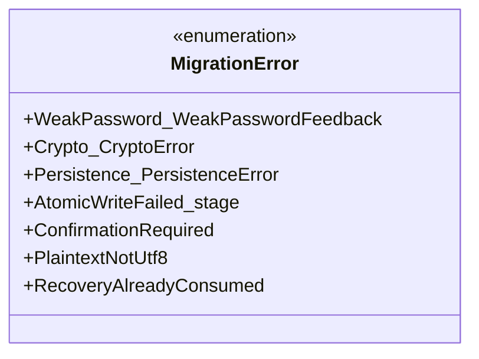

# 詳細設計書 — 暗号化 Vault リポジトリと平文⇄暗号化マイグレーション（`repository-and-migration`）

<!-- 親: docs/features/vault-encryption/detailed-design/index.md -->
<!-- 配置先: docs/features/vault-encryption/detailed-design/repository-and-migration.md -->
<!-- 主担当: Sub-D (#42)。Sub-E (#43) で VEK キャッシュ統合、Sub-F (#44) で `vault rekey` フローと統合。 -->
<!-- 依存: Sub-A (#39) 暗号ドメイン型 / Sub-B (#40) KDF + Rng + ZxcvbnGate / Sub-C (#41) AesGcmAeadAdapter + AeadKey trait -->

## 対象型

- `shikomi_infra::persistence::sqlite::SqliteVaultRepository`（**既存改訂**、暗号化モード経路解禁）
- `shikomi_infra::persistence::vault_migration::VaultMigration`（**Sub-D 新規**、平文⇄暗号化双方向マイグレーション）
- `shikomi_core::vault::header::VaultEncryptedHeader`（**Sub-D 新規 / Boy Scout**、ヘッダ独立 AEAD タグ含む）
- `shikomi_core::vault::header::HeaderAeadEnvelope`（**Sub-D 新規**、`HeaderAeadKey` で AEAD 検証する正規化バイト列封筒）
- `shikomi_core::vault::record::EncryptedRecord`（**Sub-D 新規 / Boy Scout**、`payload_variant='encrypted'` 行に対応）
- `shikomi_core::vault::recovery_disclosure::RecoveryDisclosure`（**Sub-D 新規**、24 語初回 1 度表示の型レベル強制）
- `shikomi_core::crypto::header_aead::HeaderAeadKey` への `AeadKey` impl 追加（**Sub-C 予告の Boy Scout 完成**、`crypto-types.md` 同期）
- `shikomi_core::error::PersistenceError`（**改訂**、`UnsupportedYet` 発火経路の意味論変更 + 新規 variant 追加）

## モジュール配置と責務

```
crates/shikomi-core/src/                ~ 既存改訂のみ、新規 crate なし
  crypto/
    header_aead.rs                      ~ HeaderAeadKey に AeadKey impl 追加（Sub-C 予告 Boy Scout）
  vault/
    header.rs                           ~ VaultEncryptedHeader / HeaderAeadEnvelope / KdfParams 追加
    record.rs                           ~ EncryptedRecord 追加（既存 PlaintextRecord と並列）
    recovery_disclosure.rs              + 24 語初回 1 度表示の型レベル強制（Sub-D 新規）
crates/shikomi-infra/src/                ~ 既存改訂 + 新規モジュール
  persistence/
    sqlite/
      mod.rs                            ~ 暗号化モード分岐の解禁
      schema.rs                         ~ DDL 変更なし（Sub-A で先行定義済の暗号化カラムを利用）
      mapping.rs                        ~ EncryptedRecord ↔ records 行 / VaultEncryptedHeader ↔ vault_header 行
    vault_migration/                    + Sub-D 新規モジュール
      mod.rs                            + VaultMigration 公開 API
      encrypt_flow.rs                   + 平文 → 暗号化マイグレーション
      decrypt_flow.rs                   + 暗号化 → 平文マイグレーション
      rekey_flow.rs                     + nonce overflow / change-password 対応の VEK 入替
```

**Clean Architecture の依存方向**:

- `vault-persistence` の `SqliteVaultRepository` は**暗号化に「無知」のまま据え置き**（Issue #42 §実装の責務境界凍結）。暗号文は `Vec<u8>` 不透明 BLOB として永続化、CHECK 制約のみで構造整合を担保
- 暗号化モードの load/save は **`SqliteVaultRepository` が `VaultEncryptedHeader` を素通しで保存・復元**し、AEAD 検証 / wrap_VEK 復号 / record AEAD 検証は**呼出側（daemon = Sub-E）**が `AesGcmAeadAdapter` と組合せて行う
- `VaultMigration` は shikomi-infra 内の**サービス層**として `SqliteVaultRepository` + `Argon2idHkdfVekProvider` + `AesGcmAeadAdapter` を組合せる。`SqliteVaultRepository` 自体に暗号操作を持ち込まない（SRP）
- shikomi-core への新規依存追加なし（`aes-gcm` / `argon2` / `bip39` 等は shikomi-infra のみ、Sub-A/B/C 凍結維持）

## 設計判断: 単一リポジトリ vs 暗号化専用リポジトリ

| 案 | 説明 | 採否 |
|---|---|---|
| **A: `EncryptedSqliteVaultRepository` を別 struct として新設** | `SqliteVaultRepository`（平文専用）と `EncryptedSqliteVaultRepository`（暗号化専用）の 2 実装、`VaultRepository` trait の dyn dispatch で切替 | **却下**: 暗号化に「無知」な永続化層という責務境界が壊れる（暗号化リポジトリが AEAD を呼ぶ経路が必要になり SRP 違反）。trait dispatch は `vault.protection_mode()` を見れば static dispatch で済む過剰設計 |
| **B: 既存 `SqliteVaultRepository` に暗号化モード分岐を解禁し、AEAD 計算は呼出側 service 層**（採用） | リポジトリは BLOB の素通し、`VaultMigration` service が AEAD 計算と組合せる | **採用**: vault-persistence の責務境界（Issue #42 凍結）を維持、SRP 整合、Clean Arch の依存方向破壊なし |

**採用根拠**:
1. Issue #42 §実装で「`vault-persistence` は暗号化に「無知」のまま据え置く（**責務境界**）」と凍結
2. `vault-persistence/basic-design/index.md` 既存スキーマが `protection_mode='encrypted'` カラムを先行定義済（DDL 変更不要）
3. AEAD 計算 / wrap_VEK 復号は **Sub-E（VEK キャッシュ管理 daemon）**で発生、`SqliteVaultRepository` から AEAD を呼ぶと daemon プロセス境界を跨ぐ依存が生じる

## `VaultEncryptedHeader`（Sub-D 新規 / Boy Scout）

### 型定義

- `pub struct VaultEncryptedHeader { version: VaultVersion, created_at: OffsetDateTime, kdf_salt: KdfSalt, wrapped_vek_by_pw: WrappedVek, wrapped_vek_by_recovery: WrappedVek, nonce_counter: NonceCounter, kdf_params: KdfParams, header_aead_envelope: HeaderAeadEnvelope }`
- 既存 `shikomi_core::vault::header::VaultHeader::Encrypted(VaultEncryptedHeader)` variant の中身として完成形になる（Sub-A 段階で skeleton のみ存在、Sub-D で全フィールド確定）

### `KdfParams`

- `pub struct KdfParams { m: u32, t: u32, p: u32 }`（const 値のみ、`Argon2idParams::FROZEN_OWASP_2024_05` の永続化形）
- `m=19_456, t=2, p=1` 凍結値（`tech-stack.md` §4.7 / Sub-B `kdf.md` §`Argon2idParams` 凍結値）
- 派生: `Debug, Clone, Copy, PartialEq, Eq`（const 値、秘密でない）
- **永続化フォーマット**: SQLite カラム `vault_header.kdf_params` (BLOB, 12B = `m.to_be_bytes() ‖ t.to_be_bytes() ‖ p.to_be_bytes()`)
- `KdfParams::frozen() -> Self` で凍結値構築、`KdfParams::try_from_bytes(&[u8; 12]) -> Result<Self, DomainError>` で永続化からの復元（範囲外値は `DomainError::InvalidVaultHeader(KdfParamsOutOfRange)`）

### `HeaderAeadEnvelope`

- `pub struct HeaderAeadEnvelope { ciphertext: Vec<u8>, nonce: NonceBytes, tag: AuthTag }`
- ヘッダ独立 AEAD タグの永続化形。`WrappedVek` と同じ 3 フィールド構造（DRY、Sub-A `WrappedVek` Boy Scout 後の知見再利用）
- AAD は **vault.db 全体の context** = `version (2B BE) ‖ created_at_micros (8B BE) ‖ kdf_salt (16B) ‖ wrapped_vek_by_pw_serialized ‖ wrapped_vek_by_recovery_serialized ‖ nonce_counter (8B BE u64) ‖ kdf_params (12B)`（**ヘッダ全フィールドの正規化バイト列**、ヘッダ内任意フィールドの改竄を AEAD 検証で検出。**`nonce_counter` 含有は L1 攻撃者によるカウンタ巻戻し改竄を構造防衛**: $2^{32}$ rekey 強制契約を破壊する nonce_counter→0 書戻し攻撃が AEAD 検証で fail fast、Sub-0 凍結「random nonce + 上限 $2^{32}$ rekey」契約と整合、`requirements.md` REQ-S06 関連脅威 ID 文言「`kdf_params` / `wrapped_VEK_*` / `nonce_counter` 差替検出」と同期、Sub-D 工程5 服部指摘で明文化）
- ciphertext の中身は **空 `&[]`**（鍵を運ばない、改竄検出専用の空 AEAD タグ）。AAD 改竄時に GMAC 不一致で `Err(AeadTagMismatch)`
- 派生: `Debug, Clone`（ciphertext / nonce / tag は秘密でない）

### コンストラクタ / メソッド

| 関数名 | 可視性 | シグネチャ | 仕様 |
|---|---|---|---|
| `VaultEncryptedHeader::new` | `pub` | `(version, created_at, kdf_salt, wrapped_vek_by_pw, wrapped_vek_by_recovery, nonce_counter, kdf_params, header_aead_envelope) -> Result<Self, DomainError>` | 全フィールドを受取り構築。各フィールドは型レベル強制（長さ・範囲検証は構築済型に委譲） |
| `VaultEncryptedHeader::header_aead_envelope` | `pub` | `(&self) -> &HeaderAeadEnvelope` | ヘッダ AEAD タグへの参照 |
| `VaultEncryptedHeader::canonical_bytes_for_aad` | `pub` | `(&self) -> Vec<u8>` | AEAD 検証用の正規化バイト列（ヘッダ全フィールドを上記順序で連結）。`HeaderAeadEnvelope` 自身は含まない（自己参照を避ける） |
| `VaultEncryptedHeader::increment_nonce_counter` | `pub` | `(&mut self) -> Result<(), CryptoError>` | `self.nonce_counter.increment()` 呼出のみ（Sub-A `NonceCounter::increment` の `Err(NonceLimitExceeded)` を `CryptoError::NonceLimitExceeded` に透過）。**`Rng` への依存を一切持たない**（shikomi-core no-I/O 制約継承、Clean Arch 維持）。**per-record AEAD nonce の生成は呼出側 `VaultMigration` の責務**（`let nonce = rng.generate_nonce_bytes()` を `encrypt_record` 直前に呼ぶ、`adapter.encrypt_record(&vek, &nonce, &aad, plaintext)` で消費）。Sub-D 工程5 服部指摘で「案A: increment 責務のみ、nonce 生成は完全分離」採用、メソッド名も `increment_nonce_counter` に変更（旧 `increment_nonce` は「nonce バイトを返すかカウンタを進めるか」が曖昧、Sub-D 実装担当の誤解を防止）|

### Drop 契約

- `wrapped_vek_by_pw` / `wrapped_vek_by_recovery` の各 `WrappedVek` は ciphertext バイトを保持。**鍵バイトは含まない**（wrap 済の暗号文）。`Drop` 時の zeroize は不要（攻撃面ではない）
- `nonce_counter.count` は `u64`、秘密でない（攻撃者に見えても害なし）

## ヘッダ独立 AEAD タグ検証フロー

### 検証時（vault load / unlock の前段）

1. SQLite から `vault_header` 行を読出 → `VaultEncryptedHeader` 復元
2. `let envelope = header.header_aead_envelope();`
3. `let aad_bytes = header.canonical_bytes_for_aad();`
4. `let header_key = HeaderAeadKey::from_kek_pw(&kek_pw);`（KEK_pw は前段で `Argon2idAdapter::derive_kek_pw` 経由で導出）
5. `AesGcmAeadAdapter::default().decrypt_record(&header_key, &envelope.nonce, &Aad::raw(&aad_bytes), &envelope.ciphertext, &envelope.tag)?;`
   - **注**: `Aad::raw` は本 Sub-D で Boy Scout 追加（既存 `Aad::new(record_id, version, created_at)` は record 用、ヘッダ用には汎用の `Aad::raw(&[u8])` を新設、`crypto_data.rs` の `Aad` enum 化または newtype 並設で対応 — 詳細は §`Aad` の汎用化 Boy Scout で確定）
6. **AEAD 検証成功時のみ**ヘッダを「信頼可能」と判定、`wrapped_vek_by_pw` の AES-GCM unwrap に進む
7. **AEAD 検証失敗時** `CryptoError::AeadTagMismatch` を返し、wrap_VEK 復号に進まない（`kdf_params` 改竄 / `wrapped_VEK_*` 差替 / nonce_counter 巻戻しの全攻撃を 1 variant で検出）

### 構築時（vault encrypt / change-password / rekey）

1. ヘッダ全フィールド構築（kdf_salt / wrapped_VEK_* / nonce_counter / kdf_params）
2. `let header_key = HeaderAeadKey::from_kek_pw(&kek_pw);`
3. `let nonce = rng.generate_nonce_bytes();`
4. `let aad_bytes = canonical_bytes_for_aad_skeleton(...);`（envelope を抜きにした正規化バイト列）
5. `let (ciphertext, tag) = adapter.encrypt_record(&header_key, &nonce, &Aad::raw(&aad_bytes), &[])?;`（**plaintext は空**、改竄検出専用）
6. `HeaderAeadEnvelope { ciphertext, nonce, tag }` を構築
7. `VaultEncryptedHeader::new(..., header_aead_envelope)` で完成

### `Aad` の汎用化 Boy Scout（既存型改訂）

既存 `shikomi_core::vault::crypto_data::Aad` は `(record_id, vault_version, record_created_at)` の 3 引数固定。Sub-D では**ヘッダ AEAD 用に任意バイト列を AAD として渡す経路**が必要。

採用案: **`Aad` 列挙化（2 variant）**:
- `Aad::Record { record_id: RecordId, vault_version: VaultVersion, record_created_at: OffsetDateTime }`（既存、`to_canonical_bytes() -> [u8; 26]`）
- `Aad::HeaderEnvelope(Vec<u8>)`（**Sub-D 新規**、ヘッダ正規化バイト列をそのまま AAD として渡す。長さ可変）
- `Aad::to_canonical_bytes(&self) -> Cow<[u8]>`（既存型から signature 改訂、Boy Scout）
- `AesGcmAeadAdapter::encrypt_record` / `decrypt_record` の `aad: &Aad` 引数は変更なし、内部で `aad.to_canonical_bytes()` を呼ぶ（API 後方互換維持）

代替案: **`Aad::raw(&[u8])` の自由 byte 経路を追加**
- 却下: ヘッダ専用 variant にしないと「任意バイト列を AAD として渡す」経路が `record-not-record` の 2 種類以上に増える可能性があり、用途明示性が下がる

## `EncryptedRecord`（Sub-D 新規 / Boy Scout）

### 型定義

- `pub struct EncryptedRecord { id: RecordId, kind: RecordKind, label: RecordLabel, ciphertext: Vec<u8>, nonce: NonceBytes, tag: AuthTag, created_at: OffsetDateTime, updated_at: OffsetDateTime }`
- 既存 `shikomi_core::vault::record::Record` と並列、`Record::Plaintext(PlaintextRecord) | Record::Encrypted(EncryptedRecord)` の enum variant として統合（または既存 `Record` を Boy Scout で enum 化）
- 派生: `Debug`（**`label` のみ表示、ciphertext / nonce / tag は `[REDACTED ENCRYPTED]` 固定**）, `Clone`（暗号文は秘密でない、コピー許容）

### AAD 構築

- `Aad::Record { record_id: self.id, vault_version: <vault.header().version()>, record_created_at: self.created_at }` で構築（既存 `Aad::to_canonical_bytes` 26B 規約を使用）

### Drop 契約

- ciphertext / nonce / tag は秘密でない（暗号文 + 公開タグ + 公開 nonce）。`Drop` 時の zeroize は**不要**
- 復号後の `Plaintext` は `Verified<Plaintext>::into_inner()` 経由で取り出され、Sub-E で `SecretBytes` ベースの zeroize 経路に乗る

## `RecoveryDisclosure`（Sub-D 新規、REQ-S13 型レベル強制）

### 動機

REQ-S13「初回 1 度表示」を**型レベルで強制**する。`RecoveryMnemonic` を持っている人なら何度でも `expose_words()` で 24 語を取り出せてしまう（`MasterPassword::expose_secret_bytes` と同じく `pub` 可視性、Sub-B Rev2）が、**「初回 1 度のみユーザに見せて、その後は強制 Drop して再表示禁止」**という Sub-0 凍結契約は型レベルで担保したい。

### 型定義

- `pub struct RecoveryDisclosure { mnemonic: RecoveryMnemonic, displayed_at: OffsetDateTime, consumed: bool }`
- `displayed_at` は監査ログ用（実時刻、秘密でない）
- `consumed` は `disclose` 1 回呼出後 `true`、再 disclose をコンパイルではなく runtime で拒否（`Result::Err`）

### コンストラクタ / メソッド

| 関数名 | 可視性 | シグネチャ | 仕様 |
|---|---|---|---|
| `RecoveryDisclosure::new` | `pub(crate)` | `(mnemonic: RecoveryMnemonic) -> Self` | shikomi-infra の vault encrypt フローからのみ構築可（`Argon2idHkdfVekProvider` 内で生成 → 即 disclose）|
| `RecoveryDisclosure::disclose` | `pub` | `(self) -> Result<RecoveryWords, DomainError>` | **`self` を消費**して 24 語を `RecoveryWords`（公開可能な表示用 newtype）として返す。`consumed=true` 状態にしてから内部で `RecoveryMnemonic` を `Drop` させる。**2 度呼べない**（move 後の使用は compile_fail）|
| `RecoveryDisclosure::drop_without_disclose` | `pub` | `(self) -> ()` | クラッシュ・キャンセル経路で「ユーザに見せずに即破棄」する Fail Secure 経路 |

### `RecoveryWords`（表示用、Sub-D 新規）

- `pub struct RecoveryWords { words: [String; 24] }`（**`Zeroizing` を持たない**、表示が完了すれば消える短命型）
- `pub fn iter(&self) -> impl Iterator<Item = (usize, &str)>` で「1: word1, 2: word2, ...」形式の番号付き列挙
- **`Drop` で zeroize**（Sub-A `RecoveryMnemonic` と同型、ただし表示完了後の即時 zeroize を優先）
- 派生: `Debug` は `[REDACTED RECOVERY WORDS (24)]` 固定、`Display` 未実装、`Clone` 未実装、`serde::Serialize` 未実装

### 型レベル強制

1. **2 度呼出禁止**: `disclose(self)` は `self` を消費するため、Rust の所有権で 2 度呼出が compile_fail
2. **永続化禁止**: `RecoveryDisclosure` / `RecoveryWords` 共に `serde::Serialize` 未実装、`Display` 未実装。**ヘッダの `wrapped_vek_by_recovery` のみ永続化、生 24 語は決して永続化しない**（永続化経路を型システムで物理封鎖）
3. **`drop_without_disclose` の存在**: クラッシュ時に「ユーザに見せたか不明な状態」を残さない。一度 `RecoveryDisclosure` を作ったら必ず `disclose` か `drop_without_disclose` のどちらかで消費する（`Drop` 経路もあるが明示する）

## `VaultMigration` service（Sub-D 新規）

### 型定義

- `pub struct VaultMigration<R: VaultRepository> { repo: R, vek_provider: Argon2idHkdfVekProvider, adapter: AesGcmAeadAdapter, rng: Rng, gate: ZxcvbnGate }`
- 無状態の集約型（dependency injection）

### メソッド

| 関数名 | 可視性 | シグネチャ | 仕様 |
|---|---|---|---|
| `VaultMigration::encrypt_vault` | `pub` | `(&self, plaintext_password: &str) -> Result<RecoveryDisclosure, MigrationError>` | F-D1 平文 → 暗号化マイグレーション。返値の `RecoveryDisclosure` は呼出側（Sub-F CLI / Sub-E daemon）が**1 回だけ**ユーザに表示する責務 |
| `VaultMigration::decrypt_vault` | `pub` | `(&self, password: &str, confirmation: DecryptConfirmation) -> Result<usize, MigrationError>` | F-D3 暗号化 → 平文マイグレーション。戻り値は復号レコード件数。`DecryptConfirmation` は二段確認（後述）の通過証跡 |
| `VaultMigration::rekey` | `pub` | `(&self, current_password: &str) -> Result<usize, MigrationError>` | F-D4 nonce overflow / 明示 rekey 経路。新 VEK 生成 → 全レコード再暗号化、戻り値は再暗号化件数 |
| `VaultMigration::change_password` | `pub` | `(&self, current_password: &str, new_password: &str) -> Result<(), MigrationError>` | F-D5 マスターパスワード変更（O(1)、VEK 不変、`wrapped_VEK_by_pw` のみ再生成）|

### `DecryptConfirmation`（型レベル二段確認の証跡）

- `pub struct DecryptConfirmation { _private: () }`（外部 crate からの直接構築禁止）
- `pub fn confirm(yes_keyword: &str, password_reentry: &str, expected_password: &MasterPassword) -> Result<DecryptConfirmation, ConfirmError>`
  - `yes_keyword` が `"DECRYPT"` 文字列リテラルと一致すること（`subtle::ConstantTimeEq` 経由で比較）
  - `password_reentry` が `expected_password.expose_secret_bytes()` と一致すること（`ConstantTimeEq` 経由）
  - 両方通過した場合のみ `DecryptConfirmation { _private: () }` を返す
- **`--force` フラグでも `confirm` を省略不可**（型シグネチャで `decrypt_vault` の引数に強制、Sub-F CLI 実装でも回避経路を作れない）

## 平文⇄暗号化マイグレーションフロー

### F-D1: `vault encrypt`（平文 → 暗号化、片方向昇格）

#### 入力検証 + 鍵階層構築フェーズ

1. `let master_password = MasterPassword::new(plaintext_password.to_string(), &self.gate)?;` — Sub-A/B 経路、強度 ≥ 3 で `MasterPassword` 構築
   - **失敗時** `Err(CryptoError::WeakPassword(feedback))` → `MigrationError::WeakPassword(feedback)` に包んで `MSG-S08` で提示
2. `let kdf_salt = self.rng.generate_kdf_salt();` — 16B CSPRNG（Sub-B）
3. `let kek_pw = self.vek_provider.argon2.derive_kek_pw(&master_password, &kdf_salt)?;` — Argon2id（Sub-B）
4. `let mnemonic_entropy = self.rng.generate_mnemonic_entropy();` — 32B CSPRNG（Sub-B）
5. `let bip39_mnemonic = bip39::Mnemonic::from_entropy(&mnemonic_entropy[..])?;`（shikomi-infra `vault_migration::encrypt_flow` 内）
6. `let words: [String; 24] = collect 24 strings from bip39_mnemonic.words();`
7. `let mnemonic = RecoveryMnemonic::from_words(words)?;`（Sub-A）
8. `let kek_recovery = self.vek_provider.bip39_hkdf.derive_kek_recovery(&mnemonic)?;` — HKDF（Sub-B）
9. `let vek = self.rng.generate_vek();` — 32B CSPRNG（Sub-B）

#### wrap + record 再暗号化フェーズ

10. `let wrapped_vek_by_pw = self.adapter.wrap_vek(&kek_pw, &self.rng.generate_nonce_bytes(), &vek)?;`
11. `let wrapped_vek_by_recovery = self.adapter.wrap_vek(&kek_recovery, &self.rng.generate_nonce_bytes(), &vek)?;`
12. `let plaintext_vault = self.repo.load()?;` — 既存平文 vault 読込
13. for each `record in plaintext_vault.records()`:
    - `let nonce = self.rng.generate_nonce_bytes();`
    - `let aad = Aad::Record { record_id: record.id(), vault_version: V_NEXT, record_created_at: record.created_at() };`
    - `let (ct, tag) = self.adapter.encrypt_record(&vek, &nonce, &aad, record.plaintext_value().as_bytes())?;`
    - 構築: `EncryptedRecord { id, kind, label, ciphertext: ct, nonce, tag, created_at, updated_at }`
14. `let nonce_counter = NonceCounter::new();`（count=0、初回 encrypt の record 数だけ既に消費したカウントは増加させない設計判断: rekey 前は count から外す。代わりに「初回 vault 構築時の record 数」は AAD 経路で含まれているため改竄検出は別経路で担保）
    - **設計判断**: `vault encrypt` は片方向の初回構築。各 record の AEAD 計算時に nonce を生成しているが、`NonceCounter` は per-record の incremental ではなく **「rekey からの累積暗号化回数」** として再定義する（Sub-A 段階で同方針、本フローでも踏襲）
15. `let kdf_params = KdfParams::frozen();`
16. ヘッダ AEAD タグ envelope 構築（前述 §ヘッダ独立 AEAD タグ検証フロー §構築時）
17. `let header = VaultEncryptedHeader::new(V_NEXT, OffsetDateTime::now_utc(), kdf_salt, wrapped_vek_by_pw, wrapped_vek_by_recovery, nonce_counter, kdf_params, header_aead_envelope)?;`
18. `let encrypted_vault = Vault::new_encrypted(header, encrypted_records);`

#### atomic write フェーズ

19. `self.repo.save(&encrypted_vault)?;` — 内部で `vault-persistence` の atomic write（`.new` → fsync → rename）を踏襲（Sub-D 新規実装ではない、REQ-P04 / REQ-P05 を継承）
20. **`save` 失敗時**: `.new` ファイルを `vault-persistence` の cleanup 経路が削除、原状（平文 vault）に復帰、`MigrationError::AtomicWriteFailed { stage, source }` を `MSG-S13` で提示
21. **VEK / KEK の Drop 連鎖**: 関数終了時に `vek` / `kek_pw` / `kek_recovery` / `master_password` が scope 抜けで全 zeroize（Sub-A の `Drop` 連鎖契約、L2 対策）

#### RecoveryDisclosure 返却

22. `let disclosure = RecoveryDisclosure::new(mnemonic);` — Sub-D `pub(crate)` コンストラクタ
23. 戻り値 `Ok(disclosure)`
24. **呼出側（Sub-F CLI / Sub-E daemon）の責務**: `disclosure.disclose()?` を**1 回だけ呼出** → `RecoveryWords` を取得 → ユーザに表示（MSG-S06 警告 + アクセシビリティ代替経路 MSG-S18）→ `RecoveryWords` を即 Drop（zeroize）

### F-D2: `vault unlock`（暗号化 vault の復号・メモリロード）

**Sub-D は API 提供のみ**（実呼出は Sub-E daemon 内）。

| メソッド | シグネチャ | 仕様 |
|---|---|---|
| `VaultMigration::unlock_with_password` | `(&self, password: &str) -> Result<(Vault, Vek), MigrationError>` | (1) `MasterPassword::new`（強度ゲート）→ (2) `repo.load()` で `EncryptedVault` 読込 → (3) ヘッダ AEAD タグ検証（`HeaderAeadKey::from_kek_pw` 経由）→ (4) `wrapped_vek_by_pw` を `unwrap_vek` で復号 → (5) 32B 長さ検証 + `Vek::from_array` 復元（Sub-C `unwrap_vek_with_password` 同型）→ (6) `(Vault, Vek)` 返却 |
| `VaultMigration::unlock_with_recovery` | `(&self, mnemonic: RecoveryMnemonic) -> Result<(Vault, Vek), MigrationError>` | 同様、KEK 経路のみ `Bip39Pbkdf2Hkdf::derive_kek_recovery` 経由 |

呼出側（Sub-E daemon）の責務:
- 戻り値 `Vek` を `tokio::sync::RwLock<Option<Vek>>` で daemon RAM にキャッシュ（Sub-E 詳細）
- アイドル 15min / スクリーンロック / サスペンドで `Vek` を Drop（Sub-E 詳細）

### F-D3: `vault decrypt`（暗号化 → 平文、片方向降格、リスク方向）

#### 二段確認フェーズ

1. CLI / GUI で「**暗号保護を外しますか？ vault.db が物理ディスク奪取で平文化される脅威に晒されます**」確認モーダル（MSG-S14）
2. ユーザに `DECRYPT` という大文字英字を**手入力**させる（コピペ防止のため UI で一時的に paste 抑制）
3. パスワード再入力（unlock 時と同じパスワード、`subtle::ConstantTimeEq` で比較）
4. `let confirmation = DecryptConfirmation::confirm("DECRYPT", &reentered_password, &master_password)?;` — Sub-D 型レベル証跡

#### 復号 + マイグレーションフェーズ

5. `let (encrypted_vault, vek) = self.unlock_with_password(password)?;`
6. for each `EncryptedRecord` in `encrypted_vault.records()`:
   - `let aad = Aad::Record { ... };`
   - `let verified = self.adapter.decrypt_record(&vek, &record.nonce, &aad, &record.ciphertext, &record.tag)?;`
   - **タグ検証失敗時** `MigrationError::AeadTagMismatch` → MSG-S10「vault.db 改竄の**可能性**...」（Sub-C Rev1 凍結指針）
   - `let plaintext_value: String = String::from_utf8(verified.into_inner().expose_secret().to_vec()).map_err(|_| MigrationError::PlaintextNotUtf8)?;`
   - 構築: `PlaintextRecord { id, kind, label, plaintext_value, created_at, updated_at }`
7. `let plaintext_vault = Vault::new_plaintext(header_with_protection_mode_plaintext, plaintext_records);`

#### atomic write フェーズ

8. `self.repo.save(&plaintext_vault)?;`（atomic write 経路、暗号化前のバックアップは作成しない方針 — `vault-persistence` の `.new` 残存検出で部分書込を防ぐ）
9. **`save` 失敗時**: `.new` 削除、原状（暗号化 vault）復帰、`MigrationError::AtomicWriteFailed` を `MSG-S13` で提示
10. **VEK / KEK の Drop 連鎖**: 関数終了時に zeroize

### F-D4: `rekey`（VEK 入替、nonce overflow / 明示 rekey）

#### トリガ

- 自動: `NonceCounter::increment` が `Err(NonceLimitExceeded)` を返した時、Sub-E daemon が捕捉 → `MSG-S11` で `vault rekey` 実行を案内 → ユーザ実行
- 手動: ユーザが `shikomi vault rekey` を明示実行（Sub-F CLI、Sub-D は API 提供）

#### フェーズ

1. `let (vault, old_vek) = self.unlock_with_password(current_password)?;`
2. `let new_vek = self.rng.generate_vek();`
3. **新 mnemonic は生成しない**（リカバリ経路は維持、`wrapped_vek_by_recovery` のみ新 VEK で wrap し直す）
4. `let new_wrapped_vek_by_pw = self.adapter.wrap_vek(&kek_pw, &self.rng.generate_nonce_bytes(), &new_vek)?;`
5. `let new_wrapped_vek_by_recovery = self.adapter.wrap_vek(&kek_recovery, &self.rng.generate_nonce_bytes(), &new_vek)?;`
6. for each `EncryptedRecord` in `vault.records()`:
   - 旧 VEK で復号 → 新 VEK で再暗号化（新 nonce + 新 tag、AAD は同じ）
7. `let new_nonce_counter = NonceCounter::new();`（count=0 にリセット、新 VEK での累積回数として再開）
8. ヘッダ AEAD envelope を新 wrapped_vek + 新 nonce_counter で再構築
9. `self.repo.save(&new_encrypted_vault)?;`
10. **旧 VEK / 旧 KEK の Drop 連鎖**: 関数終了時に zeroize、メモリ滞留時間最小化（Sub-A `Drop` 連鎖）
11. `MSG-S07` 表示（再暗号化レコード数）

### F-D5: `change-password`（マスターパスワード変更、O(1)、VEK 不変）

REQ-S10 の「VEK 不変、`wrapped_VEK_by_pw` のみ再生成、全レコード再暗号化なし」を実現。

1. `let (_, vek) = self.unlock_with_password(current_password)?;` — 旧パスワードで復号、`vek` を保持
2. `let new_master_password = MasterPassword::new(new_password.to_string(), &self.gate)?;` — 新パスワード強度ゲート
3. `let new_kdf_salt = self.rng.generate_kdf_salt();` — **新しい salt を生成**（旧 salt の流用は禁止、salt-password ペア更新で古い brute force 進捗を無効化）
4. `let new_kek_pw = self.vek_provider.argon2.derive_kek_pw(&new_master_password, &new_kdf_salt)?;`
5. `let new_wrapped_vek_by_pw = self.adapter.wrap_vek(&new_kek_pw, &self.rng.generate_nonce_bytes(), &vek)?;`
6. `wrapped_vek_by_recovery` は**変更しない**（リカバリ経路は鍵が変わらないため）
7. `nonce_counter` は**変更しない**（VEK 不変なので record AEAD nonce 衝突確率は同じ）
8. ヘッダ AEAD envelope を **新 kdf_salt / 新 wrapped_vek_by_pw** で再構築（kdf_params / 旧 wrapped_vek_by_recovery / 旧 nonce_counter は維持）
9. `self.repo.save(&updated_vault)?;`
10. **新 KEK_pw / 新 MasterPassword の Drop**: 関数終了時に zeroize

## `MigrationError`（Sub-D 新規列挙型）



| variant | `#[error(...)]` 文言 | 説明 | MSG マッピング |
|---|---|---|---|
| `WeakPassword(Box<WeakPasswordFeedback>)` | `#[error("weak password rejected by strength gate")]` | `vault encrypt` / `change-password` の入口 Fail Fast | MSG-S08 |
| `Crypto(CryptoError)` | `#[error(transparent)]` | KDF / AEAD 失敗の透過、`AeadTagMismatch` / `NonceLimitExceeded` を含む | MSG-S10 / MSG-S11 |
| `Persistence(PersistenceError)` | `#[error(transparent)]` | `repo.load` / `repo.save` 失敗 | 既存 MSG（vault-persistence 側） |
| `AtomicWriteFailed { stage, source }` | `#[error("vault migration atomic write failed at stage {stage}")]` | マイグレーション中の atomic write 失敗、原状復帰済み明示 | MSG-S13 |
| `ConfirmationRequired` | `#[error("decrypt confirmation required")]` | `DecryptConfirmation::confirm` 未通過 | UI 経路で MSG-S14 確認モーダルを再表示 |
| `PlaintextNotUtf8` | `#[error("decrypted plaintext is not valid UTF-8")]` | 復号成功したが UTF-8 不正（ありえない経路、Sub-C `Verified<Plaintext>` を構築できた時点で AEAD 検証は通っているが、UTF-8 検証は別レイヤー） | 開発者向けエラー（基本的にユーザに見せない、`MSG-S10` カテゴリに統合可） |
| `RecoveryAlreadyConsumed` | `#[error("recovery disclosure already consumed")]` | `RecoveryDisclosure::disclose` 2 回目呼出（型レベルで防げない move 後の使用は compile_fail だが、`drop_without_disclose` 後の disclose を runtime で防ぐ）| 開発者向けエラー |

**注**: `MigrationError::Persistence(PersistenceError)` で `vault-persistence` 側のエラーを透過する。Sub-D 内で `PersistenceError` を再分類しない（責務境界）。

## `PersistenceError` の改訂（vault-persistence 側 Boy Scout）

### `UnsupportedYet` の意味論変更

- **旧**: 「**暗号化モード全般**を未対応として拒否」
- **新**: 「**未対応バージョン**の暗号化スキーマを拒否」（Issue #42 §REQ-P11 改訂のトレーサビリティ凍結文言）
- 具体: `vault_header.vault_version` が `[V_SUPPORTED_MIN, V_SUPPORTED_MAX]` 範囲外なら `UnsupportedYet { feature: "vault schema version", supported_range: (min, max), actual: <version> }`
- 現行 v1（Sub-D 完了時の最新）は **受入**、v999 等の未来バージョンは拒否

### `UnsupportedYet` 発火経路の削除（暗号化モード即時拒否）

- `flows.md` load step 12 / save step 2 の `UnsupportedYet` 即 return を**削除**
- 暗号化モードの load/save は `Mapping::row_to_vault_header` で `VaultEncryptedHeader` を構築 → `Vault::new_encrypted(header, records)` で集約構築 → 通常経路で進行
- AEAD 検証 / wrap_VEK 復号は **`SqliteVaultRepository::load` の責務外**、呼出側（`VaultMigration` / Sub-E daemon）が実施

## SQLite スキーマ（既存 `vault-persistence` データを流用、DDL 追加なし）

`vault-persistence/detailed-design/data.md` 行 128-162 の既存スキーマを利用、Sub-D での DDL 変更は**不要**。

| カラム | 既存定義 | Sub-D での利用 |
|---|---|---|
| `vault_header.protection_mode` | `'plaintext'` / `'encrypted'` | 既存利用（暗号化モード経路解禁）|
| `vault_header.kdf_salt` | NULL / 16B | 暗号化モードで `KdfSalt::as_bytes()` を保存 |
| `vault_header.wrapped_vek_by_pw` | NULL / NOT NULL | 暗号化モードで `WrappedVek` 全体を `bincode` (Sub-D 確定: 手書きフォーマット採用、後述) |
| `vault_header.wrapped_vek_by_recovery` | NULL / NOT NULL | 同上 |
| `records.payload_variant` | `'plaintext'` / `'encrypted'` | 暗号化モードで `'encrypted'` 採用 |
| `records.plaintext_value` | NOT NULL when plaintext | 暗号化モードで NULL |
| `records.nonce` / `ciphertext` / `aad` | NULL / 12B / 任意 / 26B | 暗号化モードで `EncryptedRecord` の nonce / ciphertext / aad を保存 |

### Boy Scout 追加: `vault_header.kdf_params` カラム（既存スキーマに**追記**、Sub-D での DDL マイグレーション）

- 既存 `vault-persistence` スキーマには `kdf_params` カラムが**存在しない**（`requirements.md` データモデル表に「Sub-D で確定」として TBD）
- Sub-D で SQLite DDL に追加: `kdf_params BLOB NULL`（plaintext モードでは NULL、encrypted モードでは 12B = `m ‖ t ‖ p` の big-endian シリアライズ）
- DDL マイグレーションは **`PRAGMA user_version` を bump** し、`load` 時に `user_version < V_KDF_PARAMS_INTRODUCED` なら `ALTER TABLE vault_header ADD COLUMN kdf_params BLOB NULL;` を一度だけ実行（既存 plaintext vault には影響なし、NULL 許容のため）
- 既存 v1 暗号化 vault は**存在しない**（Sub-D 完了前は REQ-P11 で全拒否されていた）ため、後方互換問題なし

### Boy Scout 追加: `vault_header.header_aead_*` カラム（ヘッダ独立 AEAD タグ）

- `vault_header.header_aead_nonce BLOB NULL` (plaintext: NULL, encrypted: 12B)
- `vault_header.header_aead_tag BLOB NULL` (plaintext: NULL, encrypted: 16B)
- `vault_header.header_aead_ciphertext BLOB NULL` (plaintext: NULL, encrypted: 0B = 空、改竄検出専用)
- 同じく `PRAGMA user_version` bump で `ALTER TABLE` 経路追加

### `WrappedVek` の SQLite 永続化フォーマット（Sub-D 確定）

- 採用: **手書きシリアライズ**（DRY: bincode 等の重い依存を入れない）
- フォーマット: `nonce (12B) ‖ tag (16B) ‖ ciphertext (可変長)`、合計 28B 以上
- 復元: `Mapping::bytes_to_wrapped_vek(&[u8]) -> Result<WrappedVek, DomainError>` で `nonce`/`tag`/`ciphertext` に分割、`WrappedVek::new` で型化
- 既存 `vault-persistence/detailed-design/data.md` 行 142 の CHECK 制約「`length(wrapped_vek_by_pw) >= 28`」を Sub-D で追加

## 設計判断の補足

### なぜ `EncryptedSqliteVaultRepository` を別 struct にしないか

§設計判断: 単一リポジトリ vs 暗号化専用リポジトリ を参照。Issue #42 §実装で凍結された責務境界に従う。

### なぜ `RecoveryDisclosure` を導入するか

REQ-S13「初回 1 度表示」の**型レベル強制**。`RecoveryMnemonic::expose_words()` は `pub` 可視性（Sub-B Rev2 凍結）で何度でも呼べる。`RecoveryDisclosure::disclose(self)` で所有権消費するため 2 度呼出が compile_fail、永続化禁止（`Serialize` 未実装）も型レベルで保証。

### なぜ `KdfParams` を SQLite に永続化するか

ヘッダ AEAD タグの AAD に **`kdf_params` を含める**ことで、攻撃者がヘッダの `kdf_params` を `m=1, t=1` 等の弱パラメータに改竄しても **ヘッダ AEAD タグ検証で検出**される。直接的な検証ではなく、KDF 出力（`KEK_pw`）が変わることで `wrapped_vek_by_pw` の AEAD 復号が**間接的に失敗**する経路と組合わせて二重防御（`basic-design.md` §セキュリティ設計 §脅威モデル L1 §対策(c) と整合）。

### なぜ `change-password` で `kdf_salt` を更新するか

旧 salt-password ペアでの brute force 進捗（攻撃者が観測した `wrapped_vek_by_pw` から既に開始した Argon2id 計算）を**無効化**するため。新 salt-新 password ペアで KEK_pw が完全に変わり、攻撃者は brute force をゼロから再開する必要がある。

### なぜ `vault decrypt` で型レベル二段確認を要求するか

REQ-S07 / Issue #42 §マイグレーション方針で「`--force` でも 1 段は省略不可」が凍結。CLI 実装側 (Sub-F) がうっかり省略する経路を**型シグネチャで物理封鎖**する。`DecryptConfirmation::confirm` を通らずに `decrypt_vault` が呼べないため、Sub-F 実装担当が `--force` で confirmation を bypass しようとしても compile_fail。

### なぜ `Aad` を enum 化するか

ヘッダ AEAD 用に任意バイト列 AAD が必要だが、record 用の固定 26B AAD（既存 `Aad::to_canonical_bytes() -> [u8; 26]`）と用途が異なる。enum で `Aad::Record` / `Aad::HeaderEnvelope` を分けることで、各用途の意図を型レベルで明示し、`AesGcmAeadAdapter` の `aad: &Aad` 引数を**変更せずに**両用途を吸収できる。

## 不変条件・契約（Sub-D 新規）

| 契約 | 強制方法 | 検証手段 |
|---|---|---|
| **C-17**: ヘッダ AEAD タグの AAD はヘッダ全フィールドの正規化バイト列を含む | `VaultEncryptedHeader::canonical_bytes_for_aad` 実装で全フィールド連結を強制、各フィールド境界はテストで bit-exact 検証 | ユニットテスト + property test |
| **C-18**: `vault_header.kdf_params` 改竄はヘッダ AEAD タグ検証で検出 | C-17 経路で AAD に `kdf_params` を含める | property test（kdf_params の任意 byte 書換 → AEAD 検証失敗）|
| **C-19**: `RecoveryDisclosure::disclose` は 1 度しか呼べない | `disclose(self)` で所有権消費 | compile_fail doc test |
| **C-20**: `vault decrypt` は `DecryptConfirmation` を引数で要求、`--force` でも省略不可 | `VaultMigration::decrypt_vault(.., confirmation: DecryptConfirmation)` シグネチャ強制 | compile_fail doc test（confirmation なしでの呼出禁止）|
| **C-21**: 平文⇄暗号化マイグレーション中の atomic write 失敗で原状復帰 | `vault-persistence` の `.new` cleanup 経路に委譲、`MigrationError::AtomicWriteFailed` で fail fast | integration test（SIGKILL 論理等価フック、`vault-persistence` TC-I06 同型）|

## Sub-D → 後続 Sub への引継ぎ

### Sub-E（#43）への引継ぎ

1. **VEK キャッシュ**: `VaultMigration::unlock_with_password` 戻り値 `Vek` を `tokio::sync::RwLock<Option<Vek>>` で daemon 内キャッシュ
2. **アイドル 15min タイムアウト**: `Vek` Drop で zeroize、再 unlock 強制
3. **MSG-S05 文言確定**: `change-password` 完了時のユーザ向け成功メッセージ
4. **IPC V2 拡張**: `VaultMigration` の各メソッドを IPC `IpcRequest::Encrypt / Decrypt / Unlock / Lock / ChangePassword / RotateRecovery / Rekey` の variant に 1:1 マップ
5. **MSG-S09 カテゴリ別ヒント**: unlock 失敗時の (a) パスワード違い (b) IPC 接続不能 (c) キャッシュ揮発タイムアウト の 3 カテゴリ文言

### Sub-F（#44）への引継ぎ

1. **MSG-S07 文言確定**: `vault rekey` 完了時の再暗号化レコード数表示
2. **MSG-S11 文言確定**: nonce 上限到達時の `vault rekey` 誘導文言（残操作猶予数値非表示、Sub-C Rev1 凍結指針）
3. **MSG-S14 確認モーダル**: `vault decrypt` 実行前のリスク明示、`DecryptConfirmation::confirm` への `"DECRYPT"` キーワード入力 UI
4. **MSG-S18 アクセシビリティ代替経路**: `vault recovery-show --print` PDF / `--braille` .brf 出力経路実装
5. **`shikomi list` ヘッダ**: `[plaintext]` / `[encrypted]` バナー（REQ-S16）の `protection_mode` 判定

### vault-persistence への引継ぎ（**横断的変更**）

- `requirements.md` REQ-P11 改訂: 「暗号化モード即時拒否」→「未対応バージョン拒否」
- `basic-design/security.md` OWASP A02 / A04 行: 「本 Issue 範囲外」→「Sub-D で解禁」に同期
- `detailed-design/flows.md` load step 12 / save step 2: `UnsupportedYet` 即 return 削除、暗号化モード正常経路追加
- `detailed-design/data.md`: `kdf_params` / `header_aead_*` カラム追加、`PRAGMA user_version` bump
- `test-design/integration.md`: 旧 TC-I03/I04（暗号化モード即時拒否）を退役、新 TC「v1 load/save 成功 / v999 拒否」に置換、退役理由と置換先 TC ID を Boy Scout で記録
