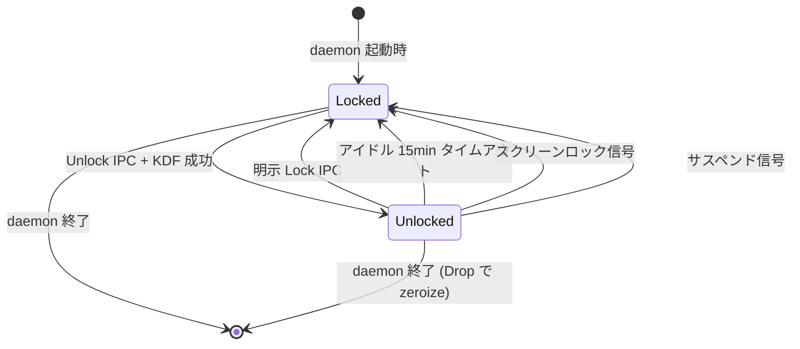

# 詳細設計書 — VEK キャッシュ + IPC V2 拡張（`vek-cache-and-ipc`）

<!-- 親: docs/features/vault-encryption/detailed-design/index.md -->
<!-- 配置先: docs/features/vault-encryption/detailed-design/vek-cache-and-ipc.md -->
<!-- 主担当: Sub-E (#43)。Sub-F (#44) で CLI サブコマンド経路から本書の IPC V2 ハンドラを呼出。 -->
<!-- 依存: Sub-A 暗号ドメイン型 / Sub-B KDF + Rng / Sub-C AesGcmAeadAdapter / Sub-D VaultMigration -->
<!-- 横断的変更: 本書は vault-encryption feature の詳細設計だが、daemon-ipc feature の `IpcRequest` / `IpcResponse` / `IpcError` enum 拡張と双方向参照する（`docs/features/daemon-ipc/detailed-design/protocol-types.md` Sub-E 章節と整合）。 -->

## 対象型

- `shikomi_daemon::cache::vek::VekCache`（**Sub-E 新規**、daemon 内 VEK 寿命管理）
- `shikomi_daemon::cache::vek::VaultUnlockState` enum（**Sub-E 新規**、`Locked` / `Unlocked` の型遷移）
- `shikomi_daemon::cache::lifecycle::IdleTimer`（**Sub-E 新規**、アイドル 15min タイムアウト）
- `shikomi_daemon::cache::lifecycle::OsLockSignal` trait（**Sub-E 新規**、OS スクリーンロック / サスペンド購読）
- `shikomi_daemon::backoff::UnlockBackoff`（**Sub-E 新規**、連続失敗 5 回で指数バックオフ）
- `shikomi_daemon::ipc::v2_handler` モジュール群（**Sub-E 新規**、`IpcRequest` V2 variant ハンドラ）
- `shikomi_core::ipc::IpcRequest` / `IpcResponse` / `IpcError` の V2 拡張（**横断的変更**、`daemon-ipc` feature と双方向同期）

## モジュール配置と責務

```
crates/shikomi-daemon/src/                ~ Sub-E で大規模拡張
  lib.rs                                   ~ run() コンポジションルートに VekCache / OsLockSignal を注入
  cache/                                  + 本 Sub-E 新規モジュール
    mod.rs                                +
    vek.rs                                +  VekCache + VaultUnlockState 型遷移
    lifecycle.rs                          +  IdleTimer + OsLockSignal trait
  backoff/                                + Sub-E 新規
    mod.rs                                +
    unlock.rs                             +  UnlockBackoff 指数バックオフ
  ipc/                                    ~ 既存 V1 ハンドラに V2 variant を追加
    handler.rs                            ~  match IpcRequest を V2 variant 5 件分拡張
    v2_handler/                           + 本 Sub-E 新規サブモジュール
      mod.rs                              +
      unlock.rs                           +  Unlock / RecoveryRequired → MSG-S09(a) 統合
      lock.rs                             +  Lock + 即時 zeroize
      change_password.rs                  +  ChangePassword O(1) (REQ-S10)
      rotate_recovery.rs                  +  RotateRecovery（新 24 語 + wrapped_vek_by_recovery 更新）
      rekey.rs                            +  Rekey（VEK 入替）
crates/shikomi-core/src/ipc/              ~ 横断的変更（daemon-ipc feature 側 SSoT、本書は消費側）
  protocol.rs                              ~  IpcProtocolVersion::V2 追加（#[non_exhaustive]）
  request.rs                               ~  IpcRequest::{Unlock, Lock, ChangePassword, RotateRecovery, Rekey} 5 variant 追加
  response.rs                              ~  対応する IpcResponse variant 追加
  error.rs                                 ~  IpcError::{VaultLocked, BackoffActive, RecoveryRequired, ProtocolDowngrade} 4 variant 追加
```

**Clean Architecture の依存方向**:

- shikomi-daemon は shikomi-core の暗号ドメイン型 + IPC スキーマ + Sub-D `VaultMigration`（shikomi-infra）に依存
- shikomi-core への新規依存追加なし。`tokio::signal` は既存 `tokio` crate 同梱（追加 deps ゼロ）
- OS スクリーンロック/サスペンド購読は **trait 抽象化（`OsLockSignal`）**で shikomi-daemon に閉じる、shikomi-core は OS API を一切持たない（pure Rust / no-I/O 制約継承）
- 各 OS の具象実装（macOS / Windows / Linux）は `cfg` 属性で条件コンパイル、shikomi-daemon 内で完結

## 設計判断: VEK キャッシュの 3 案比較

| 案 | 説明 | 採否 |
|---|---|---|
| **A: `tokio::sync::RwLock<Option<Vek>>` を直接公開** | daemon 内のグローバル状態として `Arc<RwLock<Option<Vek>>>` を共有 | **却下**: `Locked` / `Unlocked` の型遷移が runtime check に依存（`Option::None` 判定）、Tell-Don't-Ask 違反、Issue #33 の `(_, Ipc) => Secret` 哲学を踏襲できない |
| **B: `VaultUnlockState` enum + `tokio::sync::RwLock<VaultUnlockState>`（採用）** | `Locked` / `Unlocked { vek, last_used }` を enum で型レベル区別、IPC ハンドラは `match` で fail-secure 強制 | **採用**: Tell-Don't-Ask 整合、Locked 時の write 系 IPC を **match 構造で型レベル拒否**、Issue #33 哲学継承、`#[non_exhaustive]` で将来拡張耐性 |
| **C: typestate pattern（`Vault<Locked>` / `Vault<Unlocked>` の phantom 型）** | コンパイル時に `Locked` の write を完全禁止 | **却下**: IPC ハンドラは入力ごとに `match` するため runtime ディスパッチ必須、typestate pattern の利点（コンパイル時拒否）が活きない。daemon の lifecycle で同一インスタンスが Locked/Unlocked を遷移するため typestate との相性が悪い |

**採用根拠**: B 案が Sub-A `Verified<T>` の caller-asserted マーカー思想と同型。型レベル + match 強制 + `#[non_exhaustive]` の三段で fail-secure。

## `VaultUnlockState` 型遷移

### 型定義

- `pub enum VaultUnlockState { Locked, Unlocked { vek: Vek, last_used: Instant } }`（`#[non_exhaustive]`）
- 派生: `Debug`（`Vek` の `[REDACTED VEK]` 連鎖、`last_used` は秘密でない）
- **`Clone` / `Copy` / `Display` / `serde::Serialize` 未実装**（`Vek` の禁止トレイトが連鎖、誤コピー / 誤シリアライズを型レベル禁止）

### 状態遷移図



### 不変条件

| 契約 | 強制方法 |
|---|---|
| `Locked` 状態で read/write 系 IPC は型レベル拒否 | 各 IPC ハンドラ関数の入口 `match state { Locked => Err(VaultLocked), Unlocked { vek, .. } => ... }` で match 強制、ワイルドカード `_` 禁止（grep で機械検証、Sub-D `MigrationError` の TC-D-S05 同型構造防衛） |
| `Unlocked → Locked` 遷移時に `Vek` を即 zeroize | 旧 state を `mem::replace(&mut state, Locked)` で取り出し、Drop 連鎖で `Vek` の `Drop` 実装が zeroize |
| `last_used` 更新は read/write IPC ハンドラ末尾でのみ | 各ハンドラが `state.touch()` を必ず呼ぶ（Sub-E PR レビューで grep 確認） |

## `VekCache`

### 型定義

- `pub struct VekCache { state: Arc<tokio::sync::RwLock<VaultUnlockState>> }`
- `Clone` 実装（`Arc` のクローンのみ、内部 `RwLock` は共有）

### メソッド

| 関数名 | 可視性 | シグネチャ | 仕様 |
|---|---|---|---|
| `VekCache::new` | `pub` | `() -> Self` | `Locked` 状態で構築（`Arc<RwLock<VaultUnlockState::Locked>>`）|
| `VekCache::unlock` | `pub` | `(&self, vek: Vek) -> Result<(), CacheError>` | `state.write().await` で `Locked → Unlocked { vek, last_used: Instant::now() }` 遷移。**既に `Unlocked` 状態の場合は旧 `Vek` を Drop（zeroize）してから新 VEK で上書き**（連続 unlock の防御的挙動）|
| `VekCache::lock` | `pub` | `(&self) -> Result<(), CacheError>` | `state.write().await` で `Unlocked → Locked` 遷移、旧 `Vek` を `mem::replace` で取り出し Drop 連鎖 zeroize |
| `VekCache::with_vek` | `pub` | `<R, F: FnOnce(&Vek) -> R>(&self, f: F) -> Result<R, CacheError>` | `state.read().await` で **`Unlocked` の場合のみ** クロージャ `f(&vek)` を実行、`last_used` を更新。`Locked` の場合 `Err(CacheError::VaultLocked)`。クロージャインジェクション（Sub-C `AeadKey::with_secret_bytes` と同型）で借用越境、所有権は cache 内に保持 |
| `VekCache::is_unlocked` | `pub` | `(&self) -> bool` | 状態のみ確認（`last_used` 更新しない、IPC ハンドラの早期判定用） |

### `CacheError`（Sub-E 新規列挙型、`#[non_exhaustive]`）

| variant | `#[error(...)]` | 説明 |
|---|---|---|
| `VaultLocked` | `#[error("vault is locked, unlock required")]` | `Locked` 状態で `with_vek` / read/write IPC が呼ばれた |
| `AlreadyUnlocked` | `#[error("vault is already unlocked")]` | 多重 unlock 試行（防御的、運用上は旧 VEK を破棄して新 VEK で上書きする経路を採用、本 variant は opt-in 厳格モード用に予約）|

## `IdleTimer`

### 動作仕様

- `tokio::time::sleep(Duration::from_secs(15 * 60))` を `tokio::select!` で監視
- 各 IPC ハンドラが `state.touch()` で `last_used` を更新するたびに**タイマーをリセット**しない（`last_used` を毎秒チェックする方式を採用、CPU 効率より単純性優先）
- バックグラウンド `tokio::spawn` で 60 秒ごとに `now - last_used >= 15min` 判定 → 該当時 `cache.lock()` 呼出
- **設計判断**: cancellation token + reset 方式は複雑、60 秒ポーリングで KISS 達成（最大遅延 60 秒は受容、Sub-0 凍結の「アイドル 15min」契約と整合）

## `OsLockSignal` trait（OS シグナル購読の抽象化）

### trait 定義

- `pub enum LockEvent { ScreenLocked, SystemSuspended }`（`#[non_exhaustive]`）
- trait 定義は **`#[trait_variant::make(OsLockSignal: Send)]`** マクロで **AFIT (Async Fn In Trait) + `Send` future 自動推論**を有効化（Rust 1.75+ AFIT は `Send` 自動推論不可、`tokio::spawn` で `Send` 要求時の型エラーを未然防止、Sub-E 工程2 ペテルギウス指摘で明文化）
  - 元 trait: `pub trait LocalOsLockSignal { async fn next_lock_event(&mut self) -> LockEvent; }`（spawn 不要のローカル経路用、デフォルトでは生成された `OsLockSignal: Send` を使用）
  - 自動派生: `pub trait OsLockSignal: LocalOsLockSignal + Send` (`Send` future + `Send` トレイトオブジェクト)
- **代替**: `#[trait_variant::make]` macro 採用が困難な場合は **`async-trait` crate**（`#[async_trait::async_trait]` 属性）を使用、`Box<dyn OsLockSignal>` 経由で動的ディスパッチ可能（テスト容易性向上、ただし 1 回のヒープ確保コスト発生）。**採用方針**: 工程3 実装担当が Rust エディション / コンパイラバージョンと相談して `trait_variant` または `async-trait` のいずれかを選択、`tech-stack.md` §4.7 に追記

### 採用方針

| OS | 具象型 | 購読方式 |
|---|---|---|
| **macOS** | `MacOsLockSignal` (`#[cfg(target_os = "macos")]`) | `DistributedNotificationCenter` の `com.apple.screenIsLocked` / `com.apple.screensaver.didstart` 通知購読。Issue #43 凍結通り |
| **Windows** | `WindowsLockSignal` (`#[cfg(target_os = "windows")]`) | `WTSRegisterSessionNotification` で `WM_WTSSESSION_CHANGE` メッセージ購読。`windows-sys` crate 既存依存 |
| **Linux** | `LinuxLockSignal` (`#[cfg(target_os = "linux")]`) | D-Bus `org.freedesktop.login1.Session.Lock` シグナル購読。`zbus` crate を新規追加（`tech-stack.md` 同期更新必須）|
| **テスト用** | `MockLockSignal` (`#[cfg(test)]`) | `tokio::sync::mpsc::channel` 経由でテストから手動 `LockEvent` 注入 |

### 設計判断: OS シグナル統合層は trait + cfg 分割

- shikomi-daemon が **single trait 経由のみで OS シグナルを扱う**（Tell-Don't-Ask）
- 各 OS 固有実装は cfg 属性で条件コンパイル、本体ロジック（VekCache `lock` 呼出）は OS 非依存
- `MockLockSignal` でテスト容易性確保、property test で「LockEvent 受信 → 100ms 以内に VekCache が Locked」を検証

## `UnlockBackoff`（REQ-S11 アンロック失敗バックオフ）

### 型定義

- `pub struct UnlockBackoff { failures: u32, next_allowed_at: Option<Instant> }`
- 連続失敗 5 回で指数バックオフ発動（5 → 30s, 6 → 60s, 7 → 120s, ... 最大 1 時間でクランプ）

### メソッド

| 関数名 | 可視性 | シグネチャ | 仕様 |
|---|---|---|---|
| `UnlockBackoff::record_failure` | `pub` | `(&mut self) -> ()` | failures += 1、`failures >= 5` なら `next_allowed_at = Some(now + backoff)` |
| `UnlockBackoff::record_success` | `pub` | `(&mut self) -> ()` | failures = 0、`next_allowed_at = None`（unlock 成功でリセット）|
| `UnlockBackoff::check` | `pub` | `(&self) -> Result<(), BackoffActive>` | `next_allowed_at` が将来時刻なら `Err(BackoffActive { wait_secs })`、それ以外 `Ok(())` |

### Fail-Secure 契約

- **失敗カウンタの永続化方針**: daemon プロセス内のメモリのみ保持、再起動で失敗履歴をリセット（**daemon 再起動を回避策にできる**が、L1 同ユーザ別プロセスからの brute force は IPC 経路で検出可能なため許容、Sub-0 §脅威モデル §4 L1 残存リスクと整合）
- **ホットキー応答との両立**: バックオフは **`Unlock` IPC リクエスト hop に閉じる**。`tokio::time::sleep` を `await` するのは `unlock.rs` ハンドラ内のみ、daemon 全体の `Future` を blocking しない
- **数値非表示契約**: バックオフ残時間 `wait_secs` は **MSG-S09 ユーザ表示で隠蔽しない**（Sub-D Rev5 で凍結した「`NonceCounter::current()` 数値非表示」とは別経路、ユーザに「次の試行まで 30 秒待ってください」のような案内は許容）。ただし `failures` カウンタは攻撃面として隠蔽（IPC 応答に含めない）

## IPC V2 拡張（横断的変更、`daemon-ipc` feature 側 SSoT と双方向同期）

### `IpcProtocolVersion::V2` 非破壊昇格 + handshake 許可リスト方式

- 既存 `IpcProtocolVersion::V1` を維持、新規 `V2` を `#[non_exhaustive]` enum に追加
- **handshake 許可リスト方式**（Sub-E 工程2 ペテルギウス指摘で旧誤認を訂正）: 旧設計の「`#[non_exhaustive]` の serde 経路保護」記述は**技術的誤認**。`#[non_exhaustive]` 属性は **Rust API stability 用**で **serde とは独立**、V1 deserializer が V2 variant を `unknown variant "unlock"` で拒否するのは serde の通常挙動で `#[non_exhaustive]` 効果ではない。実態は **daemon ハンドラが `client_version + request_variant` の組合せを許可リスト検証**する方式
- **許可リスト具体仕様**: handshake で client_version 確認後、daemon は以下のテーブルで request 受理可否を判定:

| `client_version` | 受理する `IpcRequest` variant |
|---|---|
| `V1` | `Handshake` / `ListRecords` / `AddRecord` / `EditRecord` / `RemoveRecord`（V1 サブセット 5 件のみ） |
| `V2` | V1 サブセット 5 件 + V2 新 variant 5 件（`Unlock` / `Lock` / `ChangePassword` / `RotateRecovery` / `Rekey`） |

- 許可リスト外の組合せ（V1 client が V2 専用 variant 送信）は `IpcResponse::Error(IpcErrorCode::ProtocolDowngrade)` で拒否（C-28 機械検証）
- V2 クライアントが V1 サーバに接続した場合（理論上ありえないが防御的に）は handshake 段階で `IpcResponse::ProtocolVersionMismatch` で切断

### handshake 必須契約（Sub-E 工程2 服部指摘で C-29 として追加）

- **handshake 完了前は全 IPC variant を拒否**: daemon は client から最初に届くフレームが `IpcRequest::Handshake { client_version }` であることを必須とし、そうでない場合は **handshake バイパス攻撃**として接続を即切断
- **localhost Unix socket / Named Pipe の保護範囲**: L1 同ユーザ別プロセスからの handshake バイパス試行を防御（KDF パスワード認証で守られているが、handshake 前の他 variant 送信を受理すると `client_version` 不明状態で許可リスト検証が破綻するため、**多層防御の入口**として handshake 必須を構造化）
- **実装契約**: daemon の IPC ハンドラエントリで `client_state: ClientState` enum（`PreHandshake` / `Handshake { version: IpcProtocolVersion }`）を保持、`PreHandshake` 状態で `Handshake` 以外の variant を受信した場合は `IpcResponse::Error(IpcErrorCode::ProtocolDowngrade)` 返却 + 接続切断

### 新規 `IpcRequest` variant（5 件）

| variant | フィールド | 対応 `VaultMigration` メソッド |
|---|---|---|
| `Unlock` | `{ master_password: SecretString, recovery: Option<RecoveryMnemonic> }` | `unlock_with_password` / `unlock_with_recovery` |
| `Lock` | `{}`（フィールドなし） | （Sub-E `VekCache::lock` 直接呼出、`VaultMigration` 経由しない） |
| `ChangePassword` | `{ old: SecretString, new: SecretString }` | `change_password` |
| `RotateRecovery` | `{ master_password: SecretString }` | （Sub-E 新規実装、`VaultMigration::rotate_recovery` の追加実装も Sub-E 範囲、Sub-D §F-D5 と並列フロー）|
| `Rekey` | `{ master_password: SecretString }` | `rekey` |

### 新規 `IpcResponse` variant（5 件）

| variant | フィールド | 用途 |
|---|---|---|
| `Unlocked` | `{}` | Unlock 成功（VEK 自体は IPC で返さない、daemon 内キャッシュのみ）|
| `Locked` | `{}` | Lock 完了 |
| `PasswordChanged` | `{}` | ChangePassword 完了 |
| `RecoveryRotated` | `{ disclosure: RecoveryDisclosureWords }` | RotateRecovery 完了、新 24 語を**初回 1 度のみ**返却（`RecoveryDisclosure::disclose` を IPC 経路で実装）|
| `Rekeyed` | `{ records_count: usize }` | Rekey 完了、再暗号化レコード数 |

### 新規 `IpcError` variant（4 件）

| variant | `#[error(...)]` | 説明 | MSG マッピング |
|---|---|---|---|
| `VaultLocked` | `#[error("vault is locked, unlock required")]` | read/write IPC を Locked 状態で受信 | MSG-S09 (c) キャッシュ揮発 |
| `BackoffActive { wait_secs: u32 }` | `#[error("unlock blocked by backoff for {wait_secs}s")]` | 連続失敗 5 回後の指数バックオフ中 | MSG-S09 (a) パスワード違い + 待機時間 |
| `RecoveryRequired` | `#[error("recovery path required")]` | Sub-D `MigrationError::RecoveryRequired` 透過 | **MSG-S09 (a) リカバリ経路案内**（Sub-D Rev5 ペガサス指摘で凍結した変換責務をここで実装）|
| `ProtocolDowngrade` | `#[error("V1 client cannot use V2-only request")]` | V1 クライアントが V2 専用 variant を送信 | MSG-S15 |

### `MigrationError` → `IpcError` マッピング表（Sub-E 確定責務）

| `MigrationError` variant | `IpcError` variant | MSG |
|---|---|---|
| `Crypto(CryptoError::WeakPassword(_))` | `Crypto { reason: "weak-password" }` 透過 + Feedback フィールド | MSG-S08 |
| `Crypto(CryptoError::AeadTagMismatch)` | `Crypto { reason: "aead-tag-mismatch" }` | MSG-S10 |
| `Crypto(CryptoError::NonceLimitExceeded)` | `Crypto { reason: "nonce-limit-exceeded" }` | MSG-S11 |
| `Crypto(_)` その他 | `Crypto { reason: "kdf-failed" }` | MSG-S09 (a) |
| `Persistence(_)` | `Persistence { reason: <透過> }` | 既存 |
| `Domain(_)` | `Domain { reason: <透過> }` | 既存 |
| `AlreadyEncrypted` / `NotEncrypted` | `IpcErrorCode::Internal { reason: ... }` | 開発者向け |
| `PlaintextNotUtf8` / `RecoveryAlreadyConsumed` | `IpcErrorCode::Internal { reason: ... }` | 開発者向け |
| `AtomicWriteFailed { stage, .. }` | `Persistence { reason: format!("atomic-write-{stage}") }` | MSG-S13 |
| **`RecoveryRequired`** | **`IpcError::RecoveryRequired`** | **MSG-S09 (a) リカバリ経路案内**（Sub-D Rev5 凍結契約） |

**全 9 → 4 集約**: Sub-D `MigrationError` 9 variants は IPC 経由で `IpcError` 4 variants（+ 既存 `Crypto/Persistence/Domain/Internal`）に集約され、**内部詳細を秘匿**しつつ MSG マッピングを 1:1 で確定。

## IPC V2 ハンドラの match 強制（型レベル fail-secure）

各 V2 variant ハンドラ関数の入口は **必ず以下の構造**で実装する（Sub-E PR レビューで grep 確認、TC-E-S* 静的検査）:

| ハンドラ | 入口の match 構造 |
|---|---|
| `unlock` | `match cache.state() { Locked => proceed_unlock, Unlocked { .. } => return AlreadyUnlocked }` |
| `lock` | `match cache.state() { Locked => return AlreadyLocked, Unlocked { .. } => proceed_lock }` |
| `change_password` | `match cache.state() { Locked => Err(VaultLocked), Unlocked { vek, .. } => proceed_change_password }` |
| `rotate_recovery` | 同上、`Unlocked { vek, .. }` のみ進行 |
| `rekey` | 同上 |
| `list_records` / `add_record` / `edit_record` / `remove_record` (V1 既存) | 同上、Sub-E で V1 ハンドラに **Locked 拒否分岐を追加**（既存実装で Locked 概念がないため Boy Scout 改訂）|

**ワイルドカード `_` 禁止**: `match` 文には全 variant を明示列挙、将来 `VaultUnlockState` に新 variant が追加された場合にコンパイルエラーで検出（`#[non_exhaustive]` defining crate 内では `_` なしで exhaustive、Sub-D Rev3 ペテルギウス指摘で凍結した方針継承）。

## 処理フロー

### F-E1: `vault unlock`（IPC `Unlock` 受信）

1. クライアントから `IpcRequest::Unlock { master_password, recovery: None }` 受信
2. `backoff.check()?` でバックオフ中なら `Err(IpcError::BackoffActive)` で即拒否（MSG-S09 (a) + 待機時間）
3. `cache.state()` を確認、`Unlocked` なら `Err(IpcErrorCode::Internal { reason: "already-unlocked" })` で拒否
4. `vault_migration.unlock_with_password(&master_password)?` を呼出（Sub-D）
   - **失敗時** `MigrationError::RecoveryRequired` → `IpcError::RecoveryRequired` 透過 → MSG-S09 (a)「リカバリ経路 (`vault unlock --recovery`) も可能」案内（Sub-D Rev5 ペガサス指摘契約の実装）
   - **失敗時** `MigrationError::Crypto(CryptoError::WrongPassword)` のみ `backoff.record_failure()` → 5 回連続なら指数バックオフ発動。**他の `Crypto(_)` variant（`AeadTagMismatch` / `NonceLimitExceeded` / `InvalidMnemonic` / `KdfFailed`）は backoff カウントしない**（Sub-E 工程2 服部指摘）。理由: (a) `AeadTagMismatch` で backoff 発動すると L2 攻撃者が vault.db を 5 回連続破損させて正規ユーザの unlock を DoS する経路、(b) ディスク破損 / 実装バグでも 5 回再試行で backoff 発動する誤検出、(c) backoff は**パスワード違いに対する brute force レート制限**が本来の目的、それ以外のエラーは即返却で fail fast
   - **Sub-D への要求**: `MigrationError::Crypto(_)` をワイルドカードで扱わず、`CryptoError::WrongPassword` variant を Sub-D に追加要求する（既存 `CryptoError` には KDF 失敗 / WeakPassword / AeadTagMismatch 等はあるが、「パスワード認証失敗」専用 variant が不在）。Sub-D 設計書 `repository-and-migration.md` `MigrationError → IpcError` マッピング表に `CryptoError::WrongPassword → IpcError::Crypto { reason: "wrong-password" }` 透過行を Boy Scout 追加（Sub-E 工程5 完了後の Sub-D Rev6 で同期）
5. 戻り値 `(Vault, Vek)` の `Vek` を `cache.unlock(vek).await?` で `VaultUnlockState::Unlocked` に遷移
6. `backoff.record_success()` で失敗カウンタリセット
7. `IpcResponse::Unlocked {}` で応答（VEK 自体は IPC に乗せない）
8. **vault は IPC 経由で別途取得**: 後続の `ListRecords` / `AddRecord` 等が `cache.with_vek(|vek| ...)` 経由で AEAD 復号

### F-E2: `vault lock`（IPC `Lock` 受信、または OS シグナル / アイドル）

1. **明示 `Lock` IPC**: `cache.lock().await` 呼出 → 旧 `Vek` Drop 連鎖 zeroize → `IpcResponse::Locked {}` 応答
2. **アイドル 15min**: `IdleTimer` バックグラウンド task が `now - last_used >= 15min` 検出 → `cache.lock().await` 呼出（IPC 応答なし、次回 read/write IPC で `VaultLocked` 返却）
3. **OS スクリーンロック / サスペンド**: `OsLockSignal::next_lock_event().await` で `LockEvent::ScreenLocked` / `SystemSuspended` 受信 → `cache.lock().await`（同上）

### F-E3: `change_password`（REQ-S10 O(1)、IPC `ChangePassword` 受信）

1. `cache.state()` を確認、`Locked` なら `Err(IpcError::VaultLocked)` で拒否
2. `vault_migration.change_password(&old, &new)?`（Sub-D §F-D5）
   - **VEK 不変**: `wrapped_VEK_by_pw` のみ新 KEK で再 wrap、`nonce_counter` / `wrapped_VEK_by_recovery` は変更しない
   - **新 `kdf_salt` 生成**: 旧 salt-password ペアの brute force 進捗を無効化（Sub-D §F-D5 step 3）
3. **キャッシュ無効化は不要**（VEK 不変、再 unlock 不要）。daemon 内 `Vek` キャッシュは引き続き有効
4. `IpcResponse::PasswordChanged {}` 応答
5. **MSG-S05 文言**: 「マスターパスワードを変更しました。**VEK は不変のため再 unlock は不要、レコード再暗号化も発生しません**。daemon キャッシュも維持されています」（Sub-D 部分確定 + Sub-E daemon 側統合）

### F-E4: `rotate_recovery`（IPC `RotateRecovery` 受信）

1. `cache.state()` を確認、`Locked` なら `Err(IpcError::VaultLocked)` で拒否
2. **パスワード再認証**: `vault_migration.verify_password(&master_password, &cache_vek)?` で資格確認。**`unlock_with_password` 流用を廃止**（Sub-E 工程2 ペテルギウス指摘）：旧設計の流用は **Argon2id を再計算して結果を破棄**する KISS/DRY 違反。新設計は (a) `vault_migration.derive_kek_pw_only(&master_password, &salt)?` で KEK_pw を導出、(b) `cache.with_vek(|cached_vek| aead.unwrap_vek_with_kek_pw(&kek_pw, &wrapped_vek_by_pw_in_header) == cached_vek)?` で**bit-exact 比較**（`subtle::ConstantTimeEq` 経由で side-channel 排除）、(c) 一致時のみ進行。**Sub-D への要求**: `VaultMigration::derive_kek_pw_only(&MasterPassword, &KdfSalt) -> Result<Kek<KekKindPw>, MigrationError>` および `verify_password(&MasterPassword, &Vek) -> Result<(), MigrationError>` メソッド追加（Sub-D Rev6 で Boy Scout）
3. **新 mnemonic entropy 生成**: `rng.generate_mnemonic_entropy()` → `bip39::Mnemonic::from_entropy(&entropy)?` → `RecoveryMnemonic::from_words(words)?`
4. 新 `kek_recovery` 導出: `Bip39Pbkdf2Hkdf::derive_kek_recovery(&new_mnemonic)?`
5. **既存 VEK を新 kek_recovery で wrap**: `cache.with_vek(|vek| aead.wrap_vek(&kek_recovery, &nonce, vek))?` で **クロージャ内完結**（Sub-E 工程2 ペテルギウス + 服部指摘）。旧設計の `clone_into_temp` 経路は (a) Sub-A `Vek::Clone` 禁止契約に違反、(b) クロージャ外に VEK コピーが漏出する Sub-C `AeadKey` 哲学逆行、両面で却下。クロージャインジェクションの本来の目的「鍵をクロージャ境界から出さない」を遵守、AEAD wrap 自体をクロージャ内で完結させる
6. ヘッダ更新: `wrapped_vek_by_recovery` のみ新値で置換、`wrapped_vek_by_pw` / `nonce_counter` / `kdf_params` は維持
7. ヘッダ AEAD envelope 再構築（C-17/C-18 通り、AAD = 全フィールド正規化バイト列）
8. atomic write
9. `IpcResponse::RecoveryRotated { disclosure: RecoveryWordsDisclosure }` で**新 24 語を初回 1 度のみ返却**（`RecoveryDisclosure::disclose` の所有権消費を IPC 経路で表現）。**daemon 側 zeroize の型レベル強制**（Sub-E 工程2 服部指摘）: (a) `RecoveryWordsDisclosure` は `Drop` で `String::zeroize()` 連鎖（Sub-A `RecoveryWords` 同型）、(b) daemon ハンドラは `tokio::write_all` で IPC フレーム送信完了後、`disclosure` を `mem::replace(&mut disclosure, RecoveryWordsDisclosure::empty())` で取り出して即 `drop` → Drop 連鎖で zeroize、(c) `tracing::debug!` / `info!` / `error!` のいずれにも `disclosure` の Debug 出力を含めない（`Debug` 実装は `[REDACTED RECOVERY WORDS (24)]` 固定、Sub-A 同型）、(d) IPC エラー応答時 `Err(_)` 経路でも disclosure が構築済の場合は同様に zeroize（Drop 連鎖で透過）

### F-E5: `rekey`（IPC `Rekey` 受信、nonce overflow / 明示 rekey）

1. `cache.state()` を確認、`Locked` なら `Err(IpcError::VaultLocked)` で拒否
2. **rekey + recovery rotation atomic 化**（Sub-E 工程2 服部指摘で整合性破壊ウィンドウ封鎖）: 旧設計は rekey 完了時点〜ユーザが `rotate_recovery` 実行までの**ウィンドウ**で `wrapped_vek_by_pw=新VEK` / `wrapped_vek_by_recovery=旧VEK` の不整合状態を残し、recovery 経路 unlock で AEAD tag mismatch（MSG-S10 過信防止文言が表示されるが**実際は内部状態不整合**）を発火する経路があった。新設計は **rekey と recovery rotation を 1 atomic write トランザクションで同時実行**:
   - `vault_migration.rekey_with_recovery_rotation(&master_password)?` を Sub-D に追加要求（**Sub-D Rev6 への Boy Scout 要求**）。旧 `rekey` メソッドは内部で本メソッドに委譲する形に改訂、外向き API 後方互換維持
   - 内部処理: ① 旧 VEK で全レコード復号 → 新 VEK 生成 → 全レコード再暗号化、② `wrapped_vek_by_pw` 再 wrap（旧 KEK_pw 流用）、③ **新 mnemonic 生成** + `wrapped_vek_by_recovery` 再 wrap（新 mnemonic で wrap 済の値）、④ `nonce_counter` リセット、⑤ ヘッダ AEAD envelope 再構築、⑥ atomic write 1 回、⑦ 新 `RecoveryDisclosure` を返却
3. **キャッシュ更新**: `cache.lock().await` で旧 VEK を破棄 → `cache.unlock(new_vek).await` で新 VEK を格納
4. `IpcResponse::Rekeyed { records_count, disclosure: RecoveryWordsDisclosure }` 応答（再暗号化レコード件数 + 新 24 語、F-E4 §step 9 と同じ zeroize 経路）。**ユーザは rekey 完了直後に新 24 語をメモする責務**: rekey は片方向操作（旧 mnemonic invalidated）、新 24 語を記録しない場合は次回パスワード忘失時に永久損失するリスクが残る（MSG-S07 文言で明示誘導、Sub-F 担当）

### 旧設計（rekey と rotate_recovery 分離案）の却下理由

| 案 | 説明 | 採否 |
|---|---|---|
| **A: rekey 完了時点で `rekey-pending` マーカー書き込み** | recovery 経路 unlock 時に MSG-S09 (a) で `vault rotate-recovery` 実行を強制誘導 | **却下**: ユーザが rekey と rotate_recovery を**忘れる**経路を残す。マーカーが何らかの理由で破損した場合に整合性破壊が再発、設計穴の根本解決にならない |
| **B: rekey と rotate_recovery を atomic write で同時実行（採用）** | 1 トランザクション内で wrapped_vek_by_pw / wrapped_vek_by_recovery を同時更新、新 mnemonic を rekey 応答に含める | **採用**: 不整合ウィンドウゼロ、ユーザは「rekey = 新 24 語が出る」と単純に認識可能、Sub-F の MSG-S07 文言も簡素化 |
| **C: Sub-F 丸投げ（旧設計）** | rekey は wrapped_vek_by_pw のみ更新、wrapped_vek_by_recovery は Sub-F の `change_recovery` で別途対応 | **却下**: Sub-F 実装担当が忘却すれば永久に整合性破壊、Sub-E 段階で**設計穴の責任放棄**として服部指摘で却下 |

## 不変条件・契約（Sub-E 新規）

| 契約 | 強制方法 | 検証手段 |
|---|---|---|
| **C-22**: `Locked` 状態で read/write IPC は型レベル拒否 | 各ハンドラ入口の `match VaultUnlockState` で `Locked => Err(VaultLocked)` 強制、ワイルドカード `_` 禁止 | grep 静的検査（TC-E-S01）+ ユニットテスト（Locked で各 IPC を呼出 → `Err(VaultLocked)`）|
| **C-23**: `Unlocked → Locked` 遷移時に `Vek` を即 zeroize | `mem::replace(&mut state, Locked)` で旧 state を取り出し Drop 連鎖、`Vek` の `Drop` 実装が zeroize | ユニットテスト: lock 後にメモリ走査で旧 VEK が残らないことを確認 |
| **C-24**: アイドル 15min タイムアウトで自動 lock | `IdleTimer` バックグラウンド task が 60 秒ポーリングで `now - last_used >= 15min` 検出 | integration test: `MockClock` で 15min 進行 → cache が `Locked` になることを確認 |
| **C-25**: OS スクリーンロック / サスペンド受信で即 lock | `OsLockSignal::next_lock_event` 受信 → `cache.lock()` 呼出 | integration test: `MockLockSignal` から `LockEvent::ScreenLocked` 注入 → 100ms 以内に `Locked` 遷移 |
| **C-26**: 連続失敗 5 回で指数バックオフ発動、unlock 成功でリセット | `UnlockBackoff::record_failure` / `record_success` の状態遷移 | ユニットテスト: 5 回連続失敗 → `BackoffActive` 返却 / unlock 成功 → カウンタゼロ |
| **C-27**: `MigrationError::RecoveryRequired` を `IpcError::RecoveryRequired` 透過 → MSG-S09 (a) | `From<MigrationError> for IpcError` 実装で transparent 透過 | ユニットテスト: パスワード失敗で `RecoveryRequired` 発火 → IPC 応答が `RecoveryRequired` variant、MSG-S09 (a) 文言を含む |
| **C-28**: V1 クライアントが V2 専用 variant 送信時に `ProtocolDowngrade` で拒否 | handshake 許可リスト方式で `(client_version, request_variant)` の組合せを daemon ハンドラで検証（旧設計の「`#[non_exhaustive]` の serde 経路保護」誤認は Sub-E 工程2 ペテルギウス指摘で訂正、許可リストテーブルが SSoT） | integration test: V1 セッションで V2 variant 送信 → `IpcResponse::Error(ProtocolDowngrade)` 返却 |
| **C-29**: handshake 必須、handshake 前は全 IPC variant 拒否（Sub-E 工程2 服部指摘） | daemon ハンドラに `ClientState::PreHandshake` / `Handshake { version }` を保持、`PreHandshake` 状態で `Handshake` 以外の variant を受信した場合は接続即切断 + `IpcResponse::Error(IpcErrorCode::ProtocolDowngrade)` 返却 | integration test: handshake バイパスで V2 variant を直接送信 → 接続切断 + `ProtocolDowngrade` 返却 |

## Sub-E → 後続 Sub への引継ぎ

### Sub-F（#44）への引継ぎ

1. **CLI サブコマンド**: `shikomi vault {encrypt, decrypt, unlock, lock, change-password, recovery-show, rekey}` の clap 構造、各サブコマンドが `IpcRequest::*` V2 variant を発行
2. **`vault decrypt` の `DecryptConfirmation`**: Sub-D Rev2 凍結通り、CLI/GUI 層で `subtle::ConstantTimeEq` 比較 + paste 抑制 + 大文字検証 → `DecryptConfirmation::confirm()` 呼出 → IPC 経由で `decrypt_vault` 呼出
3. **MSG 文言確定**: MSG-S07 (rekey 完了レコード数) / MSG-S11 (nonce 上限到達文言、`vault rekey` 誘導、残操作猶予数値非表示) / MSG-S14 確認モーダル (DECRYPT 入力 + パスワード再入力 UI)
4. **MSG-S18 アクセシビリティ**: `vault recovery-show --print` PDF / `--braille` .brf / `--audio` OS TTS 経路（WCAG 2.1 AA 準拠）
5. **`shikomi list` ヘッダ**: `[plaintext]` / `[encrypted]` バナー（REQ-S16）

### `change_recovery`（Sub-D 透明性報告で Sub-E 範囲外として残された経路）

- 銀時 PR #58 透明性報告で「rekey 後の `wrapped_vek_by_recovery` 再 wrap は Sub-D 範囲外、Sub-E IPC 統合の `change_recovery` メソッドで対応予定」と凍結
- 本書 §F-E4 `rotate_recovery` フローが**この `change_recovery` 責務を実装**（mnemonic を**新規生成**して新 24 語を返す経路）
- 既存 mnemonic を保持したまま `wrapped_vek_by_recovery` のみ新 VEK で再 wrap する経路は**不要**（rekey 後は新 VEK で全 wrap し直すため、旧 mnemonic は invalidated → ユーザは `rotate_recovery` で新 mnemonic を取得する経路のみが正規）

## daemon-ipc feature への横断的変更（双方向同期）

本書は vault-encryption feature の詳細設計だが、以下の `daemon-ipc` feature ファイルとの**双方向同期**が必須（Sub-E 工程2 で同時更新）:

| daemon-ipc 側ファイル | 同期内容 |
|---|---|
| `requirements.md` | `IpcProtocolVersion::V2` 非破壊昇格、5 新 variant の REQ 追加 |
| `basic-design/index.md` | プロトコル状態遷移図に V2 経路、`#[non_exhaustive]` 維持確認 |
| `detailed-design/protocol-types.md` | `IpcRequest` / `IpcResponse` / `IpcError` の V2 variant 詳細、`MigrationError → IpcError` マッピング |
| `detailed-design/future-extensions.md` | Sub-E で V2 variant が消化されたため履歴記述化 |
| `test-design/integration.md` | V2 拡張 TC（V1 クライアント拒否、V2 ハンドラ全 5 variant ラウンドトリップ） |

**SSoT 凍結**: `IpcRequest` / `IpcResponse` / `IpcError` の variant 列挙は **`daemon-ipc/detailed-design/protocol-types.md` を SSoT** とし、本書は消費側として参照する。Sub-D Rev3 で凍結した「実装直読 SSoT」原則を継承（grep gate で機械検証する場合は Sub-E `sub-e-static-checks.sh` で `IpcRequest` variant 数を実装と一致確認）。
