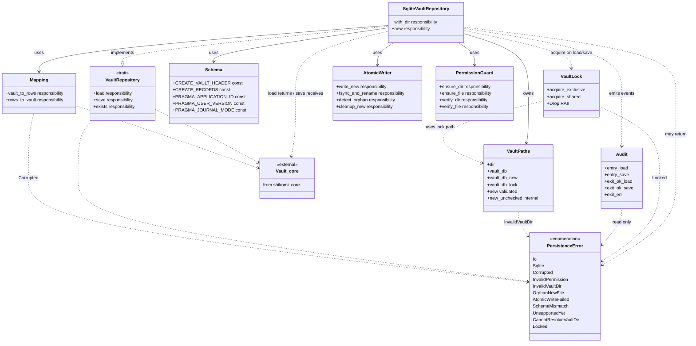
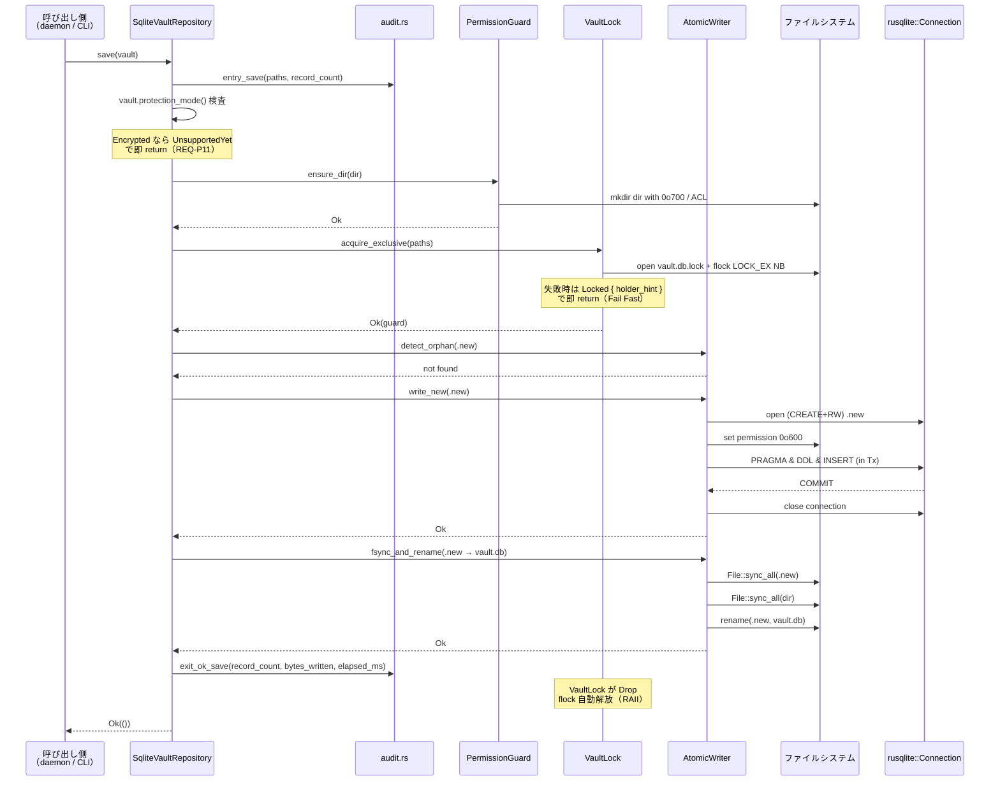
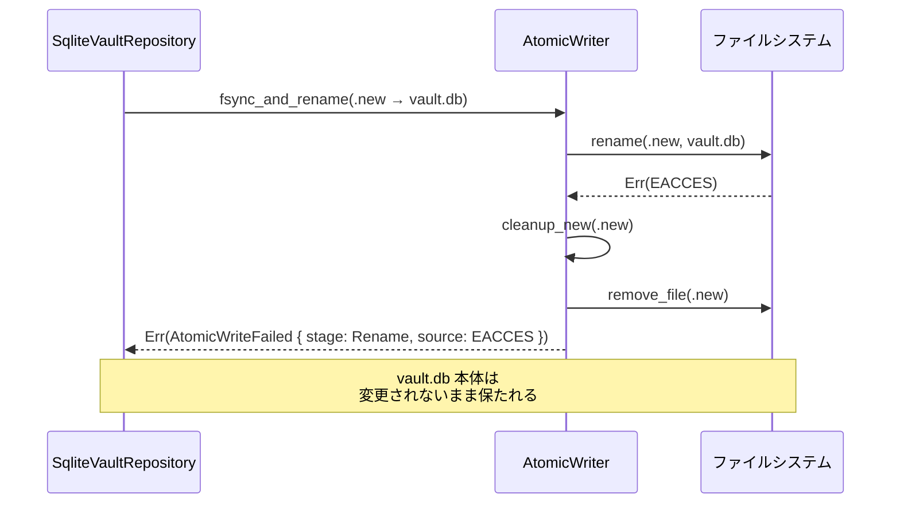
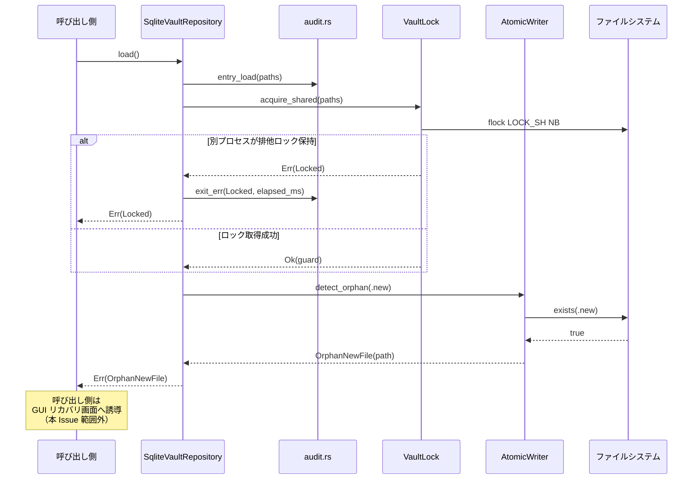
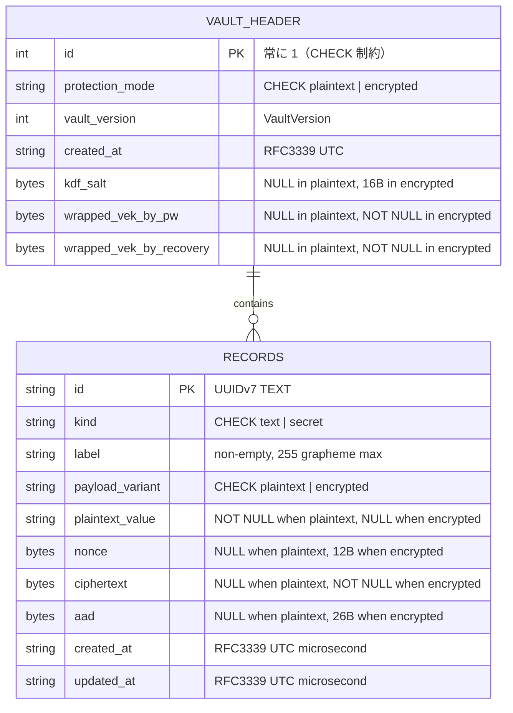

# 基本設計書

<!-- 詳細設計書とは別ファイル。統合禁止 -->
<!-- feature: vault-persistence / Issue #10 -->
<!-- 配置先: docs/features/vault-persistence/basic-design.md -->

## 記述ルール（必ず守ること）

基本設計に**疑似コード・サンプル実装（python/ts/go等の言語コードブロック）を書くな**。
ソースコードと二重管理になりメンテナンスコストしか生まない。

## モジュール構成

本 Issue は `shikomi-infra` crate 内部に `persistence` モジュールを追加する。`shikomi-core` に一切の変更を加えない（Clean Architecture の依存方向を厳守）。

| 機能ID | モジュール | ディレクトリ | 責務 |
|--------|----------|------------|------|
| REQ-P01 | `shikomi_infra::persistence` | `crates/shikomi-infra/src/persistence/mod.rs` | モジュールルート、公開 API の再エクスポート |
| REQ-P01 | `shikomi_infra::persistence::repository` | `crates/shikomi-infra/src/persistence/repository.rs` | `VaultRepository` trait 定義 |
| REQ-P02, P03, P04, P05, P11, P12 | `shikomi_infra::persistence::sqlite` | `crates/shikomi-infra/src/persistence/sqlite/mod.rs` | `SqliteVaultRepository` 実装の入口、トランザクション制御 |
| REQ-P03 | 〃 `::schema` | `crates/shikomi-infra/src/persistence/sqlite/schema.rs` | `CREATE TABLE`・`CHECK` 制約・`PRAGMA` の SQL 定数 |
| REQ-P03, P09 | 〃 `::mapping` | `crates/shikomi-infra/src/persistence/sqlite/mapping.rs` | ドメイン型 ↔ SQLite 行の写像（シリアライズ / 検証付きデシリアライズ） |
| REQ-P04, P05 | 〃 `::atomic` | `crates/shikomi-infra/src/persistence/sqlite/atomic.rs` | atomic write（`.new` → fsync → rename）、`.new` 残存検出 |
| REQ-P06, P07 | `shikomi_infra::persistence::permission` | `crates/shikomi-infra/src/persistence/permission/mod.rs` | OS 非依存の検証 API。内部で `cfg_if!` により `unix.rs` / `windows.rs` へ委譲 |
| REQ-P06 | 〃 `::unix` | `crates/shikomi-infra/src/persistence/permission/unix.rs` | `cfg(unix)` のみ有効。`0o700` / `0o600` 設定・検証 |
| REQ-P07 | 〃 `::windows` | `crates/shikomi-infra/src/persistence/permission/windows.rs` | `cfg(windows)` のみ有効。NTFS ACL 設定・検証 |
| REQ-P08 | `shikomi_infra::persistence::paths` | `crates/shikomi-infra/src/persistence/paths.rs` | `VaultPaths` 値オブジェクト（ディレクトリ / `vault.db` / `vault.db.new` / `vault.db.lock`）、**`SHIKOMI_VAULT_DIR` バリデーション（パストラバーサル・シンボリックリンク・保護領域拒否）** |
| REQ-P10 | `shikomi_infra::persistence::error` | `crates/shikomi-infra/src/persistence/error.rs` | `PersistenceError` と付随 Reason 列挙（`CorruptedReason` / `AtomicWriteStage` / `VaultDirReason`） |
| REQ-P13（新規） | `shikomi_infra::persistence::lock` | `crates/shikomi-infra/src/persistence/lock.rs` | `VaultLock`（プロセス間 advisory lock、RAII ハンドル、`fs4` バックエンド） |
| REQ-P14（新規） | `shikomi_infra::persistence::audit` | `crates/shikomi-infra/src/persistence/audit.rs` | `tracing` マクロのラッパ（`audit::entry_load` / `audit::entry_save` / `audit::exit_ok_load` / `audit::exit_ok_save` / `audit::exit_err` の **5 関数**）。load と save で終了時に記録する情報が異なる（load=`record_count`/`protection_mode`、save=`record_count`/`bytes_written`）ため終了ログは分離。秘密値を一切記録しない事実を型で保証（シグネチャが秘密型を受けない） |
| （エントリ） | `shikomi_infra` | `crates/shikomi-infra/src/lib.rs` | `pub mod persistence;` と再エクスポート |

```
ディレクトリ構造:
crates/shikomi-infra/src/
  lib.rs                                  # `pub mod persistence;`
  persistence/
    mod.rs                                # 再エクスポート、モジュール doc
    repository.rs                         # VaultRepository trait
    error.rs                              # PersistenceError + Reason 列挙
    paths.rs                              # VaultPaths 値オブジェクト + SHIKOMI_VAULT_DIR バリデーション
    lock.rs                               # VaultLock（RAII, fs4 バックエンド）
    audit.rs                              # tracing ラッパ（秘密値を含めない記録マクロ）
    permission/
      mod.rs                              # OS 非依存のエントリ API
      unix.rs                             # cfg(unix) 実装
      windows.rs                          # cfg(windows) 実装
    sqlite/
      mod.rs                              # SqliteVaultRepository 入口、トランザクション
      schema.rs                           # SQL 定数（CREATE TABLE / PRAGMA）
      mapping.rs                          # ドメイン型 ↔ 行写像
      atomic.rs                           # atomic write / .new 検出
```

**モジュール設計方針**:

- `repository.rs`（trait）と `sqlite/`（実装）を**ディレクトリで分離**する。将来テスト用 in-memory / 別 DB 実装を追加しても `sqlite/` 以外に影響しない（Open-Closed）
- `permission/` は OS 依存コードを集中させ、他モジュールから `cfg!` を追い出す（SRP）。`persistence/sqlite/` は OS 中立
- `schema.rs` は全 SQL リテラルを `const &str` で定義。文字列連結で組み立てる箇所を作らない（REQ-P12）
- `mapping.rs` は **1 関数 1 方向**（`vault_header_to_row` / `row_to_vault_header` / `record_to_row` / `row_to_record`）で責務を小さく保つ

## クラス設計（概要）

`VaultRepository` を trait として頂点に置き、`SqliteVaultRepository` が具象実装。メソッドシグネチャは詳細設計書を参照。



**設計判断メモ**:

- **`VaultRepository` は trait**: `shikomi-daemon` が `&dyn VaultRepository` で受けられるようにし、将来 in-memory 実装や暗号化対応実装への差替を可能にする（Open-Closed、Dependency Inversion）
- **`SqliteVaultRepository` は構造体 1 つ**: 内部で `VaultPaths` / `AtomicWriter` / `PermissionGuard` / `Mapping` / `Schema` を**委譲ベースで利用**する。継承は使わない（Composition over Inheritance）
- **`AtomicWriter` / `PermissionGuard` / `Mapping` は公開しない**: `pub(crate)` で `persistence` モジュール内部実装。外部から個別に呼び出せるのは `SqliteVaultRepository` 経由のみ
- **`PersistenceError` は `shikomi-core::DomainError` と独立**: ただし `DomainError` をラップするバリアントを持つ。ドメイン層エラーを握り潰さず保持する（Fail Fast + 原因追跡）

## 処理フロー

### REQ-P01 / REQ-P02 / REQ-P06 / REQ-P11: `SqliteVaultRepository::load()`

1. `VaultPaths` を取得（コンストラクタで既に解決済み）
2. `PermissionGuard::verify_dir(paths.dir)` でディレクトリパーミッション検証（不正なら `InvalidPermission` で即 return、Fail Fast）
3. `AtomicWriter::detect_orphan(paths.vault_db_new)` で `.new` 残存検出（残っていれば `OrphanNewFile` で即 return、REQ-P05）
4. `paths.vault_db` が存在しなければ `Ok(Vault::new(VaultHeader::new_plaintext(CURRENT, now)?))` 相当の**空 vault** を返さず、`Err(PersistenceError::Io(NotFound))` を返す（「初回起動」は呼出側が `exists()` で判断する責務、REQ-P01）
5. `paths.vault_db` のファイルパーミッション検証（不正なら `InvalidPermission`、REQ-P06）
6. `rusqlite::Connection::open(paths.vault_db)` で読み取り専用オープン（`OpenFlags::SQLITE_OPEN_READ_ONLY \| SQLITE_OPEN_NO_MUTEX`）
7. `PRAGMA application_id` と `PRAGMA user_version` を検証し、shikomi 形式と一致しなければ `SchemaMismatch` / `Corrupted` を返す
8. `vault_header` テーブルから 1 行取得、`Mapping::row_to_vault_header` で `VaultHeader` を構築
9. `vault_header.protection_mode = 'encrypted'` なら **`UnsupportedYet` を即 return**（REQ-P11）
10. `records` テーブルから全行取得、`Mapping::row_to_record` で `Record` を構築し `Vault::add_record` で集約に追加（ドメイン整合が自動検証）
11. `Vault` を返却

### REQ-P01 / REQ-P02 / REQ-P04 / REQ-P11: `SqliteVaultRepository::save(vault)`

1. `vault.protection_mode()` が `Encrypted` なら **`UnsupportedYet` を即 return**（REQ-P11、Fail Fast）
2. `PermissionGuard::ensure_dir(paths.dir)` でディレクトリ作成（既存なら `0o700` を強制、Windows は ACL 強制）
3. `AtomicWriter::detect_orphan(paths.vault_db_new)` で `.new` 残存検出（残っていれば `OrphanNewFile` を返し中断、ユーザ明示操作を待つ）
4. `AtomicWriter::write_new(paths.vault_db_new)` のスコープで一時 SQLite DB を作成:
   - `Connection::open_with_flags(OpenFlags::SQLITE_OPEN_CREATE \| SQLITE_OPEN_READ_WRITE \| SQLITE_OPEN_NO_MUTEX)`
   - **作成直後**にファイルパーミッションを `0o600` に設定（Unix） / 所有者 ACL 設定（Windows）
   - `PRAGMA application_id = 0x73686B6D`、`PRAGMA user_version = 1`、`PRAGMA journal_mode = DELETE` を発行
   - `Schema::CREATE_VAULT_HEADER` / `Schema::CREATE_RECORDS` で DDL 適用
   - **単一トランザクション**で `vault_header` に 1 行 insert、`records` に全レコード insert（`tx.execute_batch` ではなく `params!` バインドで個別 insert）
   - COMMIT
   - `Connection` drop（SQLite 内部 flush）
5. `AtomicWriter::fsync_and_rename`:
   - `.new` を再 open し `File::sync_all()`
   - 親ディレクトリを open し `File::sync_all()`（Unix で rename メタデータの永続化に必要、POSIX 2008）
   - `std::fs::rename(paths.vault_db_new, paths.vault_db)`（Unix）または `windows::Win32::Storage::FileSystem::ReplaceFileW`（Windows）
   - rename 失敗時は `.new` を削除し `AtomicWriteFailed { stage: Rename, ... }` を返す
6. `Ok(())`

### REQ-P01: `SqliteVaultRepository::exists()`

1. `paths.vault_db.try_exists()` の結果を `bool` として返却
2. I/O エラーは `Err(PersistenceError::Io)` で返す（`bool` に潰さない、Fail Fast）

### REQ-P08: `SqliteVaultRepository::new()` / `with_dir(PathBuf)`

1. `new()`: `std::env::var("SHIKOMI_VAULT_DIR")` を優先、なければ `dirs::data_dir()` で `$XDG_DATA_HOME/shikomi/` 等を解決。いずれも失敗なら `CannotResolveVaultDir` を返す。得られた候補パスを **`VaultPaths::new(dir)`（検証あり）** に通し、バリデーション違反は `InvalidVaultDir` を伝播する（§vault ディレクトリ検証）
2. `with_dir(dir)`: 受け取った `dir` を**無検証で** `VaultPaths::new_unchecked(dir)` に通して `VaultPaths` を構築する。**`#[doc(hidden)]` で公開 doc から隠蔽された内部・テスト専用 API**（一般開発者向けの正規 API は `new()`）。パス検証（パストラバーサル / シンボリックリンク）は呼出側の責務。パーミッション検証は `load`/`save` 冒頭で別途行う。詳細は `detailed-design/data.md` §モジュール別公開メソッド §`SqliteVaultRepository` を参照
3. 構築手段の分離:
   - `VaultPaths::new(dir) -> Result<Self, PersistenceError>` — **公開 API**、`new()` 専用。7 段階バリデーション（§vault ディレクトリ検証）を通す
   - `pub(crate) fn VaultPaths::new_unchecked(dir: PathBuf) -> Self` — **crate 内専用・infallible**。`with_dir` 専用。バリデーションをスキップしパスだけを派生させる（tempdir に対する無用な検証失敗を回避するため）。`pub(crate)` で crate 外からは呼べない
   - **根拠**: バリデーション済みパス前提の型（`VaultPaths`）が Result なしで構築されると、呼出側で検証漏れが起きる。`new_unchecked` を `pub(crate)` + 明示名で分けることで「検証を意図的にスキップしている」ことが型名で分かる（Tell, Don't Ask / Fail Safe by naming）

## シーケンス図

### `save` シーケンス（成功ケース）



### `save` シーケンス（異常系: rename 失敗時のクリーンアップ）



### `load` シーケンス（`.new` 残存検出、Locked 競合含む）



## アーキテクチャへの影響

`docs/architecture/` への変更は**発生しない**。根拠:

- `tech-stack.md` §2.1 で「永続化フォーマット = SQLite（`rusqlite` + SQLCipher 任意）」が確定済み。本 Issue は同項目の具体化
- `context/process-model.md` §4.3 で vault ヘッダの `protection_mode` フィールドが確定済み。本 Issue はその物理スキーマ化
- `context/threat-model.md` §7.1 で atomic write 手順が確定済み。本 Issue は実装
- `local.md` / `dev.md` / `production.md` / `environment-diff.md` はデスクトップ OSS で「該当なし」確定済み

ただし、本 Issue で新規に `[workspace.dependencies]` に追加する crate（`rusqlite` バンドル版・`dirs`・`windows`・`tempfile`）について、`Cargo.toml` への追記は本 PR に含める。`docs/architecture/tech-stack.md` の依存一覧セクション（もし該当項目があれば）に情報が追加されるが、**本 Issue で同一 PR 内に記載を更新する方針**（外部レビューで tech-stack が最新化されていることを人間が確認できるよう）。

## 外部連携

| 連携先 | 用途 | 認証方式 | タイムアウト / リトライ |
|-------|------|---------|-----------------------|
| OS ファイルシステム（POSIX / Win32） | vault.db 読み書き、パーミッション / ACL 操作、rename | プロセス権限（通常ユーザ） | タイムアウトなし（ローカル I/O）、リトライは行わず Fail Fast |
| OS 環境変数（`SHIKOMI_VAULT_DIR` / `XDG_DATA_HOME` / `HOME` / `APPDATA`） | vault ディレクトリ解決 | — | — |
| SQLite（`rusqlite` バンドル版） | vault.db 内部構造 | プロセス内、認証なし | — |

**外部 HTTP API・クラウドサービスは本 Issue で使用しない**。

## UX設計

該当なし — 理由: UI 不在のため該当なし。DX（開発者体験）の設計は「`VaultRepository` trait の簡潔な 3 メソッドシグネチャ」と「`PersistenceError` の排他バリアント」に集約し、`requirements.md` §API 仕様と `detailed-design/classes.md` のクラス図で表現する。リカバリ GUI（`.new` 残存時のユーザ操作）は別 Issue。

## セキュリティ設計

本 Issue は**パスワードと認証情報を初めてディスクに落とす層**であり、永続化境界の防御はここで決まる。`docs/architecture/context/threat-model.md` §7 / §7.0 / §7.1 に沿って脅威モデルを具体化する。

### 脅威モデル

| 想定攻撃者 | 攻撃経路 | 保護資産 | 対策 |
|-----------|---------|---------|------|
| 同ユーザ内の他プロセス（マルウェア等） | `~/.local/share/shikomi/vault.db` を直接 open | レコード平文（平文モード） | **OS パーミッション `0600` / ACL 所有者のみ**。REQ-P06 / P07 で強制・検証。ただし平文モードの残存リスク（§7.0）は暗号化オプトインで解除する設計判断としてユーザに明示 |
| 別ユーザ / root | 同上 | 同上 | 平文モードでは防御不能（§7.0 で明記）。暗号化モード（別 Issue）で対応 |
| 悪意あるスクリプトによる vault.db 差替え | `vault.db` を偽ファイルで上書き | レコード完全性 | 平文モードでは暗号学的改竄検出不可（AEAD がない、§7.0）。`PRAGMA application_id` で「shikomi 形式でない」ファイルは拒否するが、同形式の偽 vault は検出できない（受容リスク） |
| 電源断・クラッシュ | save 中の強制終了 | vault.db 本体の可用性 | **atomic write**（REQ-P04）: `.new` → fsync → rename。rename は POSIX atomic、`ReplaceFileW` は同一ボリューム内 atomic |
| 前回 save の `.new` 残存 | 前回クラッシュ痕 | vault.db の一貫性（古い vs 新しい） | **起動時検出**（REQ-P05）: `.new` が残っていたら `load` は `OrphanNewFile` を返し、ユーザ明示操作を待つ（Fail Secure、勝手に削除しない） |
| SQL インジェクション | 悪意ある label 文字列が SQL に連結される | vault.db 破壊・情報漏洩 | **parameter binding のみ**（REQ-P12）: `rusqlite::params!` マクロで全値をバインド。生 SQL 連結は全面禁止、grep と lint で検証 |
| ファイル差替えによる権限昇格 | 攻撃者が `0777` の vault.db を置く | データ改竄・読取 | 起動時のパーミッション検証（REQ-P06）で `0600` 以外を拒否。攻撃者が正しいパーミッションで作り直しても上記「悪意あるスクリプト」の枠（§7.0） |
| テンポラリファイル経由のレース | `.new` 作成から rename までの間に攻撃者が介入 | vault.db 差替え | `.new` は作成時に `0600` / ACL 所有者のみ。属しないトラスティが書込不可であることで TOCTOU を狭める。rename 自体は atomic |
| 起動時のドメイン整合性違反 | vault.db の行が壊れている | ドメイン不変条件 | **復元時検証**（REQ-P09）: 全 newtype の `try_new` を通す。`RecordId` / `RecordLabel` / `VaultHeader` / `RecordPayloadEncrypted` / `NonceBytes` / `KdfSalt` / `WrappedVek` 全て検証済み型でしか `Vault` に入らない |
| `SHIKOMI_VAULT_DIR` の悪用 | 環境変数で `../../etc` / `/proc/self/root` / シンボリックリンクを指定 | システム保護領域・任意ディレクトリへの書込、TOCTOU 差替え | **`VaultPaths::new` バリデーション**（§vault ディレクトリ検証）: 絶対パス必須、`..` 早期拒否、シンボリックリンク全面禁止、`canonicalize` 後の保護領域 prefix 一致拒否、ディレクトリ判定 |
| 並行書込レース（daemon 未起動時） | CLI / リカバリツール / 別 CLI が同時に `save` を呼ぶ | vault.db 壊れ、`.new` 錯綜 | **プロセス間 advisory lock**（`VaultLock::acquire_exclusive`）: `fs4` / `LockFileEx` で非ブロッキング排他取得、失敗時は `Locked { holder_hint }` で即 return（待機・再試行しない、Fail Fast） |
| ログ経由の秘密漏洩 | 開発者がデバッグで vault 内容を `tracing::info!("{:?}", record)` してしまう | plaintext_value / ciphertext / VEK が journal に流れる | 多層防御 — ①`SecretString`/`SecretBytes` の `Debug` は `"[REDACTED]"`（Issue #7）、②`audit.rs` 経由以外の tracing 呼出を clippy lint で禁止、③`PersistenceError::Display` は全バリアント秘密を含めない、④`tracing-test` による CI 検証（AC-13） |

### 監査ログ規約（`tracing` の使用ルール、OWASP A09 対応）

**目的**: 本 crate の全 I/O 操作に一貫した監査証跡を残し、かつ秘密値を一切ログに載せない。エラー調査・フォレンジック・退行検出を可能にする。記録は `tracing` crate のスパン / イベントで行い、daemon 側の subscriber 実装（別 Issue）に従ってフォーマット・出力先が決まる。

| 操作 | レベル | 記録タイミング | 必須フィールド | 禁止フィールド |
|-----|------|-------------|-------------|-------------|
| `load` エントリ | `info` | `SqliteVaultRepository::load` 冒頭 | `vault_dir`（絶対パス、秘密ではない） | レコード内容、パスワード、VEK |
| `load` 成功 | `info` | 戻り値 `Ok(vault)` 直前 | `record_count`, `protection_mode`, `elapsed_ms` | レコード内容、ラベル、plaintext_value |
| `save` エントリ | `info` | `SqliteVaultRepository::save` 冒頭 | `vault_dir`, `record_count`（入力 vault から） | ラベル、plaintext_value、ciphertext、nonce、aad |
| `save` 成功 | `info` | `Ok(())` 直前 | `record_count`, `elapsed_ms`, `bytes_written`（`.new` サイズ） | 同上 |
| `exists` 呼出 | `debug` | 戻り値直前 | `vault_dir`, `found: bool` | — |
| `PersistenceError` 全バリアント | `warn`（`InvalidPermission` / `OrphanNewFile` / `Locked` / `UnsupportedYet`）／ `error`（`Sqlite` / `Corrupted` / `AtomicWriteFailed` / `SchemaMismatch` / `Io` / `InvalidVaultDir` / `CannotResolveVaultDir`） | return の直前 | エラーバリアント名、`path`（秘密でない）、`stage`（atomic write 時）、`table`（Corrupted 時）、`reason`（列挙の variant 名のみ） | 下位 `#[source]` の `Debug` 文字列全体（`SecretString` の `Debug` は `"[REDACTED]"` 固定だが、SQLite エラーメッセージにパラメータ値が混入する可能性があるため、`source` は `display_redacted()` ヘルパ経由で記録し、SQL パラメータは `?` 化して記録） |
| atomic write 中間段階 | `debug` | 各 stage（`PrepareNew` / `WriteTemp` / `FsyncTemp` / `FsyncDir` / `Rename` / `CleanupOrphan`）遷移時 | `stage` 名、`elapsed_ms` | ファイル内容 |

**秘密値マスクの型保証**:

- `SecretString` / `SecretBytes` の `Debug` 実装は `shikomi-core` で `"[REDACTED]"` 固定（Issue #7 完了済み）。`tracing::info!` の `?value` / `%value` に誤って渡しても平文は出ない
- **防衛線として**: `audit.rs` モジュールが公開するのは以下の **5 関数**のみ（requirements.md REQ-P14 と整合）:
  - `audit::entry_load(paths: &VaultPaths)` — `load` 冒頭の info イベント発行
  - `audit::entry_save(paths: &VaultPaths, record_count: usize)` — `save` 冒頭の info イベント発行
  - `audit::exit_ok_load(record_count: usize, protection_mode: ProtectionMode, elapsed_ms: u64)` — load 成功時
  - `audit::exit_ok_save(record_count: usize, bytes_written: u64, elapsed_ms: u64)` — save 成功時
  - `audit::exit_err(err: &PersistenceError, elapsed_ms: u64)` — 全エラー経路の終了イベント（内部でバリアント→レベル写像）

  これら関数のシグネチャは `&VaultPaths`, `&PersistenceError`, `usize`, `u64`, `ProtectionMode` など**秘密を含まない型**のみ受け付ける。呼出側は `audit` モジュール経由でのみログを出す（直接 `tracing::info!` を vault payload に対して発行することを禁止、clippy の `disallowed-methods` lint で機械的に検証）
- **load と save の終了ログを分離する根拠**: load 成功時は `protection_mode` を記録（後続 daemon のモード遷移判定に使う）、save 成功時は `bytes_written` を記録（ディスク消費監視）。共通の `exit_ok` にまとめると `Option` まみれになり、型保証が緩む（YAGNI より Fail Safe by type を優先）
- `PersistenceError::Display` 実装は**全バリアント**で秘密値を含めない。バリアント内包値の `Display` が潜在的に秘密を漏らすケース（`Sqlite` の下位エラー等）は `display_redacted()` で SQL パラメータプレースホルダー（`?1`）と値マスク（`***`）に置換
- **検証（AC-13）**: `tracing-test` で 1 テスト内の全ログ文字列を収集 → `plaintext_value` / `ciphertext` / `SecretString::expose_secret` で得られる生文字列が 1 文字も現れないことを grep 検証

**監査ログと通常 I/O の分離**:

- 本 crate は**ログ出力先を選ばない**。`tracing` subscriber の設定は daemon / CLI / GUI 側の責務
- 監査証跡の保管場所（ファイルローテーション、改竄対策）は別 Issue（daemon Issue）で決定

### vault ディレクトリ検証（`VaultPaths::new` の設計、OWASP A01 対応）

**目的**: `SHIKOMI_VAULT_DIR` 環境変数による任意パス指定機能が悪用されないよう、危険なパスパターンを入口で拒否する。パストラバーサル・シンボリックリンク経由の権限昇格・システム保護領域への書込を設計レベルで排除する。

**検証アルゴリズム**（`VaultPaths::new(dir: PathBuf) -> Result<Self, PersistenceError>`）:

1. **絶対パス必須**: `dir.is_absolute()` が false なら `InvalidVaultDir { reason: NotAbsolute }` を即 return。相対パス起点で`..` を辿られる攻撃面を消す
2. **`..` 要素早期拒否**: `dir.components()` を走査し `Component::ParentDir` を含むなら `PathTraversal` で即 return。`canonicalize` 前の生値で判定することで、「存在しないパス経由の `..`」も確実に拒否
3. **シンボリックリンク検出**: `dir` 自身と全親要素に対し `fs::symlink_metadata` → `is_symlink()` で検査。1 つでもリンクが含まれれば `SymlinkNotAllowed` で即 return（`canonicalize` 後のリンク解決結果が保護領域外でも拒否、リンク先張替え攻撃対策）
4. **`canonicalize` 適用**: `fs::canonicalize(&dir)` で正規化。失敗なら `Canonicalize { source }`。ただしディレクトリがまだ存在しない初回起動シナリオでは、親ディレクトリの最長存在部分までを canonicalize し、存在しない末尾要素は通常の path join で結合（設計 §9: `SqliteVaultRepository::new` の初期化経路と整合）
5. **保護領域チェック**: canonicalize 結果のパスが `PROTECTED_PATH_PREFIXES_UNIX` / `PROTECTED_PATH_PREFIXES_WIN` のいずれかの prefix に match したら `ProtectedSystemArea { prefix }` で即 return。`C:\Windows` 等は case-insensitive 比較（Windows のパス規約）
6. **ディレクトリ判定**: 存在するなら `fs::metadata(&canonical)?.is_dir()` を検証、ファイルなら `NotADirectory` で即 return
7. **合格**: `VaultPaths { dir: canonical, vault_db: canonical.join("vault.db"), vault_db_new: canonical.join("vault.db.new"), vault_db_lock: canonical.join("vault.db.lock") }` を返す

**設計判断**:

- **`canonicalize` 前後で二段階検査**: `..` の早期拒否と `canonicalize` 後の保護領域チェックを両方行う理由は、`canonicalize` がシンボリックリンクを追って別の無害なパスに化ける可能性があるため（例: `/tmp/shikomi → /etc/shikomi`）。リンク自体を拒否することで TOCTOU を封じる
- **シンボリックリンク完全禁止**: 「vault ディレクトリは**ユーザーのデータディレクトリ直下の実ディレクトリ**である」という単純な契約を強制。リンク経由のパスは攻撃面として不要（個人利用 OSS の YAGNI）
- **`SHIKOMI_VAULT_DIR` 以外への適用**: `dirs::data_dir()` の戻り値も同じバリデーションを通す。OS が返すパスだから無検証で通すのは信頼の置き場所を誤る（Zero Trust）
- **`with_dir(PathBuf)`**: `#[doc(hidden)]` の内部 API は**バリデーションを通さない**。テスト tempdir を通す正当用途で無用な失敗を避ける。正規公開 API（`new()`）のみがバリデーションの責任を負う

### OWASP Top 10 対応

| # | カテゴリ | 対応状況 |
|---|---------|---------|
| A01 | Broken Access Control | **主対応** — ①vault ファイル / ディレクトリを OS パーミッション（Unix `0600`/`0700`）・NTFS ACL（所有者のみ）で保護、起動時検証（REQ-P06 / P07）。②`SHIKOMI_VAULT_DIR` の **パストラバーサル・シンボリックリンク・保護領域アクセスを `VaultPaths::new` で拒否**（§vault ディレクトリ検証、`InvalidVaultDir`）。③プロセス間 advisory lock（`VaultLock`）で daemon 未起動時の並行書込レースを封じる |
| A02 | Cryptographic Failures | **本 Issue 範囲外**（平文モード前提）。暗号化モードは別 Issue。ただし `kdf_salt` / `wrapped_vek_*` / `ciphertext` / `nonce` / `aad` のスキーマは先行定義し、将来の暗号化実装で atomic write・パーミッション層をそのまま再利用できる |
| A03 | Injection | **主対応** — 生 SQL 連結禁止、`rusqlite::params!` マクロ経由のみ（REQ-P12）。`PRAGMA` は静的リテラルのみ。コードレビュー + grep + clippy で機械的検証 |
| A04 | Insecure Design | **主対応** — atomic write / `.new` 残存検出 / Fail Secure（勝手に復旧しない）を設計レベルで強制。暗号化モードを静かにスキップせず `UnsupportedYet` で明示拒否（REQ-P11） |
| A05 | Security Misconfiguration | **主対応** — パーミッション設定を作成時に**強制**し、起動時に**検証**する。ユーザ誤設定を検知（REQ-P06 / P07）。`journal_mode=DELETE` を明示的に設定（WAL のチェックポイント不整合を避ける） |
| A06 | Vulnerable Components | `rusqlite` バンドル版（`features = ["bundled"]`）で外部 SQLite に依存しない。SQLite 本体のアドバイザリは `cargo deny` で検出。`windows` crate は Microsoft 公式 |
| A07 | Auth Failures | 対象外 — 本 Issue は認証ロジックを持たない。認証は暗号化モード（別 Issue）でマスターパスワード経由 |
| A08 | Data Integrity Failures | **主対応（部分）** — atomic write で部分書込を防ぐ。ドメイン再構築時に全 newtype 検証（REQ-P09）で整合性を担保。**暗号学的改竄検出**は本 Issue 範囲外（平文モードには AEAD がない、§7.0 で明示） |
| A09 | Logging Failures | **主対応** — `§監査ログ規約` で記録対象・レベル・秘密マスクルールを網羅。`audit.rs` 経由のみログを許可し clippy `disallowed-methods` で直接 `tracing::info!` 呼出を禁止。秘密型の `Debug` は Issue #7 で `"[REDACTED]"` 固定、`PersistenceError::Display` は全バリアントで秘密を含めない。検証は AC-13 で `tracing-test` により機械的に行う |
| A10 | SSRF | 対象外 — HTTP リクエストを発行しない |

## ER図

物理スキーマ（SQLite テーブル構造）を ER 図で表現する。両モード対応カラムを含む全体構成。



**整合性ルール**（SQLite `CHECK` 制約で物理レベルに強制、詳細 SQL は `detailed-design/data.md` §SQLite スキーマ詳細）:

- `vault_header` は 1 行のみ存在（`CHECK(id = 1)` + `PRIMARY KEY`）
- `protection_mode = 'plaintext'` のとき、暗号化カラム（`kdf_salt`, `wrapped_vek_*`）は全て `NULL`。それ以外は制約違反
- `protection_mode = 'encrypted'` のとき、暗号化カラムは全て `NOT NULL`。さらに `length(kdf_salt) = 16`
- `payload_variant = 'plaintext'` のとき、`plaintext_value` が `NOT NULL`、暗号文系列（`nonce`, `ciphertext`, `aad`）は `NULL`
- `payload_variant = 'encrypted'` のとき、`plaintext_value` は `NULL`、暗号文系列は全て `NOT NULL`。さらに `length(nonce) = 12`、`length(aad) = 26`
- 全 `records.payload_variant` が `vault_header.protection_mode` と一致する（**この論理制約は SQLite 側では TRIGGER を使わず**、load 後の `Vault::add_record` 呼出時に `VaultConsistencyError::ModeMismatch` で検出する。TRIGGER は migration 時の複雑化を招き YAGNI 違反になるため採用しない）

## エラーハンドリング方針

| 例外種別 | 処理方針 | ユーザーへの通知 |
|---------|---------|----------------|
| ファイル I/O 失敗（NotFound 以外） | `PersistenceError::Io` にラップ、`#[source]` で下位保持、即 return | 開発者向けエラー文面（UI は別 Issue で i18n 写像） |
| SQLite エラー（BUSY / LOCKED 含む） | `PersistenceError::Sqlite` にラップ、即 return | 同上 |
| ドメイン整合性違反（復元時） | `PersistenceError::Corrupted { table, row_key, domain_error }` にラップ | 同上。`row_key` で何番目の行が壊れているか特定可能 |
| パーミッション異常 | `PersistenceError::InvalidPermission` で即 return。**自動修復しない**（ユーザ明示操作を要求、Fail Secure） | 同上 |
| `.new` 残存 | `PersistenceError::OrphanNewFile` で即 return。**自動削除しない** | 同上。リカバリ UI で案内（別 Issue） |
| atomic write 失敗 | 発生 stage を `AtomicWriteStage` 列挙で区別、`.new` はベストエフォートで削除、`PersistenceError::AtomicWriteFailed` を返す | 同上 |
| スキーマ不一致（`application_id` / `user_version`） | `PersistenceError::SchemaMismatch` または `Corrupted`（前者は「別アプリの DB」、後者は「バージョン未知」）で区別 | 同上 |
| 暗号化モード vault | `PersistenceError::UnsupportedYet { feature, tracking_issue }` で即 return（Fail Fast） | 同上。別 Issue 進捗を tracking_issue で明示 |
| vault ディレクトリ解決失敗 | `PersistenceError::CannotResolveVaultDir` で即 return | 同上 |
| `SHIKOMI_VAULT_DIR` バリデーション違反 | `PersistenceError::InvalidVaultDir { path, reason: VaultDirReason }` で即 return（§vault ディレクトリ検証）。**自動で安全な別パスに fallback しない**（ユーザ明示修正を要求、Fail Secure） | 同上 |
| プロセス間 advisory lock 競合 | `PersistenceError::Locked { path, holder_hint }` で即 return（`VaultLock::acquire_{shared,exclusive}` 失敗時）。**待機・再試行しない**（ユーザに別プロセス終了を促す、Fail Fast） | 同上。CLI は holder_hint を表示して「`shikomi-daemon` などが稼働していないか確認してください」とガイド |
| 内部バグ（不変条件違反） | `debug_assert!` で検出、production では `tracing::error!` 後 panic | daemon がキャプチャ（別 Issue） |

**本 Issue での禁止事項**:

- `Result<T, String>` / `Result<T, Box<dyn Error>>` のようなエラー情報を失う型を公開 API で使わない
- `unwrap()` / `expect()` を本番コードパスで使わない（テスト以外）
- エラーを握り潰さない（`let _ = ...`, `if let Err(_) = ... {}` の無言通過禁止）
- `AtomicWriter::cleanup_new` でエラーが出た場合のみ `tracing::warn!` でログし続行（cleanup は best-effort、ただし元のエラーは必ず呼出側に伝播）
