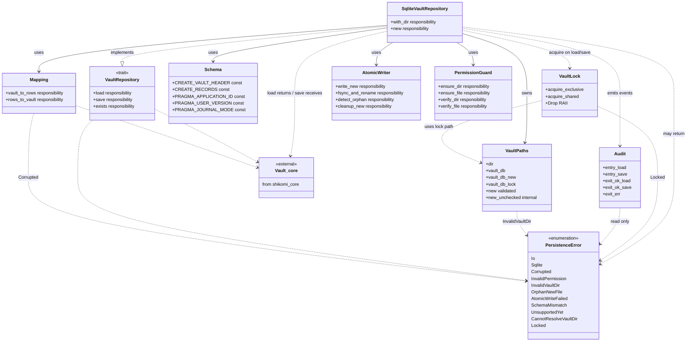
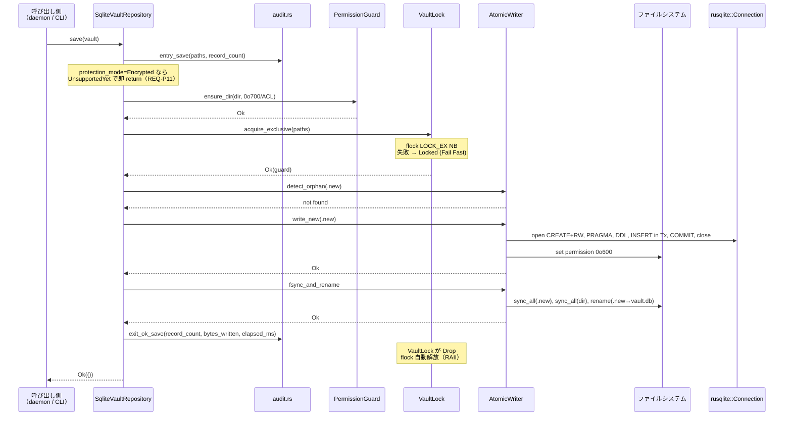
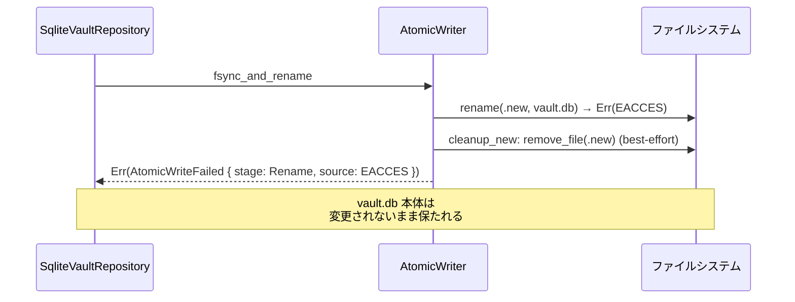
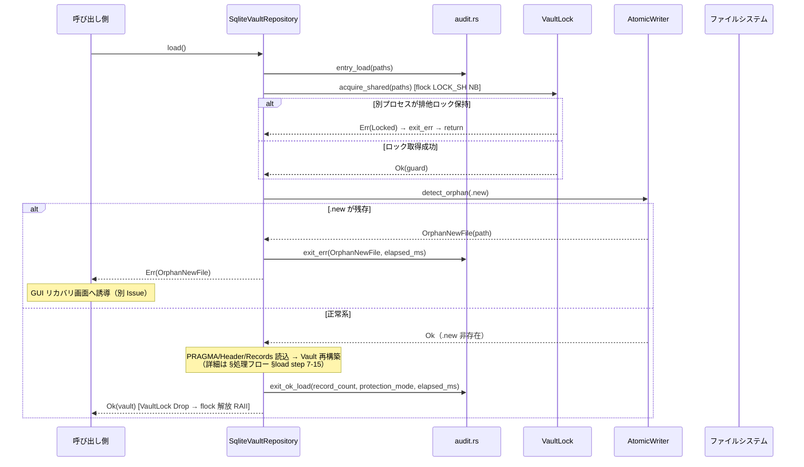
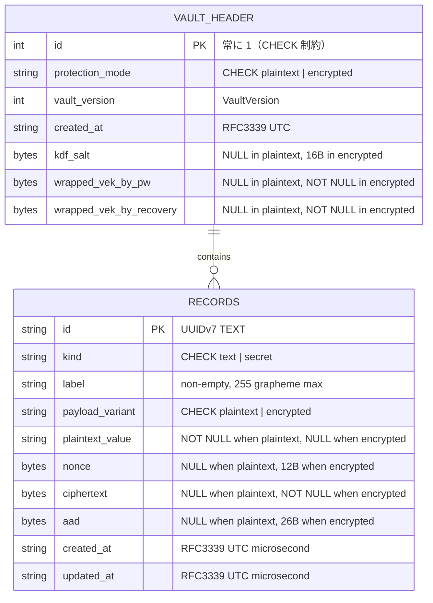

# 基本設計書 — index（モジュール / クラス / 処理フロー / シーケンス / 外部連携 / ER）

<!-- 詳細設計書とは別ファイル。統合禁止 -->
<!-- feature: vault-persistence / Issue #10 -->
<!-- 配置先: docs/features/vault-persistence/basic-design/index.md -->
<!-- 兄弟: ./security.md（セキュリティ設計）, ./error.md（エラーハンドリング方針） -->

## 記述ルール（必ず守ること）

基本設計に**疑似コード・サンプル実装（python/ts/go等の言語コードブロック）を書くな**。
ソースコードと二重管理になりメンテナンスコストしか生まない。

`basic-design.md` 単一ファイルの 500 行超えを避けるため、本基本設計は次の 3 ファイルに分割する（PR #15 レビューでペガサス指摘）:

| ファイル | 担当領域 |
|---------|---------|
| `index.md` | モジュール構成 / クラス設計（概要）/ 処理フロー / シーケンス図 / アーキテクチャへの影響 / 外部連携 / UX設計 / ER 図 |
| `security.md` | セキュリティ設計 / 脅威モデル / 監査ログ規約 / vault ディレクトリ検証 / Windows owner-only DACL / OWASP Top 10 / `unsafe_code` 整合方針 |
| `error.md` | エラーハンドリング方針 / 禁止事項 |

各ファイルは独立して読めるよう、内部参照は `./security.md §...` / `./error.md §...` 形式で記す。

## モジュール構成

本 Issue は `shikomi-infra` crate 内部に `persistence` モジュールを追加する。`shikomi-core` に一切の変更を加えない（Clean Architecture の依存方向を厳守）。

| 機能ID | モジュール | ディレクトリ | 責務 |
|--------|----------|------------|------|
| REQ-P01 | `shikomi_infra::persistence` | `crates/shikomi-infra/src/persistence/mod.rs` | モジュールルート、公開 API の再エクスポート |
| REQ-P01 | `shikomi_infra::persistence::repository` | `crates/shikomi-infra/src/persistence/repository.rs` | `VaultRepository` trait 定義 |
| REQ-P02, P03, P04, P05, P11, P12 | `shikomi_infra::persistence::sqlite` | `crates/shikomi-infra/src/persistence/sqlite/mod.rs` | `SqliteVaultRepository` 実装の入口、トランザクション制御 |
| REQ-P03 | 〃 `::schema` | `crates/shikomi-infra/src/persistence/sqlite/schema.rs` | `CREATE TABLE`・`CHECK` 制約・`PRAGMA` の SQL 定数 |
| REQ-P03, P09 | 〃 `::mapping` | `crates/shikomi-infra/src/persistence/sqlite/mapping.rs` | ドメイン型 ↔ SQLite 行の写像（シリアライズ / 検証付きデシリアライズ） |
| REQ-P04, P05 | 〃 `::atomic` | `crates/shikomi-infra/src/persistence/sqlite/atomic.rs` | atomic write（`.new` → fsync → rename）、`.new` 残存検出 |
| REQ-P06, P07 | `shikomi_infra::persistence::permission` | `crates/shikomi-infra/src/persistence/permission/mod.rs` | OS 非依存の検証 API。内部で `cfg_if!` により `unix.rs` / `windows.rs` へ委譲 |
| REQ-P06 | 〃 `::unix` | `crates/shikomi-infra/src/persistence/permission/unix.rs` | `cfg(unix)` のみ有効。`0o700` / `0o600` 設定・検証 |
| REQ-P07 | 〃 `::windows` | `crates/shikomi-infra/src/persistence/permission/windows.rs` | `cfg(windows)` のみ有効。NTFS owner-only DACL 設定・検証（`SetNamedSecurityInfoW` / `GetNamedSecurityInfoW`）。**本モジュールは本 Issue で スタブ → 本実装に置換**、関連ヘルパは `pub(super)` で同ファイル内に閉じる。unsafe boundary は**本ファイル内のみ**（`./security.md` §unsafe_code 整合方針 / §Windows owner-only DACL の適用戦略 と詳細設計 `detailed-design/classes.md` §13 を参照） |
| REQ-P08 | `shikomi_infra::persistence::paths` | `crates/shikomi-infra/src/persistence/paths.rs` | `VaultPaths` 値オブジェクト（ディレクトリ / `vault.db` / `vault.db.new` / `vault.db.lock`）、**`SHIKOMI_VAULT_DIR` バリデーション**（`./security.md` §vault ディレクトリ検証） |
| REQ-P10 | `shikomi_infra::persistence::error` | `crates/shikomi-infra/src/persistence/error.rs` | `PersistenceError` と付随 Reason 列挙（`CorruptedReason` / `AtomicWriteStage` / `VaultDirReason`） |
| REQ-P13 | `shikomi_infra::persistence::lock` | `crates/shikomi-infra/src/persistence/lock.rs` | `VaultLock`（プロセス間 advisory lock、RAII ハンドル、`fs4` バックエンド） |
| REQ-P14 | `shikomi_infra::persistence::audit` | `crates/shikomi-infra/src/persistence/audit.rs` | `tracing` マクロのラッパ（5 関数）。秘密値を一切記録しない事実を型で保証（`./security.md` §監査ログ規約） |
| （エントリ） | `shikomi_infra` | `crates/shikomi-infra/src/lib.rs` | `pub mod persistence;` と再エクスポート |

```
ディレクトリ構造:
crates/shikomi-infra/src/
  lib.rs                                  # `pub mod persistence;`
  persistence/
    mod.rs                                # 再エクスポート、モジュール doc
    repository.rs                         # VaultRepository trait
    error.rs                              # PersistenceError + Reason 列挙
    paths.rs                              # VaultPaths 値オブジェクト + SHIKOMI_VAULT_DIR バリデーション
    lock.rs                               # VaultLock（RAII, fs4 バックエンド）
    audit.rs                              # tracing ラッパ（秘密値を含めない記録マクロ）
    permission/
      mod.rs                              # OS 非依存のエントリ API
      unix.rs                             # cfg(unix) 実装
      windows.rs                          # cfg(windows) 実装、#![allow(unsafe_code)]
    sqlite/
      mod.rs                              # SqliteVaultRepository 入口、トランザクション
      schema.rs                           # SQL 定数（CREATE TABLE / PRAGMA）
      mapping.rs                          # ドメイン型 ↔ 行写像
      atomic.rs                           # atomic write / .new 検出
```

**モジュール設計方針**:

- `repository.rs`（trait）と `sqlite/`（実装）を**ディレクトリで分離**する。将来テスト用 in-memory / 別 DB 実装を追加しても `sqlite/` 以外に影響しない（Open-Closed）
- `permission/` は OS 依存コードを集中させ、他モジュールから `cfg!` を追い出す（SRP）。`persistence/sqlite/` は OS 中立
- `schema.rs` は全 SQL リテラルを `const &str` で定義。文字列連結で組み立てる箇所を作らない（REQ-P12）
- `mapping.rs` は **1 関数 1 方向**（`vault_header_to_row` / `row_to_vault_header` / `record_to_row` / `row_to_record`）で責務を小さく保つ

## クラス設計（概要）

`VaultRepository` を trait として頂点に置き、`SqliteVaultRepository` が具象実装。メソッドシグネチャは詳細設計書を参照。



**設計判断メモ**:

- **`VaultRepository` は trait**: `shikomi-daemon` が `&dyn VaultRepository` で受けられるようにし、将来 in-memory 実装や暗号化対応実装への差替を可能にする（Open-Closed、Dependency Inversion）
- **`SqliteVaultRepository` は構造体 1 つ**: 内部で `VaultPaths` / `AtomicWriter` / `PermissionGuard` / `Mapping` / `Schema` を**委譲ベースで利用**する。継承は使わない（Composition over Inheritance）
- **`AtomicWriter` / `PermissionGuard` / `Mapping` は公開しない**: `pub(crate)` で `persistence` モジュール内部実装。外部から個別に呼び出せるのは `SqliteVaultRepository` 経由のみ
- **`PersistenceError` は `shikomi-core::DomainError` と独立**: 下位ドメインエラーは `Corrupted` バリアント内の `#[source] source: Option<DomainError>` で保持する（旧 `DomainError` バリアント廃止・`Corrupted` に統合、詳細は `../detailed-design/classes.md` §設計判断 §12）。ドメイン層エラーを握り潰さず `#[source]` チェーンで辿れる（Fail Fast + 原因追跡）

## 処理フロー

### REQ-P01 / REQ-P02 / REQ-P06 / REQ-P11 / REQ-P13 / REQ-P14: `SqliteVaultRepository::load()`

1. `VaultPaths` を取得（コンストラクタで既に解決済み）
2. `audit::entry_load(&self.paths)` を発行（REQ-P14、開始ログ）
3. `PermissionGuard::verify_dir(paths.dir)` でディレクトリパーミッション検証（不正なら `InvalidPermission` で即 return、Fail Fast）
4. **`VaultLock::acquire_shared(&self.paths)?`** で共有ロック取得（REQ-P13）。別プロセスが排他ロック保持中なら `Locked` で即 return（非ブロッキング、待機しない）。取得した `VaultLock` は step 14 までスコープに生存し、drop 時に自動解放（RAII）
5. `AtomicWriter::detect_orphan(paths.vault_db_new)` で `.new` 残存検出（残っていれば `OrphanNewFile` で即 return、REQ-P05）
6. `paths.vault_db` が存在しなければ `Err(PersistenceError::Io(NotFound))` を返す（「初回起動」は呼出側が `exists()` で判断する責務、REQ-P01）
7. `paths.vault_db` のファイルパーミッション検証（不正なら `InvalidPermission`、REQ-P06）
8. `rusqlite::Connection::open(paths.vault_db)` で読み取り専用オープン（`OpenFlags::SQLITE_OPEN_READ_ONLY \| SQLITE_OPEN_NO_MUTEX`）
9. `PRAGMA application_id` と `PRAGMA user_version` を検証し、shikomi 形式と一致しなければ `SchemaMismatch` / `Corrupted` を返す
10. `vault_header` テーブルから 1 行取得、`Mapping::row_to_vault_header` で `VaultHeader` を構築
11. `vault_header.protection_mode = 'encrypted'` なら **`UnsupportedYet` を即 return**（REQ-P11）
12. `records` テーブルから全行取得、`Mapping::row_to_record` で `Record` を構築し `Vault::add_record` で集約に追加（ドメイン整合が自動検証）
13. `audit::exit_ok_load(record_count, protection_mode, elapsed_ms)` を発行（REQ-P14、成功ログ）
14. `VaultLock` が drop され共有ロックが自動解放される
15. `Vault` を返却

（任意 step で `Err` を return する直前に `audit::exit_err(&err, elapsed_ms)` を発行する、REQ-P14）

### REQ-P01 / REQ-P02 / REQ-P04 / REQ-P11 / REQ-P13 / REQ-P14: `SqliteVaultRepository::save(vault)`

1. `audit::entry_save(&self.paths, vault.record_count())` を発行（REQ-P14、開始ログ）
2. `vault.protection_mode()` が `Encrypted` なら **`UnsupportedYet` を即 return**（REQ-P11、Fail Fast）
3. `PermissionGuard::ensure_dir(paths.dir)` でディレクトリ作成（既存なら `0o700` を強制、Windows は ACL 強制）
4. **`VaultLock::acquire_exclusive(&self.paths)?`** で排他ロック取得（REQ-P13）。別プロセスが排他/共有ロックを保持中なら `Locked` で即 return（非ブロッキング、待機・再試行しない）。取得した `VaultLock` は step 7 までスコープに生存し、drop 時に自動解放（RAII）
5. `AtomicWriter::detect_orphan(paths.vault_db_new)` で `.new` 残存検出（残っていれば `OrphanNewFile` を返し中断、ユーザ明示操作を待つ、AC-14 の save 側検証）
6. `AtomicWriter::write_new(paths.vault_db_new)` のスコープで一時 SQLite DB を作成:
   - `Connection::open_with_flags(OpenFlags::SQLITE_OPEN_CREATE \| SQLITE_OPEN_READ_WRITE \| SQLITE_OPEN_NO_MUTEX)`
   - **作成直後**にファイルパーミッションを `0o600` に設定（Unix） / 所有者 ACL 設定（Windows）
   - `PRAGMA application_id = 0x73686B6D`、`PRAGMA user_version = 1`、`PRAGMA journal_mode = DELETE` を発行
   - `Schema::CREATE_VAULT_HEADER` / `Schema::CREATE_RECORDS` で DDL 適用
   - **単一トランザクション**で `vault_header` に 1 行 insert、`records` に全レコード insert（`tx.execute_batch` ではなく `params!` バインドで個別 insert）
   - COMMIT
   - `Connection` drop（SQLite 内部 flush）
7. `AtomicWriter::fsync_and_rename`:
   - `.new` を再 open し `File::sync_all()`
   - 親ディレクトリを open し `File::sync_all()`（Unix で rename メタデータの永続化に必要、POSIX 2008）
   - `std::fs::rename(paths.vault_db_new, paths.vault_db)`（Unix）または `windows::Win32::Storage::FileSystem::ReplaceFileW`（Windows）
   - rename 失敗時は `.new` を削除し `AtomicWriteFailed { stage: Rename, ... }` を返す
8. `audit::exit_ok_save(record_count, bytes_written, elapsed_ms)` を発行（REQ-P14、成功ログ）
9. `VaultLock` が drop され排他ロックが自動解放される
10. `Ok(())`

（任意 step で `Err` を return する直前に `audit::exit_err(&err, elapsed_ms)` を発行する、REQ-P14）

### REQ-P01: `SqliteVaultRepository::exists()`

1. `paths.vault_db.try_exists()` の結果を `bool` として返却
2. I/O エラーは `Err(PersistenceError::Io)` で返す（`bool` に潰さない、Fail Fast）

### REQ-P08: `SqliteVaultRepository::new()` / `with_dir(PathBuf)`

1. `new()`: `std::env::var("SHIKOMI_VAULT_DIR")` を優先、なければ `dirs::data_dir()` で `$XDG_DATA_HOME/shikomi/` 等を解決。いずれも失敗なら `CannotResolveVaultDir` を返す。得られた候補パスを **`VaultPaths::new(dir)`（検証あり）** に通し、バリデーション違反は `InvalidVaultDir` を伝播する（`./security.md` §vault ディレクトリ検証）
2. `with_dir(dir)`: 受け取った `dir` を**無検証で** `VaultPaths::new_unchecked(dir)` に通して `VaultPaths` を構築する。**`#[doc(hidden)]` で公開 doc から隠蔽された内部・テスト専用 API**（一般開発者向けの正規 API は `new()`）。パス検証（パストラバーサル / シンボリックリンク）は呼出側の責務。パーミッション検証は `load`/`save` 冒頭で別途行う。詳細は `../detailed-design/data.md` §モジュール別公開メソッド §`SqliteVaultRepository` を参照
3. 構築手段の分離: `VaultPaths::new`（公開・検証あり、`new()` 専用）と `VaultPaths::new_unchecked`（`pub(crate)` infallible、`with_dir` 専用、検証スキップ）を明示名で分ける。バリデーション済みパス前提の型が Result なしで構築されると検証漏れが起きるため、`new_unchecked` を明示名にして「意図的スキップ」を型で可視化（Fail Safe by naming）。詳細は `../detailed-design/data.md` §`VaultPaths`

## シーケンス図

### `save` シーケンス（成功ケース）



### `save` シーケンス（異常系: rename 失敗時のクリーンアップ）



### `load` シーケンス（`.new` 残存検出、Locked 競合含む）



## アーキテクチャへの影響

`docs/architecture/` への変更は**発生しない**。根拠:

- `tech-stack.md` §2.1 で「永続化フォーマット = SQLite（`rusqlite` + SQLCipher 任意）」が確定済み。本 Issue は同項目の具体化
- `context/process-model.md` §4.3 で vault ヘッダの `protection_mode` フィールドが確定済み。本 Issue はその物理スキーマ化
- `context/threat-model.md` §7.1 で atomic write 手順が確定済み。本 Issue は実装
- `local.md` / `dev.md` / `production.md` / `environment-diff.md` はデスクトップ OSS で「該当なし」確定済み

ただし、本 Issue で新規に `[workspace.dependencies]` に追加する crate を `Cargo.toml` に追記する。バージョン・feature・用途の完全表は `../requirements.md` §依存関係を参照。本 PR で追加する crate の要約:

- **本体**: `rusqlite`（bundled）/ `dirs` / `thiserror` / `cfg-if` / `time` / `uuid`
- **REQ-P13**: `fs4`（`sync` feature、プロセス間 advisory lock。`fs2` は 2018 以降停止のため fork 後継の `fs4` を採用、OWASP A06 対応）
- **REQ-P14**: `tracing`（監査ログ、`audit.rs` 経由のみ使用）
- **Windows のみ**: `windows`（`Win32_Security_Authorization` / `Win32_Security` / `Win32_Foundation` / `Win32_Storage_FileSystem` / `Win32_System_Threading`、NTFS owner-only DACL・`ReplaceFileW`・`LockFileEx`）
- **dev-deps**: `tempfile`（tempdir）／ `tracing-test`（AC-15 秘密漏洩検証）／ `serial_test`（`std::env::set_var` の直列化）

`docs/architecture/tech-stack.md` への情報追加は同一 PR 内で行う方針（外部レビューで tech-stack の最新化を確認可能にする）。

## 外部連携

| 連携先 | 用途 | 認証方式 | タイムアウト / リトライ |
|-------|------|---------|-----------------------|
| OS ファイルシステム（POSIX / Win32） | vault.db 読み書き、パーミッション / ACL 操作、rename | プロセス権限（通常ユーザ） | タイムアウトなし（ローカル I/O）、リトライは行わず Fail Fast |
| OS 環境変数（`SHIKOMI_VAULT_DIR` / `XDG_DATA_HOME` / `HOME` / `APPDATA`） | vault ディレクトリ解決 | — | — |
| SQLite（`rusqlite` バンドル版） | vault.db 内部構造 | プロセス内、認証なし | — |

**外部 HTTP API・クラウドサービスは本 Issue で使用しない**。

## UX設計

該当なし — 理由: UI 不在のため該当なし。DX（開発者体験）の設計は「`VaultRepository` trait の簡潔な 3 メソッドシグネチャ」と「`PersistenceError` の排他バリアント」に集約し、`../requirements.md` §API 仕様と `../detailed-design/classes.md` のクラス図で表現する。リカバリ GUI（`.new` 残存時のユーザ操作）は別 Issue。

## ER図

物理スキーマ（SQLite テーブル構造）を ER 図で表現する。両モード対応カラムを含む全体構成。



**整合性ルール**（SQLite `CHECK` 制約で物理レベルに強制、詳細 SQL は `../detailed-design/data.md` §SQLite スキーマ詳細）:

- `vault_header` は 1 行のみ存在（`CHECK(id = 1)` + `PRIMARY KEY`）
- `protection_mode = 'plaintext'` のとき、暗号化カラム（`kdf_salt`, `wrapped_vek_*`）は全て `NULL`。それ以外は制約違反
- `protection_mode = 'encrypted'` のとき、暗号化カラムは全て `NOT NULL`。さらに `length(kdf_salt) = 16`
- `payload_variant = 'plaintext'` のとき、`plaintext_value` が `NOT NULL`、暗号文系列（`nonce`, `ciphertext`, `aad`）は `NULL`
- `payload_variant = 'encrypted'` のとき、`plaintext_value` は `NULL`、暗号文系列は全て `NOT NULL`。さらに `length(nonce) = 12`、`length(aad) = 26`
- 全 `records.payload_variant` が `vault_header.protection_mode` と一致する（**この論理制約は SQLite 側では TRIGGER を使わず**、load 後の `Vault::add_record` 呼出時に `VaultConsistencyError::ModeMismatch` で検出する。TRIGGER は migration 時の複雑化を招き YAGNI 違反になるため採用しない）
