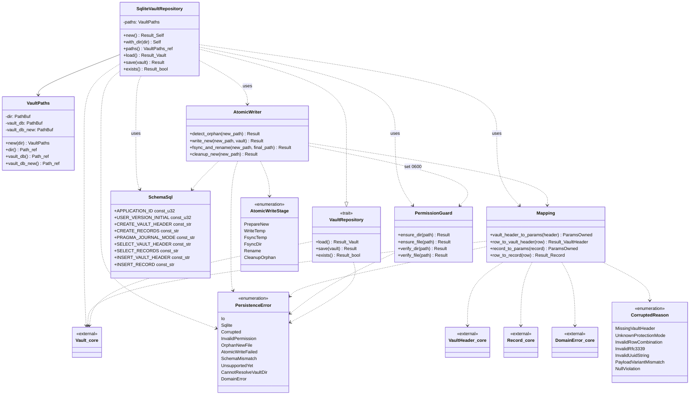

# 詳細設計書

<!-- 基本設計書とは別ファイル。統合禁止 -->
<!-- feature: vault-persistence / Issue #10 -->
<!-- 配置先: docs/features/vault-persistence/detailed-design.md -->

## 記述ルール（必ず守ること）

詳細設計に**疑似コード・サンプル実装（python/ts/go等の言語コードブロック）を書くな**。
ソースコードと二重管理になりメンテナンスコストしか生まない。

本書では Rust の関数シグネチャは**プレーンテキスト（インライン `code`）**で示し、実装本体は書かない。Mermaid クラス図と表と箇条書きで設計判断を記述する。

## クラス設計（詳細）

### 全体像

### 設計判断の補足

**1. なぜ `VaultRepository` を trait とし、`SqliteVaultRepository` を単体実装にするか**: 呼び出し側（`shikomi-daemon`）は trait オブジェクトで受け取り、テスト時は in-memory 実装や mock に差し替えられる（Dependency Inversion / Open-Closed）。本 Issue で in-memory 実装を同梱するかは**スコープ外**（YAGNI）だが、trait 境界は将来のテストダブル差替えに備えて分離。trait オブジェクト利用（`dyn VaultRepository`）を想定し、全 trait メソッドは `&self` / `&mut self` 不要の `&self` 設計（save は内部で `Connection` を都度 open）。

**2. なぜ `VaultPaths` は不変の値オブジェクトにするか**: `dir` から `vault.db` / `vault.db.new` のパスを派生させるロジックを**1 箇所**に閉じ込めるため。文字列結合を各所で書くと typo（`vault.dbnew` 等）の温床になる（DRY）。不変にすることで save 中の状態変化を防ぐ（Fail Fast）。

**3. なぜ `AtomicWriter` を別クラスに分離するか**: atomic write は「`.new` への書き込み」「fsync」「rename」「cleanup」の 4 段階があり、各段階で失敗時の責務が異なる。`SqliteVaultRepository::save` に直接書くと関数が 100 行超えになり SRP 違反。`AtomicWriter` は**状態を持たない**（メソッドはいずれも引数の `&VaultPaths` と `&Vault` から計算）、`impl AtomicWriter` の関連関数のみで構成（実質 modulized namespace）。

**4. なぜ `PermissionGuard` を別クラスに分離するか**: OS 別実装（Unix / Windows）を `cfg(unix)` / `cfg(windows)` で切り分けるが、`SqliteVaultRepository` の制御フローを OS 依存にしたくない。`PermissionGuard` が OS 非依存の 4 メソッド（`ensure_dir` / `ensure_file` / `verify_dir` / `verify_file`）を公開し、内部で `cfg_if!` で実装選択（Dependency Inversion の OS レベル適用）。

**5. なぜ `Mapping` を構造体ではなく関連関数の集合にするか**: 写像は**副作用なし・状態なし**の純関数。構造体でラップすると不要なインスタンス生成が発生する（YAGNI）。`Mapping` は空構造体（zero-sized type）にし、関連関数 `Mapping::vault_header_to_params` のようにドット記法で呼び出す（namespace 機能のみ）。

**6. なぜ SQLite トランザクションを `save` 全体でなく「`.new` への書込」で閉じるか**: atomic write 方式は **SQLite トランザクションに頼らず**、ファイルシステムの rename で atomicity を担保する。SQLite トランザクションは `.new` 書込中の一貫性のためだけに使う（複数の `INSERT` が途中で失敗しても `.new` が不完全な状態で残らないことを保証）。rename 失敗時は `.new` 丸ごと削除すれば良いので、SQLite レベルでは単純な 1 トランザクション。

**7. なぜ暗号化モード vault を早期リターンにし、レコード行を読ませないか**: `UnsupportedYet` を返す前に `records` テーブルから BLOB を読むと、万が一スキーマ不整合が起きていた場合に `Corrupted` エラーが優先され、本来知りたい「暗号化モードはまだ未対応」というメッセージが隠れる。ユーザ/呼出側が次にすべき行動が「別 Issue の進捗を待つ」であることを明示するため、最短経路で `UnsupportedYet` を返す（Fail Fast + 診断性）。

**8. なぜ `.new` 残存検出を `load` 側で行うか**: save 側で検出すれば前回の失敗を即座に reported できるが、それだと**前回 save の失敗以降、1 度も `load` されていない状況**で `.new` が放置される。`load` は必ず daemon 起動時に呼ばれるため、ここでの検出が確実。save 側でも一応検出する（step 3）が、それは「前回の失敗痕をユーザが放置したまま新たな save を始めた」という特殊ケースの保険。

**9. なぜ親ディレクトリの `fsync` が必要か**: POSIX 2008 で、`rename(2)` のメタデータ更新はディレクトリの `fsync` で永続化することが要求される。これを怠ると「ファイル本体はディスクに書かれたが rename はまだ」という状態で電源断が起きた場合、リブート後に `.new` が残ったまま `vault.db` は古いままという不整合が起きる。Linux / macOS 共に `File::open(dir).sync_all()` で対応。Windows は `ReplaceFileW` が内部でメタデータ flush するため不要。

**10. なぜ `SqliteVaultRepository::save(&self, ...)` か（`&mut self` でない）**: 内部で `Connection` を都度 open するため、`self` 自体には可変状態がない。`&self` なら `Arc<dyn VaultRepository>` で daemon / CLI 間の共有が容易になる。SQLite ファイルへの並行書込は**プロセス内の別スレッドから起きないこと**を daemon のシングルインスタンス保証（`context/process-model.md` §4.1）で担保する。

## データ構造

### 定数・境界値

| 名前 | 型 | 用途 | 値 |
|------|---|------|------|
| `SchemaSql::APPLICATION_ID` | `u32` | `PRAGMA application_id`。"shkm" のバイト列 | `0x73_68_6B_6D` |
| `SchemaSql::USER_VERSION_INITIAL` | `u32` | `PRAGMA user_version`。本 Issue のスキーマ世代 | `1` |
| `SchemaSql::USER_VERSION_SUPPORTED_MIN` | `u32` | 読込み時の下限 | `1` |
| `SchemaSql::USER_VERSION_SUPPORTED_MAX` | `u32` | 読込み時の上限 | `1` |
| `VAULT_DB_FILENAME` | `&'static str` | vault ファイル名 | `"vault.db"` |
| `VAULT_DB_NEW_FILENAME` | `&'static str` | atomic write 中間ファイル名 | `"vault.db.new"` |
| `DIR_MODE_UNIX` | `u32` | ディレクトリの期待 mode（Unix） | `0o700` |
| `FILE_MODE_UNIX` | `u32` | ファイルの期待 mode（Unix） | `0o600` |
| `MODE_MASK_UNIX` | `u32` | mode 比較時に有効な下位 bit | `0o777` |
| `ENV_VAR_VAULT_DIR` | `&'static str` | 環境変数名 | `"SHIKOMI_VAULT_DIR"` |
| `APP_SUBDIR_NAME` | `&'static str` | `dirs::data_dir()` 下のサブディレクトリ | `"shikomi"` |
| `TRACKING_ISSUE_ENCRYPTED_VAULT` | `u32` | `UnsupportedYet` で参照する tracking issue 番号（本 Issue 次の暗号化 Issue） | 発行後に確定、本 Issue 設計段階では **TBD** として定数化し TBD 値は `0` で placehold。**実装段階で暗号化 Issue が発行されたら値を差替え、必ず commit 前に確定**する |

**日時表現**:

- SQLite `TEXT` カラムに RFC3339 UTC 文字列で保存。形式: `YYYY-MM-DDTHH:MM:SS.ssssssZ`（マイクロ秒 6 桁、`Z` 固定）
- 書込時は `time::OffsetDateTime` を UTC に変換し、マイクロ秒に切り捨てたうえで `format_description::well_known::Rfc3339` で出力
- 読込時は `OffsetDateTime::parse` で復元。パース失敗は `Corrupted { reason: InvalidRfc3339, ... }` でラップ
- **マイクロ秒丸め**は `docs/features/vault/detailed-design.md` §バイナリ正規形仕様と整合（AAD の 26 byte レイアウトが前提とするため、暗号化モード時の round-trip で壊れないように本 Issue の段階からマイクロ秒粒度を強制）

### 公開 API（`shikomi_infra::persistence` からの再エクスポート一覧）

`shikomi_infra::persistence::` 直下からアクセス可能にする型:

- `VaultRepository`（trait）
- `SqliteVaultRepository`（具象実装）
- `VaultPaths`
- `PersistenceError`, `CorruptedReason`, `AtomicWriteStage`

**公開しないもの**:

- `AtomicWriter`, `PermissionGuard`, `Mapping`, `SchemaSql`: 全て `pub(crate)`（モジュール内部実装）
- OS 別実装（`permission::unix` / `permission::windows`）: `pub(super)` のみ

### モジュール別公開メソッドのシグネチャ（要点）

Rust のシグネチャをインラインで示す。`Result` は `Result<_, PersistenceError>` の略記。

`VaultRepository` trait:
- `fn load(&self) -> Result<Vault>`
- `fn save(&self, vault: &Vault) -> Result<()>`
- `fn exists(&self) -> Result<bool>`

（trait オブジェクト利用のため `&self` 固定。`Send + Sync` 境界は trait 定義側では課さず、実装側と呼出側が必要に応じて要求する）

`SqliteVaultRepository`:
- `impl SqliteVaultRepository`:
  - `pub fn new() -> Result<Self, PersistenceError>` — OS 標準 vault ディレクトリで構築
  - `pub fn with_dir(dir: PathBuf) -> Self` — 明示ディレクトリで構築（テスト・CI 向け、失敗しない。パーミッション検証は `load`/`save` 冒頭で行う）
  - `pub fn paths(&self) -> &VaultPaths`
- `impl VaultRepository for SqliteVaultRepository`:
  - `load`, `save`, `exists`（trait シグネチャに従う）

`VaultPaths`:
- `pub fn new(dir: PathBuf) -> Self`
- `pub fn dir(&self) -> &Path`
- `pub fn vault_db(&self) -> &Path`
- `pub fn vault_db_new(&self) -> &Path`

`PersistenceError`（`thiserror::Error` derive）:
- バリアントは `CorruptedReason` / `AtomicWriteStage` を内包する（下記「エラー型詳細」参照）
- `#[source]` で下位 error を保持
- `From<std::io::Error>` / `From<rusqlite::Error>` / `From<shikomi_core::DomainError>` を手動実装し、`?` 演算子で透過的に伝播

`PermissionGuard`（`pub(crate)`、関連関数の集合）:
- `fn ensure_dir(path: &Path) -> Result<()>` — 作成時に `0o700` / 所有者 ACL を**強制設定**
- `fn ensure_file(path: &Path) -> Result<()>` — 作成済みファイルに `0o600` / 所有者 ACL を設定
- `fn verify_dir(path: &Path) -> Result<()>` — 既存ディレクトリの mode / ACL を検証
- `fn verify_file(path: &Path) -> Result<()>` — 既存ファイルの mode / ACL を検証

`AtomicWriter`（`pub(crate)`、関連関数の集合、状態なし）:
- `fn detect_orphan(new_path: &Path) -> Result<()>` — `.new` が存在したら `Err(OrphanNewFile)`
- `fn write_new(paths: &VaultPaths, vault: &Vault) -> Result<()>` — `.new` 作成 → PRAGMA → DDL → Tx 内 insert → COMMIT → close。OS パーミッション設定を作成直後に行う
- `fn fsync_and_rename(paths: &VaultPaths) -> Result<()>` — `.new` を open し `sync_all`、親ディレクトリを open し `sync_all`、rename / ReplaceFileW
- `fn cleanup_new(new_path: &Path) -> Result<()>` — best-effort 削除。失敗時は `tracing::warn!` でログ、上位には伝播しない（呼出側のエラーを上書きしない）

`Mapping`（`pub(crate)`、関連関数の集合、状態なし）:
- `fn vault_header_to_params(header: &VaultHeader) -> HeaderParams` — insert 用パラメータ束を作る
- `fn row_to_vault_header(row: &rusqlite::Row) -> Result<VaultHeader, PersistenceError>`
- `fn record_to_params<'a>(record: &'a Record) -> RecordParams<'a>` — insert 用パラメータ束
- `fn row_to_record(row: &rusqlite::Row) -> Result<Record, PersistenceError>`

（`HeaderParams` / `RecordParams` は `rusqlite::params!` を組み立てるための内部型。`pub(crate)` で外部に漏らさない）

`SchemaSql`（`pub(crate)`、定数のみ）:
- `pub(crate) const CREATE_VAULT_HEADER: &str` — `CREATE TABLE IF NOT EXISTS vault_header ...`
- `pub(crate) const CREATE_RECORDS: &str`
- `pub(crate) const PRAGMA_JOURNAL_MODE: &str = "PRAGMA journal_mode = DELETE;"`
- `pub(crate) const PRAGMA_APPLICATION_ID_SET: &str`
- `pub(crate) const PRAGMA_USER_VERSION_SET: &str`
- `pub(crate) const PRAGMA_APPLICATION_ID_GET: &str = "PRAGMA application_id;"`
- `pub(crate) const PRAGMA_USER_VERSION_GET: &str = "PRAGMA user_version;"`
- `pub(crate) const SELECT_VAULT_HEADER: &str`
- `pub(crate) const SELECT_RECORDS_ORDERED: &str`（`ORDER BY created_at ASC, id ASC` で決定的順序）
- `pub(crate) const INSERT_VAULT_HEADER: &str`
- `pub(crate) const INSERT_RECORD: &str`

全 SQL リテラルは **const**。コンパイル時に解決され、実行時に文字列連結される箇所を作らない（REQ-P12）。

### SQLite スキーマ詳細（DDL）

**`vault_header` テーブル**（1 行固定、`id = 1` で強制）:

| カラム | 型 | NULL | 制約 |
|-------|---|------|------|
| `id` | `INTEGER` | NOT NULL | `PRIMARY KEY CHECK(id = 1)` |
| `protection_mode` | `TEXT` | NOT NULL | `CHECK(protection_mode IN ('plaintext', 'encrypted'))` |
| `vault_version` | `INTEGER` | NOT NULL | `CHECK(vault_version >= 1)` |
| `created_at` | `TEXT` | NOT NULL | — |
| `kdf_salt` | `BLOB` | NULL 可 | 以下の 1 つの CHECK で強制 |
| `wrapped_vek_by_pw` | `BLOB` | NULL 可 | 同上 |
| `wrapped_vek_by_recovery` | `BLOB` | NULL 可 | 同上 |

**テーブル CHECK 制約**（`CREATE TABLE ... CHECK(...)` に集約）:

- `(protection_mode = 'plaintext' AND kdf_salt IS NULL AND wrapped_vek_by_pw IS NULL AND wrapped_vek_by_recovery IS NULL) OR (protection_mode = 'encrypted' AND kdf_salt IS NOT NULL AND length(kdf_salt) = 16 AND wrapped_vek_by_pw IS NOT NULL AND length(wrapped_vek_by_pw) >= 32 AND wrapped_vek_by_recovery IS NOT NULL AND length(wrapped_vek_by_recovery) >= 32)`
- wrapped VEK の最小長 32 byte は「AES-256-GCM の wrap 出力 = `VEK 32B + tag 16B = 48B` 最低」を緩めに下限チェック。暗号化モード対応 Issue で正確な長さ検証に差し替え可能

**`records` テーブル**:

| カラム | 型 | NULL | 制約 |
|-------|---|------|------|
| `id` | `TEXT` | NOT NULL | `PRIMARY KEY`、UUIDv7 文字列 |
| `kind` | `TEXT` | NOT NULL | `CHECK(kind IN ('text', 'secret'))` |
| `label` | `TEXT` | NOT NULL | `CHECK(length(label) > 0)` |
| `payload_variant` | `TEXT` | NOT NULL | `CHECK(payload_variant IN ('plaintext', 'encrypted'))` |
| `plaintext_value` | `TEXT` | NULL 可 | テーブル CHECK で variant と相関 |
| `nonce` | `BLOB` | NULL 可 | 同上 |
| `ciphertext` | `BLOB` | NULL 可 | 同上 |
| `aad` | `BLOB` | NULL 可 | 同上 |
| `created_at` | `TEXT` | NOT NULL | — |
| `updated_at` | `TEXT` | NOT NULL | — |

**テーブル CHECK 制約**:

- `(payload_variant = 'plaintext' AND plaintext_value IS NOT NULL AND nonce IS NULL AND ciphertext IS NULL AND aad IS NULL) OR (payload_variant = 'encrypted' AND plaintext_value IS NULL AND nonce IS NOT NULL AND length(nonce) = 12 AND ciphertext IS NOT NULL AND length(ciphertext) > 0 AND aad IS NOT NULL AND length(aad) = 26)`

**インデックス**: 初期スキーマでは不要（`id` の PK インデックスのみ）。レコード件数は個人利用で数百〜数千、`SELECT_RECORDS_ORDERED` は full scan で p95 50 ms を満たす（非機能要求）。将来レコード数が増えた場合は `(updated_at)` インデックス等を別 Issue で追加。

### エラー型詳細

`PersistenceError` の各バリアントとフィールド:

| バリアント | フィールド | 発生箇所 |
|-----------|-----------|---------|
| `Io { path: PathBuf, #[source] source: std::io::Error }` | 対象パスと原因 | ファイルシステム操作 |
| `Sqlite { #[source] source: rusqlite::Error }` | — | SQLite API |
| `Corrupted { table: &'static str, row_key: Option<String>, reason: CorruptedReason, #[source] source: Option<shikomi_core::DomainError> }` | 対象テーブル名、特定できる場合は row PK（UUID 文字列）、原因分類、下位ドメインエラー | `Mapping::row_to_*` |
| `InvalidPermission { path: PathBuf, expected: &'static str, actual: String }` | 対象パス、期待値（例: `"0600"` or `"owner-only DACL"`）、実測（mode 数値文字列または DACL 要約） | `PermissionGuard::verify_*` |
| `OrphanNewFile { path: PathBuf }` | `.new` 絶対パス | `AtomicWriter::detect_orphan` |
| `AtomicWriteFailed { stage: AtomicWriteStage, #[source] source: std::io::Error }` | stage 列挙、下位 I/O error | `AtomicWriter::*` |
| `SchemaMismatch { expected_application_id: u32, found_application_id: u32, expected_version_range: (u32, u32), found_user_version: u32 }` | 期待値と実測値 | `SqliteVaultRepository::load` 冒頭 |
| `UnsupportedYet { feature: &'static str, tracking_issue: u32 }` | 未対応機能名、tracking issue 番号 | 暗号化モード検出時 |
| `CannotResolveVaultDir` | — | `SqliteVaultRepository::new` |
| `DomainError { #[source] source: shikomi_core::DomainError }` | ドメイン整合性違反のスルー（`Vault::add_record` 等） | `SqliteVaultRepository::load` でドメイン検証 |

`CorruptedReason` の各バリアント:

| バリアント | 意味 |
|-----------|------|
| `MissingVaultHeader` | `vault_header` テーブルに 0 行 |
| `UnknownProtectionMode { raw: String }` | CHECK 制約を抜けた不明値（通常は起こらないが破損検出用） |
| `InvalidRowCombination { detail: String }` | CHECK 制約を満たしているはずなのに組合せ不整合（SQLite 破損等の想定外） |
| `InvalidRfc3339 { column: &'static str, raw: String }` | RFC3339 パース失敗 |
| `InvalidUuidString { raw: String }` | UUIDv7 文字列パース失敗 |
| `PayloadVariantMismatch { expected: &'static str, got: &'static str }` | variant と NULL 組合せの不整合 |
| `NullViolation { column: &'static str }` | CHECK を抜けた NULL 検出（想定外） |

`AtomicWriteStage` の各バリアント:

| バリアント | 意味 |
|-----------|------|
| `PrepareNew` | `.new` 作成前の準備（親ディレクトリ作成等） |
| `WriteTemp` | `.new` への SQLite 書込中（open / PRAGMA / DDL / insert / COMMIT） |
| `FsyncTemp` | `.new` の `sync_all` |
| `FsyncDir` | 親ディレクトリの `sync_all` |
| `Rename` | `rename` / `ReplaceFileW` |
| `CleanupOrphan` | `.new` の削除失敗（best-effort） |

### load / save のアルゴリズム詳細（制御フロー）

**`SqliteVaultRepository::load(&self)`**:

1. `PermissionGuard::verify_dir(self.paths.dir())` — 失敗なら `InvalidPermission` を即 return
2. `AtomicWriter::detect_orphan(self.paths.vault_db_new())` — 残存なら `OrphanNewFile` を即 return
3. `self.paths.vault_db().try_exists()?` が `false` なら `Io { path, source: NotFound-like }` を即 return（「vault が無い」判定は `exists()` の責務）
4. `PermissionGuard::verify_file(self.paths.vault_db())` — 失敗なら `InvalidPermission` を即 return
5. `Connection::open_with_flags(self.paths.vault_db(), OpenFlags::SQLITE_OPEN_READ_ONLY | SQLITE_OPEN_NO_MUTEX)` — 失敗は `Sqlite` で return
6. `PRAGMA application_id` を `query_row`、取得値が `SchemaSql::APPLICATION_ID` でなければ `SchemaMismatch`
7. `PRAGMA user_version` を `query_row`、取得値が `[USER_VERSION_SUPPORTED_MIN, USER_VERSION_SUPPORTED_MAX]` 範囲外なら `SchemaMismatch`
8. `SELECT_VAULT_HEADER` を実行、0 行なら `Corrupted { reason: MissingVaultHeader }`、2 行以上は `CHECK(id=1)` により物理的に起きないが防御で `Corrupted { reason: InvalidRowCombination }`
9. `Mapping::row_to_vault_header(&row)` で `VaultHeader` を再構築（失敗は `Corrupted` or `DomainError`）
10. `VaultHeader::protection_mode() == ProtectionMode::Encrypted` なら **`UnsupportedYet { feature: "encrypted vault persistence", tracking_issue: TRACKING_ISSUE_ENCRYPTED_VAULT }` を即 return**（step 9 で得た `header` を使わず、records を読まない）
11. `Vault::new(header)` で集約を構築
12. `SELECT_RECORDS_ORDERED` を実行、各行を `Mapping::row_to_record` で `Record` に変換
13. 各 `Record` を `Vault::add_record` で集約に追加（**ドメイン側でモード整合とID重複が検証される**）。失敗は `DomainError` にラップして return
14. `Ok(vault)`

**`SqliteVaultRepository::save(&self, vault: &Vault)`**:

1. `vault.protection_mode() == ProtectionMode::Encrypted` なら **`UnsupportedYet { ... }` を即 return**（Fail Fast、step 2 以降のファイル操作を一切しない）
2. `PermissionGuard::ensure_dir(self.paths.dir())` — 作成 or 既存強制
3. `AtomicWriter::detect_orphan(self.paths.vault_db_new())` — 残存なら `OrphanNewFile` を return（ユーザ操作待ち）
4. `AtomicWriter::write_new(self.paths, vault)`:
   1. `File::create(new_path)` 相当の mode 指定 open（Unix: `OpenOptions::mode(0o600)`、Windows: 作成後に ACL 設定）
   2. file handle を drop（SQLite が同じパスを再 open できるようにする）
   3. `Connection::open_with_flags(new_path, SQLITE_OPEN_CREATE | SQLITE_OPEN_READ_WRITE | SQLITE_OPEN_NO_MUTEX)`
   4. `PermissionGuard::ensure_file(new_path)` — SQLite が open 時に mode を変えた場合の再強制
   5. `execute(PRAGMA_APPLICATION_ID_SET)`、`execute(PRAGMA_USER_VERSION_SET)`、`execute(PRAGMA_JOURNAL_MODE)`
   6. `execute(CREATE_VAULT_HEADER)`、`execute(CREATE_RECORDS)`
   7. `let tx = conn.transaction()?`
   8. `Mapping::vault_header_to_params(vault.header())` で params 取得、`tx.execute(INSERT_VAULT_HEADER, params)` 実行
   9. `for record in vault.records()`: `Mapping::record_to_params(record)` → `tx.execute(INSERT_RECORD, params)`
   10. `tx.commit()?`
   11. `drop(conn)`
5. `AtomicWriter::fsync_and_rename(self.paths)`:
   1. `File::open(new_path)?.sync_all()?`（`FsyncTemp`）
   2. `File::open(dir)?.sync_all()?`（`FsyncDir`、Unix のみ。Windows では no-op）
   3. `fs::rename(new_path, final_path)?` または `ReplaceFileW(..., REPLACEFILE_WRITE_THROUGH)`（`Rename`）
   4. 各段階で失敗したら `AtomicWriter::cleanup_new(new_path)` を呼び、best-effort で `.new` を削除。元のエラーを `AtomicWriteFailed { stage, source }` にラップして return
6. `Ok(())`

**`SqliteVaultRepository::exists(&self)`**:

1. `self.paths.vault_db().try_exists().map_err(|e| PersistenceError::Io { path: self.paths.vault_db().to_path_buf(), source: e })`

### OS 別パーミッション実装詳細

**Unix（`cfg(unix)`）**:

- `ensure_dir`: ディレクトリが存在しない場合は `fs::DirBuilder::new().recursive(true).mode(0o700).create(path)?`。存在する場合は `fs::set_permissions(path, Permissions::from_mode(0o700))?` で強制上書き
- `ensure_file`: `fs::set_permissions(path, Permissions::from_mode(0o600))?`
- `verify_dir`: `fs::metadata(path)?.permissions().mode() & 0o777 == 0o700` を検証
- `verify_file`: `fs::metadata(path)?.permissions().mode() & 0o777 == 0o600` を検証
- macOS / Linux で挙動は同一（`std::os::unix::fs` が共通 trait を提供）

**Windows（`cfg(windows)`）**:

- `ensure_dir` / `ensure_file`:
  1. `GetSidSubAuthorityCount` 等で現在のプロセスの所有者 SID を取得
  2. `BuildExplicitAccessWithNameW`（または `EXPLICIT_ACCESS_W` を直接構築）で所有者 SID に `GENERIC_READ | GENERIC_WRITE` を Allow
  3. `SetEntriesInAclW` で新 DACL を構築
  4. `SetNamedSecurityInfoW(path, SE_FILE_OBJECT, DACL_SECURITY_INFORMATION | PROTECTED_DACL_SECURITY_INFORMATION, ...)` で適用（継承を破棄）
- `verify_dir` / `verify_file`:
  1. `GetNamedSecurityInfoW` で DACL を取得
  2. `GetAclInformation` で ACE 数を取得
  3. 各 ACE を `GetAce` で取得、所有者 SID 以外のトラスティが **Allow ACE を持っていれば拒否**、所有者 SID の ACE に含まれる AccessMask が `GENERIC_READ | GENERIC_WRITE` 以外の権限（`GENERIC_EXECUTE`, `DELETE` 等）を含めば異常
- Windows の `ReplaceFileW`（`windows::Win32::Storage::FileSystem`）: `lpReplacementFileName = .new`, `lpReplacedFileName = vault.db`, `dwReplaceFlags = REPLACEFILE_WRITE_THROUGH`（内部で fsync 相当が走る）, `lpBackupFileName = null_ptr`（バックアップ不要）

### 具体的な SQL の要点（定数値の抜粋）

**`CREATE_VAULT_HEADER`**（1 行フォーマットで `const &str`、CHECK 制約を含む。以下は構造の要約、完全な SQL は実装ファイルで 1 箇所定義）:

- `CREATE TABLE IF NOT EXISTS vault_header(id INTEGER PRIMARY KEY CHECK(id = 1), protection_mode TEXT NOT NULL CHECK(protection_mode IN ('plaintext', 'encrypted')), vault_version INTEGER NOT NULL CHECK(vault_version >= 1), created_at TEXT NOT NULL, kdf_salt BLOB, wrapped_vek_by_pw BLOB, wrapped_vek_by_recovery BLOB, CHECK(...mode-col coherence...))`

**`CREATE_RECORDS`** 同様:

- `CREATE TABLE IF NOT EXISTS records(id TEXT PRIMARY KEY, kind TEXT NOT NULL CHECK(kind IN ('text', 'secret')), label TEXT NOT NULL CHECK(length(label) > 0), payload_variant TEXT NOT NULL CHECK(payload_variant IN ('plaintext', 'encrypted')), plaintext_value TEXT, nonce BLOB, ciphertext BLOB, aad BLOB, created_at TEXT NOT NULL, updated_at TEXT NOT NULL, CHECK(...variant-col coherence...))`

**`SELECT_RECORDS_ORDERED`**:

- `SELECT id, kind, label, payload_variant, plaintext_value, nonce, ciphertext, aad, created_at, updated_at FROM records ORDER BY created_at ASC, id ASC`

**`INSERT_VAULT_HEADER`**:

- `INSERT INTO vault_header(id, protection_mode, vault_version, created_at, kdf_salt, wrapped_vek_by_pw, wrapped_vek_by_recovery) VALUES (1, ?1, ?2, ?3, ?4, ?5, ?6)`

**`INSERT_RECORD`**:

- `INSERT INTO records(id, kind, label, payload_variant, plaintext_value, nonce, ciphertext, aad, created_at, updated_at) VALUES (?1, ?2, ?3, ?4, ?5, ?6, ?7, ?8, ?9, ?10)`

全 `?n` は `rusqlite::params!` マクロで**型付きバインド**する。`to_sql()` の Rust 型は以下の写像:

| ドメイン値 | Rust 型 | SQLite 型 | 備考 |
|----------|--------|----------|------|
| `ProtectionMode` | `&'static str`（`as_persisted_str()` の戻り） | `TEXT` | `"plaintext"` or `"encrypted"` |
| `VaultVersion` | `u16`（`value()`） | `INTEGER` | |
| `OffsetDateTime` | `String`（RFC3339 UTC） | `TEXT` | マイクロ秒丸め |
| `KdfSalt` | `&[u8]`（`as_array()`） | `BLOB` | NULL 可 |
| `WrappedVek` | `&[u8]`（`as_bytes()`） | `BLOB` | NULL 可 |
| `RecordId` | `String`（`Display` 経由） | `TEXT` | UUIDv7 ハイフン区切り |
| `RecordKind` | `&'static str` | `TEXT` | `"text"` or `"secret"` |
| `RecordLabel` | `&str`（`as_str()`） | `TEXT` | |
| `RecordPayload::Plaintext(SecretString)` | `&str`（`expose_secret()`） | `TEXT` | **`expose_secret` はここ 1 箇所のみ** |
| `RecordPayload::Encrypted(enc)` | `&[u8]`（nonce / ciphertext / aad） | `BLOB` | `Aad::to_canonical_bytes()` で 26B |

### テスト設計担当向けメモ（参考）

テスト担当（涅マユリ）が `test-design.md` を作成する際の参考観点:

- **Round-trip プロパティテスト**: ランダム生成の `Vault`（1〜100 件レコード、平文モード）を save → load し、`header` / `records` が等価
- **CHECK 制約違反テスト**: `rusqlite::Connection::execute` で CHECK を故意に破る生 SQL を実行し、SQLite が `SQLITE_CONSTRAINT_CHECK` エラーを返すことを確認（防衛線）
- **atomic write クラッシュテスト**: 子プロセスで save 中に `SIGKILL` → 親で `vault.db` が未変更 / `.new` 残存検出を検証
- **OS パーミッション テスト**: Unix で `chmod 644` → `load` が `InvalidPermission` を返す
- **暗号化モード vault**: `VaultHeader::new_encrypted` で作った `Vault` を save → `UnsupportedYet` が返る。暗号化モード vault.db（別 Issue 完成前に手動作成した fixture）を load → 同じく `UnsupportedYet`
- **破損 DB**: ゼロバイトファイル / 不正マジックバイト / 一部 SELECT 行の UUID 不正 → `Corrupted` / `SchemaMismatch` / `Sqlite` のいずれかが返り panic しない
- **ユニットテストと結合テストの境界**:
  - ユニット: `Mapping` の純関数（`row_to_*`）、`PermissionGuard::verify_*` の mode 比較ロジック
  - 結合: `SqliteVaultRepository::save` → `load` の round-trip（tempdir）、atomic write、OS パーミッション、`.new` 残存検出

## ビジュアルデザイン

該当なし — 理由: UI なし。本 crate は `shikomi-daemon` / `shikomi-cli` / `shikomi-gui` から呼ばれる永続化ライブラリ。エンドユーザーに見える画面はない。
