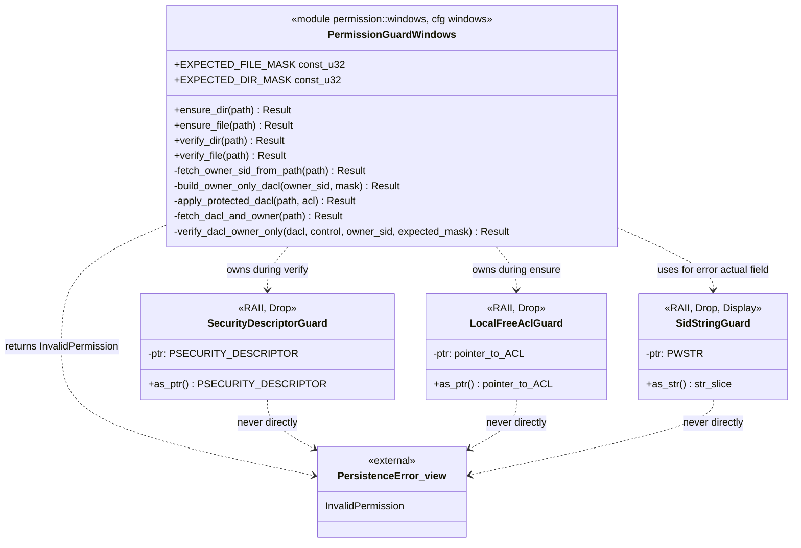

# 詳細設計 — クラス設計

<!-- feature: vault-persistence / Issue #10 -->
<!-- 配置先: docs/features/vault-persistence/detailed-design/classes.md -->
<!-- 上位文書: ./index.md -->

> **記述ルール**: 疑似コード・サンプル実装（python/ts/go等の言語コードブロック）を書かない。Rust のシグネチャはインライン `code` で示す。

## 全体像

```mermaid
classDiagram
    direction TB

    class VaultRepository {
        <<trait>>
        +load() Result_Vault
        +save(vault) Result
        +exists() Result_bool
    }

    class SqliteVaultRepository {
        -paths: VaultPaths
        +new() Result_Self
        +with_dir(dir) Self
        +paths() VaultPaths_ref
        +load() Result_Vault
        +save(vault) Result
        +exists() Result_bool
    }

    class VaultPaths {
        -dir: PathBuf
        -vault_db: PathBuf
        -vault_db_new: PathBuf
        -vault_db_lock: PathBuf
        +new(dir) Result_VaultPaths
        +new_unchecked(dir) VaultPaths
        +dir() Path_ref
        +vault_db() Path_ref
        +vault_db_new() Path_ref
        +vault_db_lock() Path_ref
    }

    class VaultLock {
        -file: File
        +acquire_exclusive(paths) Result_Self
        +acquire_shared(paths) Result_Self
    }

    class Audit {
        +entry_load(paths)
        +entry_save(paths, record_count)
        +exit_ok_load(record_count, protection_mode, elapsed_ms)
        +exit_ok_save(record_count, bytes_written, elapsed_ms)
        +exit_err(err, elapsed_ms)
    }

    class PermissionGuard {
        +ensure_dir(path) Result
        +ensure_file(path) Result
        +verify_dir(path) Result
        +verify_file(path) Result
    }

    class AtomicWriter {
        +detect_orphan(new_path) Result
        +write_new(new_path, vault) Result
        +fsync_and_rename(new_path, final_path) Result
        +cleanup_new(new_path) Result
    }

    class SchemaSql {
        +APPLICATION_ID const_u32
        +USER_VERSION_INITIAL const_u32
        +CREATE_VAULT_HEADER const_str
        +CREATE_RECORDS const_str
        +PRAGMA_JOURNAL_MODE const_str
        +SELECT_VAULT_HEADER const_str
        +SELECT_RECORDS const_str
        +INSERT_VAULT_HEADER const_str
        +INSERT_RECORD const_str
    }

    class Mapping {
        +vault_header_to_params(header) ParamsOwned
        +row_to_vault_header(row) Result_VaultHeader
        +record_to_params(record) ParamsOwned
        +row_to_record(row) Result_Record
    }

    class PersistenceError {
        <<enumeration>>
        Io
        Sqlite
        Corrupted
        InvalidPermission
        InvalidVaultDir
        OrphanNewFile
        AtomicWriteFailed
        SchemaMismatch
        UnsupportedYet
        CannotResolveVaultDir
        Locked
    }

    class CorruptedReason {
        <<enumeration>>
        MissingVaultHeader
        UnknownProtectionMode
        InvalidRowCombination
        InvalidRfc3339
        InvalidUuidString
        PayloadVariantMismatch
        NullViolation
    }

    class VaultDirReason {
        <<enumeration>>
        PathTraversal
        SymlinkNotAllowed
        NotAbsolute
        ProtectedSystemArea
        NotADirectory
        Canonicalize
    }

    class AtomicWriteStage {
        <<enumeration>>
        PrepareNew
        WriteTemp
        FsyncTemp
        FsyncDir
        Rename
        CleanupOrphan
    }

    class Vault_core {
        <<external>>
    }

    class VaultHeader_core {
        <<external>>
    }

    class Record_core {
        <<external>>
    }

    class DomainError_core {
        <<external>>
    }

    SqliteVaultRepository ..|> VaultRepository
    SqliteVaultRepository --> VaultPaths
    SqliteVaultRepository ..> VaultLock : acquire on load/save
    SqliteVaultRepository ..> Audit : emits events
    SqliteVaultRepository ..> PermissionGuard : uses
    SqliteVaultRepository ..> AtomicWriter : uses
    SqliteVaultRepository ..> Mapping : uses
    SqliteVaultRepository ..> SchemaSql : uses
    SqliteVaultRepository ..> PersistenceError
    SqliteVaultRepository ..> Vault_core
    VaultPaths ..> PersistenceError : InvalidVaultDir
    VaultLock ..> VaultPaths : uses lock path
    VaultLock ..> PersistenceError : Locked
    Audit ..> PersistenceError : read only
    AtomicWriter ..> Mapping
    AtomicWriter ..> SchemaSql
    AtomicWriter ..> PermissionGuard : set 0600
    AtomicWriter ..> AtomicWriteStage
    AtomicWriter ..> PersistenceError
    Mapping ..> Vault_core
    Mapping ..> VaultHeader_core
    Mapping ..> Record_core
    Mapping ..> DomainError_core
    Mapping ..> PersistenceError
    Mapping ..> CorruptedReason
    PermissionGuard ..> PersistenceError
    VaultRepository ..> Vault_core
    VaultRepository ..> PersistenceError
```

## 設計判断の補足

**1. なぜ `VaultRepository` を trait とし、`SqliteVaultRepository` を単体実装にするか**: 呼び出し側（`shikomi-daemon`）は trait オブジェクトで受け取り、テスト時は in-memory 実装や mock に差し替えられる（Dependency Inversion / Open-Closed）。本 Issue で in-memory 実装を同梱するかは**スコープ外**（YAGNI）だが、trait 境界は将来のテストダブル差替えに備えて分離。trait オブジェクト利用（`dyn VaultRepository`）を想定し、全 trait メソッドは `&self` 設計（save は内部で `Connection` を都度 open）。

**2. なぜ `VaultPaths` は不変の値オブジェクトにするか**: `dir` から `vault.db` / `vault.db.new` / `vault.db.lock` のパスを派生させるロジックを**1 箇所**に閉じ込めるため。文字列結合を各所で書くと typo（`vault.dbnew` 等）の温床になる（DRY）。不変にすることで save 中の状態変化を防ぐ（Fail Fast）。`new` は 7 段階バリデーション（`../basic-design/security.md` §vault ディレクトリ検証）を通す公開 API。`new_unchecked` は `pub(crate)` の内部 API で `with_dir` 専用（検証スキップ、明示名で危険性を可視化）。

**3. なぜ `AtomicWriter` を別クラスに分離するか**: atomic write は「`.new` への書き込み」「fsync」「rename」「cleanup」の 4 段階があり、各段階で失敗時の責務が異なる。`SqliteVaultRepository::save` に直接書くと関数が 100 行超えになり SRP 違反。`AtomicWriter` は**状態を持たない**（メソッドはいずれも引数の `&VaultPaths` と `&Vault` から計算）、`impl AtomicWriter` の関連関数のみで構成（実質 modulized namespace）。

**3.1 `AtomicWriter` のクローズ順序契約**（Issue #65 由来、Win file-handle semantics 対応）: `write_new` 内で SQLite `Connection` を扱う際、以下の順序を**契約**として固定する。順序逸脱は `AtomicWriteFailed { stage: WriteTemp }` で fail fast し、本契約は型では強制できないため doc コメント（`atomic.rs`）と本設計書 SSoT で二重管理する（`./flows.md` §`save` step 6.10〜6.13 と整合）:

1. 全 `INSERT` を含むトランザクションを `tx.commit()` で締める
2. **`PRAGMA wal_checkpoint(TRUNCATE)`** を発行（WAL 採用時のサイドカー強制空化、DELETE 採用時は no-op で害なし）
3. **`PRAGMA journal_mode = DELETE`** を発行（残存サイドカーを close 時に物理削除する契約に切替）
4. **`Connection::close()` を明示呼出**（`Drop` 任せ禁止）。失敗は `WriteTemp` stage で fail fast
5. 以降 `fsync_and_rename` 段で `.new` を再 open してフラッシュ → rename

**契約違反例**（PR レビューで却下対象、`../basic-design/error.md` §禁止事項 §Windows rename retry の盲目採用は禁止 と整合）:

- `tx.commit()` 後に `drop(conn)` のみで `Connection::close()` 明示呼出を省く（`sqlite3_close_v2` の遅延クローズ semantics で Win rename が race する温床、rusqlite docs https://docs.rs/rusqlite/latest/rusqlite/struct.Connection.html#method.close 参照）
- `PRAGMA wal_checkpoint(TRUNCATE)` / `journal_mode = DELETE` を省く（`-wal` / `-shm` / `-journal` サイドカー残存で Win Indexer が触りに行き rename 競合の温床）
- `cfg(windows)` rename retry を「根本対策なし」で挿入する（`./flows.md` §`save` step 7.3 / `../basic-design/error.md` §Windows rename PermissionDenied 行で禁止）

**3.2 `AtomicWriteSession` への構造体化リファクタは Phase 8 別 PR に分離**: 上記クローズ順序契約は理想的には `AtomicWriteSession { conn, paths, new_path }` のようなセッション型を作り、`finalize(self) -> Result<()>` の所有権消費メソッドに集約することで**型レベル強制**できる（Tell, Don't Ask）。本 Issue では既存 `AtomicWriter` ZST + 静的メソッド連鎖の構造を維持し、本 PR スコープを「Issue #65 バグ修正 + 契約 SSoT 化」に絞る（KISS、本 PR 肥大化回避）。構造体化は Phase 8 リファクタ専用 PR で実施する（外部レビューでキャプテン決定、合意済）。

**4. なぜ `PermissionGuard` を別クラスに分離するか**: OS 別実装（Unix / Windows）を `cfg(unix)` / `cfg(windows)` で切り分けるが、`SqliteVaultRepository` の制御フローを OS 依存にしたくない。`PermissionGuard` が OS 非依存の 4 メソッド（`ensure_dir` / `ensure_file` / `verify_dir` / `verify_file`）を公開し、内部で `cfg_if!` で実装選択（Dependency Inversion の OS レベル適用）。

**5. なぜ `Mapping` を構造体ではなく関連関数の集合にするか**: 写像は**副作用なし・状態なし**の純関数。構造体でラップすると不要なインスタンス生成が発生する（YAGNI）。`Mapping` は空構造体（zero-sized type）にし、関連関数 `Mapping::vault_header_to_params` のようにドット記法で呼び出す（namespace 機能のみ）。

**6. なぜ SQLite トランザクションを `save` 全体でなく「`.new` への書込」で閉じるか**: atomic write 方式は **SQLite トランザクションに頼らず**、ファイルシステムの rename で atomicity を担保する。SQLite トランザクションは `.new` 書込中の一貫性のためだけに使う（複数の `INSERT` が途中で失敗しても `.new` が不完全な状態で残らないことを保証）。rename 失敗時は `.new` 丸ごと削除すれば良いので、SQLite レベルでは単純な 1 トランザクション。

**7. なぜ暗号化モード vault を早期リターンにし、レコード行を読ませないか**: `UnsupportedYet` を返す前に `records` テーブルから BLOB を読むと、万が一スキーマ不整合が起きていた場合に `Corrupted` エラーが優先され、本来知りたい「暗号化モードはまだ未対応」というメッセージが隠れる。ユーザ/呼出側が次にすべき行動が「別 Issue の進捗を待つ」であることを明示するため、最短経路で `UnsupportedYet` を返す（Fail Fast + 診断性）。

**8. なぜ `.new` 残存検出を `load` 側で行うか**: save 側で検出すれば前回の失敗を即座に reported できるが、それだと**前回 save の失敗以降、1 度も `load` されていない状況**で `.new` が放置される。`load` は必ず daemon 起動時に呼ばれるため、ここでの検出が確実。save 側でも一応検出する（`flows.md` §save step 4）が、それは「前回の失敗痕をユーザが放置したまま新たな save を始めた」という特殊ケースの保険。

**9. なぜ親ディレクトリの `fsync` が必要か**: POSIX 2008 で、`rename(2)` のメタデータ更新はディレクトリの `fsync` で永続化することが要求される。これを怠ると「ファイル本体はディスクに書かれたが rename はまだ」という状態で電源断が起きた場合、リブート後に `.new` が残ったまま `vault.db` は古いままという不整合が起きる。Linux / macOS 共に `File::open(dir).sync_all()` で対応。Windows は `ReplaceFileW` が内部でメタデータ flush するため不要。

**10. なぜ `SqliteVaultRepository::save(&self, ...)` か（`&mut self` でない）**: 内部で `Connection` を都度 open するため、`self` 自体には可変状態がない。`&self` なら `Arc<dyn VaultRepository>` で daemon / CLI 間の共有が容易になる。SQLite ファイルへの並行書込は**プロセス内の別スレッドから起きないこと**を daemon のシングルインスタンス保証（`context/process-model.md` §4.1）で担保する。

**11. プロセス間排他（advisory lock）の設計**: daemon シングルインスタンス保証（§4.1）は **daemon が起動している時のみ**有効。daemon 未起動時に CLI / GUI / 将来のリカバリツールが `SqliteVaultRepository` を直接利用するシナリオがあり、複数プロセスが同じ vault ディレクトリで `save` を同時実行する可能性が残る。以下の多層防御で対応する:

- **ロックファイル**: `VaultPaths` が `vault.db.lock` を派生パスに持つ（`vault.db` / `vault.db.new` / `vault.db.lock` の 3 パス体系）。`lock` ファイルは内容ゼロバイト、mode `0o600`
- **ロック獲得 API**: `pub(crate) struct VaultLock` 型を定義。`acquire_exclusive` / `acquire_shared` で排他・共有ロックを取得、`Drop` で解放（RAII）。Unix は `fs4::FileExt::try_lock_exclusive`（`flock(LOCK_EX | LOCK_NB)`）、Windows は `LockFileEx` の `LOCKFILE_EXCLUSIVE_LOCK | LOCKFILE_FAIL_IMMEDIATELY`
- **ロック取得に失敗したら即 return**: `PersistenceError::Locked { path: PathBuf, holder_hint: Option<u32> }`（`holder_hint` は Unix の `F_GETLK` から得た PID、Windows では `None` 固定）。Fail Fast、待機・再試行しない（CLI ユーザに即座にエラー表示し、別プロセス終了を待つか確認させる）
- **適用範囲**: `save` の全工程を `VaultLock::acquire_exclusive` のスコープで囲む。`load` は共有ロック（`LOCK_SH`）を使い、複数プロセス同時 read を許可。`exists` はロック不要
- **依存 crate**: `fs4`（`fs2` の積極メンテ中フォーク、2024 年以降も release 継続。OWASP A06 対応として `fs2`（2018 以降停止）ではなく採用）を `[workspace.dependencies]` に追加
- **別 Issue に出さない根拠**: ロックは「save の整合性」の一部であり、atomic write と同じレイヤで完結させないと中途半端な実装が develop に残る（Boy Scout Rule）。`VaultLock` 型と `PersistenceError::Locked` バリアントを本 Issue 設計に含め、実装も本 Issue で一緒に入れる

**12. `PersistenceError::DomainError` と `Corrupted` の統合**: 当初 `DomainError`（SQLite から読み出したドメイン整合性違反のスルー用）と `Corrupted { source: Option<DomainError> }` の 2 バリアントで `shikomi_core::DomainError` を内包する経路が冗長になっていた（YAGNI 違反）。**本 Issue では `DomainError` バリアントを廃止し、`Corrupted` に一本化**する。理由:

- 永続化層から見て「ドメイン層エラー」と「行データ破損」は**同じ一次事象**（SQLite 行を newtype に通したら不変条件違反が出た）であり、呼出側が区別して処理する動機がない
- `Corrupted { table, row_key, reason, source: Option<shikomi_core::DomainError> }` 単独で `table`・`row_key`・分類理由（`CorruptedReason`）・下位エラー（`#[source]`）が全て揃う。診断性は `DomainError` バリアントと同等以上
- バリアント総数は当初 10 → 統合で 9 → その後 `Locked` / `InvalidVaultDir` 追加で **最終 11**。呼出側 `match` は依然簡素（Tell, Don't Ask / YAGNI）
- `From<shikomi_core::DomainError>` は `Corrupted { reason: InvalidRowCombination, source: Some(e), .. }` へマップする手動実装とする（`?` の透過伝播は限定的に残す、ただし `table`/`row_key` 情報が付かないので呼出側が明示で `Corrupted { .. }` を組み立てる方を推奨）

**13. Windows `permission/windows.rs` の内部クラス構成（REQ-P07 実装、本 Issue で追加）**: 公開 API（`ensure_dir` / `ensure_file` / `verify_dir` / `verify_file`）は OS 非依存 trait と同一シグネチャで、**unsafe はシグネチャに出さない**。内部ヘルパは以下の責務で分解する（全て `pub(super)`、`permission/windows.rs` 内に閉じる）:

| 型 / 関数 | 責務 | 備考 |
|----------|------|------|
| `struct SecurityDescriptorGuard { ptr: *mut c_void }` | `GetNamedSecurityInfoW` が返した `PSECURITY_DESCRIPTOR` を RAII で保持 | `Drop` で `LocalFree(ptr as HLOCAL)` を呼ぶ。早期 return / panic でも確実に解放（Fail Safe、Microsoft Learn 明記のメモリ責務） |
| `struct LocalFreeAclGuard { ptr: *mut ACL }` | `SetEntriesInAclW` が返した新 ACL を RAII で保持 | 同上。`SetNamedSecurityInfoW` への引き渡し後も本 guard の寿命中は生存 |
| `struct SidStringGuard { ptr: PWSTR }` | `ConvertSidToStringSidW` が返した SID 文字列バッファを RAII で保持 | `Drop` で `LocalFree`。`Display` 実装で `&str` に写して `InvalidPermission.actual` に含める |
| `fn fetch_owner_sid_from_path(path: &Path) -> Result<(SecurityDescriptorGuard, PSID), PersistenceError>` | ファイル側の `OWNER_SECURITY_INFORMATION` を `GetNamedSecurityInfoW` で取得 | 取得した `PSECURITY_DESCRIPTOR` はガード型で保持（SID ポインタは SD 内部、SD より長生きにしない）|
| `fn build_owner_only_dacl(owner_sid: PSID, access_mask: u32) -> Result<LocalFreeAclGuard, PersistenceError>` | `EXPLICIT_ACCESS_W` 1 個を組み立て `SetEntriesInAclW` で新 DACL を生成 | `access_mask` は呼出側（ファイル or ディレクトリ）が決定。ACE は 1 個のみ、`AceFlags = 0`、`grfAccessMode = SET_ACCESS`、`Trustee.TrusteeForm = TRUSTEE_IS_SID` |
| `fn apply_protected_dacl(path: &Path, acl: &LocalFreeAclGuard) -> Result<(), PersistenceError>` | `SetNamedSecurityInfoW(SE_FILE_OBJECT, DACL_SECURITY_INFORMATION \| PROTECTED_DACL_SECURITY_INFORMATION, ...)` で適用 | 所有者は touch しない（既存の `OWNER_SECURITY_INFORMATION` をそのまま使う）|
| `fn fetch_dacl_and_owner(path: &Path) -> Result<(SecurityDescriptorGuard, PSID, *mut ACL, u32 /*control*/), PersistenceError>` | 検証用：`GetNamedSecurityInfoW` で DACL / 所有者 / Control Flags を 1 回で取得 | Control Flags から `SE_DACL_PROTECTED` bit を抽出 |
| `fn verify_dacl_owner_only(dacl: *mut ACL, control: u32, owner_sid: PSID, expected_mask: u32) -> Result<(), PersistenceError>` | `../basic-design/security.md` §Windows owner-only DACL の 4 つの不変条件を検証 | 失敗時は `InvalidPermission { expected, actual: <ACE 列挙文字列> }` を構築。ACE 列挙の文字列化は `SidStringGuard::fmt_aces` に集約 |
| `const EXPECTED_FILE_MASK: u32 = FILE_GENERIC_READ \| FILE_GENERIC_WRITE` | ファイル用期待 AccessMask | 定数で中央管理、`verify_*` と `build_*` で共有（DRY）|
| `const EXPECTED_DIR_MASK: u32 = FILE_GENERIC_READ \| FILE_GENERIC_WRITE \| FILE_TRAVERSE` | ディレクトリ用期待 AccessMask | 同上 |

**設計原則の適用**:

- **unsafe 境界の局所化**: 全 unsafe 呼出は本ファイル内、各ヘルパ関数の 1 関数 1 ブロック（`unsafe { ... }`）に閉じる。`ensure_*` / `verify_*` の公開シグネチャは安全（Fail Safe by type）
- **RAII ガード 3 種で解放責務を型保証**: `Drop` 忘れ / 早期 return / panic のいずれでも `LocalFree` が走る。Microsoft Learn 記載の解放責務を**コードで忘れられない構造**に落とす
- **ACE 列挙の文字列化**: `SidStringGuard` が `Display` を実装し、`verify_dacl_owner_only` は失敗時に ACE を列挙して `actual: String` を作る。ここで SID のみ `ConvertSidToStringSidW` を通し、`DeviceIoControl` 等の経路は使わない（攻撃面最小、KISS）
- **AccessMask の中央管理**: `EXPECTED_FILE_MASK` / `EXPECTED_DIR_MASK` を `const` で 1 箇所定義し、`build_*` と `verify_*` が同じ値を使う。設定と検証でマスクがズレると「書いたのに検証失敗」のバグが発生するため定数化（DRY / Fail Safe）
- **Unix 実装との対称性**: `unix.rs` が `ensure_*` / `verify_*` の 4 関数で完結しているのと対称に、`windows.rs` も同 4 関数を公開する。内部ヘルパが 8 個あっても公開 API 面積は Unix と同一（`permission/mod.rs` から見て OS 差が見えない、Tell Don't Ask）

**Windows 内部構造図**:

補足:

- RAII ガード 3 種は **`Drop` のみを通じて** `LocalFree` を呼ぶ。`Drop` 以外で解放する経路を作らない（二重解放防止）
- `SecurityDescriptorGuard` / `LocalFreeAclGuard` / `SidStringGuard` はいずれも `!Send + !Sync`（内部の生ポインタが Windows ハンドル由来で、別スレッドへ move すると `LocalFree` のスレッド安全性が保証できない）。必要であれば `#[derive(Debug)]` を意図的に実装せず、ポインタ値をログに載せない（攻撃情報流出の防止）
