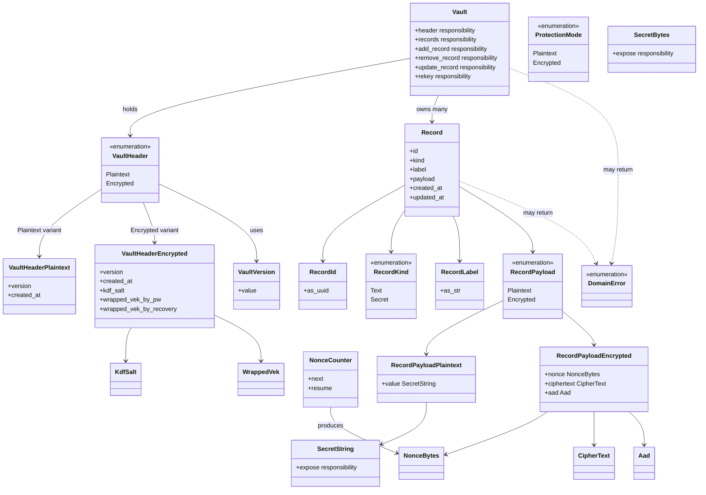
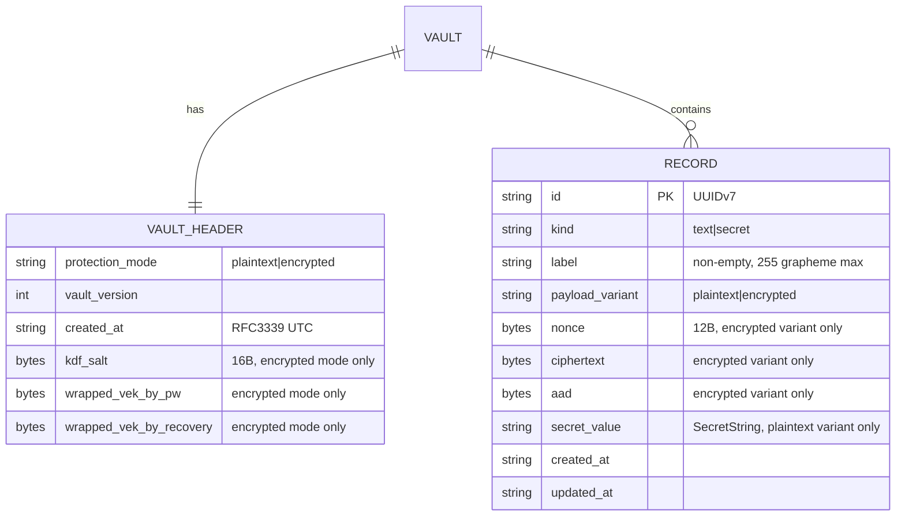

# 基本設計書

<!-- 詳細設計書とは別ファイル。統合禁止 -->
<!-- feature: vault / Issue #7 -->
<!-- 配置先: docs/features/vault/basic-design.md -->

## 記述ルール（必ず守ること）

基本設計に**疑似コード・サンプル実装（python/ts/go等の言語コードブロック）を書くな**。
ソースコードと二重管理になりメンテナンスコストしか生まない。

## モジュール構成

本 Issue は `shikomi-core` crate 内部のモジュール分割を確定する。`shikomi-core` はドメイン層で、他 crate への依存は `[workspace.dependencies]` 経由の軽量 crate のみ。

| 機能ID | モジュール | ディレクトリ | 責務 |
|--------|----------|------------|------|
| REQ-001〜REQ-007 | `shikomi_core::vault` | `crates/shikomi-core/src/vault/` | vault 集約・ヘッダ・レコード・保護モード |
| REQ-008 | `shikomi_core::secret` | `crates/shikomi-core/src/secret/` | 秘密値ラッパ型 |
| REQ-009 | `shikomi_core::error` | `crates/shikomi-core/src/error.rs` | `DomainError` と付随 `Reason` 列挙 |
| REQ-010 | `shikomi_core::vault::nonce` | `crates/shikomi-core/src/vault/nonce.rs` | NonceCounter / NonceBytes |
| （全体エントリ） | `shikomi_core` | `crates/shikomi-core/src/lib.rs` | 公開 API の再エクスポート（`pub use vault::...`） |

```
ディレクトリ構造:
crates/shikomi-core/src/
  lib.rs                 # 公開 API 再エクスポート
  error.rs               # DomainError + 付随 Reason 列挙
  secret/
    mod.rs               # SecretString / SecretBytes / SecretBytesN
  vault/
    mod.rs               # Vault 集約ルート、公開型の再エクスポート
    protection_mode.rs   # ProtectionMode enum + 変換
    version.rs           # VaultVersion（CURRENT / MIN_SUPPORTED）
    header.rs            # VaultHeader enum（Plaintext variant / Encrypted variant）
    record.rs            # Record / RecordKind / RecordLabel / RecordPayload
    id.rs                # RecordId (UUIDv7 newtype)
    crypto_data.rs       # KdfSalt / WrappedVek / CipherText / Aad （バイト列 newtype 群）
    nonce.rs             # NonceBytes / NonceCounter
```

**モジュール設計方針**:

- 集約ルート `Vault` は `vault::mod.rs` に置く。公開 API が `shikomi_core::Vault` で参照できるよう `lib.rs` で再エクスポート
- `secret` モジュールは vault 以外の feature（IPC、ホットキー等）からも参照される見込みのため、vault 配下ではなく crate ルート直下に置く（責務分離）
- 不変条件（構築時検証）を持つ型は**別ファイル**に分けてファイル粒度を揃える（Record と RecordLabel、VaultHeader と VaultVersion）。テストも同ファイルに併置（`#[cfg(test)] mod tests`）

## クラス設計（概要）

`Vault` 集約を頂点とする依存関係を Mermaid クラス図で示す。メソッドシグネチャは詳細設計書を参照。



**設計判断メモ**:

- `VaultHeader` と `RecordPayload` を **enum バリアント（タグ付き共用体）で排他** する。`Option<KdfSalt>` を並べるより型の不変条件がコンパイル時に保証される（Fail Fast）
- `ProtectionMode` enum を残すのは、永続化形式（vault ヘッダの `"plaintext"` / `"encrypted"` 文字列）との写像と、外部 API で「モードだけ問合せたい」ケース（Ask が必要な最小限）をサポートするため
- `RecordLabel`, `RecordId`, `NonceBytes`, `KdfSalt`, `WrappedVek`, `CipherText`, `Aad` は全て **newtype**。ドメインの意味を型で表現し、byte 列の取り違えを型で封じる

## 処理フロー

本 Issue は型定義のため、処理フローは「型構築時の検証フロー」が主体。

### REQ-003: `VaultHeader::new_plaintext(version, created_at)`

1. `version` が `MIN_SUPPORTED..=CURRENT` の範囲であることを検証
2. 範囲外なら `DomainError::UnsupportedVaultVersion` を返却
3. 範囲内なら `VaultHeader::Plaintext { version, created_at }` を返却

### REQ-003: `VaultHeader::new_encrypted(version, created_at, kdf_salt, wrapped_vek_by_pw, wrapped_vek_by_recovery)`

1. `version` 範囲検証（上記と同じ）
2. `kdf_salt` のバイト長（16）検証。失敗で `DomainError::InvalidVaultHeader(Reason::KdfSaltLength)`
3. `wrapped_vek_by_pw` / `wrapped_vek_by_recovery` の非空検証（§2.4 AES-GCM wrap は最低限 tag 16B 含む）。失敗で `DomainError::InvalidVaultHeader(Reason::WrappedVekEmpty)`
4. 全検証 pass で `VaultHeader::Encrypted { ... }` を返却

### REQ-005: `Record::new(id, kind, label, payload, now)`

1. `RecordLabel` は `try_from(String)` で内部検証済みの前提（外部から渡される）
2. 呼び出し元が `created_at = updated_at = now` で生成し、`updated_at >= created_at` 不変条件を満たす
3. Record を生成して返却

### REQ-007: `Vault::add_record(&mut self, record)`

1. ヘッダの `protection_mode` と `record.payload` のバリアントが整合することを確認
   - `VaultHeader::Plaintext` に `RecordPayload::Encrypted` → `DomainError::VaultConsistencyError(ModeMismatch)`
   - `VaultHeader::Encrypted` に `RecordPayload::Plaintext` → 同上
2. 既存 records に同一 `RecordId` がないことを確認。重複なら `DomainError::VaultConsistencyError(DuplicateId)`
3. records に push

### REQ-007: `Vault::rekey_with(&mut self, new_vek_provider)`

1. モードが `Encrypted` であることを確認。`Plaintext` なら `DomainError::VaultConsistencyError(ModeMismatch)`
2. 呼び出し側が提供する trait（`VekProvider`）経由で新 VEK を入手（実装は `shikomi-infra`）
3. 全 records を再暗号化（計算は `VekProvider::reencrypt` に委譲）
4. NonceCounter をリセット、wrapped_VEK を更新
5. 本 Issue では trait の**シグネチャのみ**定義し、`Vault` メソッドは trait 境界を受け取る形で提供する

### REQ-010: `NonceCounter::next(&mut self)`

1. 内部 `u32` counter が `u32::MAX` なら `DomainError::NonceOverflow` を返却し状態を進めない
2. それ未満なら CSPRNG 乱数（呼び出し側から供給、`shikomi-core` は乱数源を持たない）と counter 値から 12 バイトの `NonceBytes` を構築
3. counter をインクリメント

## シーケンス図

該当なし — 理由: 本 Issue は `shikomi-core` 単体完結のドメイン型定義であり、複数モジュール・外部連携を伴うフローが存在しない。型構築フローは処理フローセクションで記述済み。シーケンス図は暗号化モード・IPC 連携を扱う後続 Issue（`shikomi-infra` / IPC プロトコル）で追加する。

## アーキテクチャへの影響

`docs/architecture/tech-stack.md` への軽微な追記が発生:

- **§4.4 `[workspace.dependencies]`**: 本 Issue で 6 crate（`uuid` / `serde` / `secrecy` / `zeroize` / `thiserror` / `time`）を追加する。各バージョンと feature 指定をワークスペースレベルに一元化
- **§2.1 の「シークレット保護」行**: 既存の `secrecy` / `zeroize` 記述を維持、本 Issue で実際に依存に加わることを明記（将来の実装担当が「いつ導入されたか」を追える）

`docs/architecture/context/` 群への変更は**発生しない**。vault 保護モード方針・脅威モデル・鍵階層は既に確定しており、本 Issue はそれを型で表現する下流工程。

## 外部連携

該当なし — 理由: `shikomi-core` は外部 API / 外部サービスへ接続しない pure Rust crate。OS キーチェーン・SQLite・IPC・ホットキーはすべて `shikomi-infra` 以降の責務。

## UX設計

該当なし — 理由: UI 不在のため該当なし。DX（開発者体験）の設計は「公開 API の明瞭さ」に集約し、requirements.md §API仕様と詳細設計書のクラス図で表現する。

## セキュリティ設計

本 Issue は型定義の工程だが、**パスワードと暗号化を扱う全 crate の出発点**となるため、脅威モデルと OWASP 対応を明示する。

### 脅威モデル

| 想定攻撃者 | 攻撃経路 | 保護資産 | 対策 |
|-----------|---------|---------|------|
| 同一マシン上の他プロセス（同一 UID） | `shikomi-core` を利用する別プロセスがメモリダンプを取得 | `SecretString` / `SecretBytes` 内部の秘密値 | `secrecy::SecretBox` 経由で所有、drop 時 `zeroize` by default。`Debug` / `Display` で露出しない |
| 悪意あるログ出力パス | 開発者が誤って `tracing::info!("...{:?}", secret)` を書く | 秘密値 | `SecretString` / `SecretBytes` の `Debug` を `"[REDACTED]"` 固定に実装。**コンパイルは通るが中身は出ない** |
| 誤った永続化 | `serde` で `Vault` をシリアライズする際に秘密値が混入 | レコード平文 | `SecretString` / `SecretBytes` は `serde::Serialize` **未実装**。コンパイルエラーで防ぐ（Fail Fast） |
| nonce 再利用攻撃 | アプリバグで同一 VEK での nonce が重複 | AEAD の認証タグと暗号文 | `NonceCounter` で $2^{32}$ 到達を Fail Fast 検知し rekey を強制 |
| 入れ替え攻撃 | 攻撃者が vault ファイル内のレコードをすげ替え | レコード完全性 | `Aad` に `record_id` + `version` + `created_at` を含める（§2.4）。型で AAD の構造を固定 |
| 状態遷移の誤り | `Plaintext` vault に暗号化レコードが混入 | Vault の一貫性 | `VaultHeader` enum と `RecordPayload` enum の整合を `Vault::add_record` が検証（Fail Fast） |

### OWASP Top 10 対応

本 Issue は crate 内部型のため全項目に該当するわけではないが、各項目の扱いを明記する。

| # | カテゴリ | 対応状況 |
|---|---------|---------|
| A01 | Broken Access Control | 対象外 — 本 crate にアクセス制御主体はない。`Vault` へのアクセス制御は `shikomi-daemon` IPC 層（別 Issue） |
| A02 | Cryptographic Failures | **主対応** — `SecretString` / `SecretBytes` で秘密値を型で封じ、`Debug` / `Serialize` リークを防止。nonce 上限を `NonceCounter` で強制 |
| A03 | Injection | 対象外 — SQL / HTML / OS コマンドを扱わない |
| A04 | Insecure Design | **主対応** — 平文 / 暗号化モードの enum 排他、AAD 構造、rekey メカニズムを型で表現 |
| A05 | Security Misconfiguration | 対象外 — 本 crate に設定項目なし（ただし呼び出し側で `VaultHeader::new_encrypted` を誤って `Plaintext` のつもりで使うことは無い、enum で分離しているため） |
| A06 | Vulnerable Components | 暗号クリティカル crate（`secrecy` / `zeroize`）を `deny.toml` §4.3.2 で `ignore` 禁止対象として管理 |
| A07 | Auth Failures | 対象外 — 認証ロジックは `shikomi-infra`（暗号化実装）で扱う。本 Issue は型のみ |
| A08 | Data Integrity Failures | **主対応** — `Aad` newtype で AEAD 追加認証データの構造を固定、入れ替え攻撃を防ぐ |
| A09 | Logging Failures | `SecretString` / `SecretBytes` の `Debug` を `"[REDACTED]"` に固定、ログ漏洩を型で防ぐ |
| A10 | SSRF | 対象外 — HTTP リクエストを発行しない |

## ER図

vault 集約と下位エンティティのリレーションを ER 図で表現する。型定義のため一部属性は「バイト列」で抽象化。



**整合性ルール**:

- `VAULT_HEADER.protection_mode == "plaintext"` のとき、全 `RECORD.payload_variant == "plaintext"`
- `VAULT_HEADER.protection_mode == "encrypted"` のとき、全 `RECORD.payload_variant == "encrypted"`
- `RECORD.id` は vault 内で一意
- `RECORD.updated_at >= RECORD.created_at`

これらは `Vault` 集約メソッドで構造的に保証する（Fail Fast）。

## エラーハンドリング方針

| 例外種別 | 処理方針 | ユーザーへの通知 |
|---------|---------|----------------|
| 不変条件違反（`RecordLabel` 空文字・制御文字・長すぎ） | 構築時に `DomainError::InvalidRecordLabel(Reason)` を返却、型は構築されない | 開発者向けエラー文面（UI 表示は `shikomi-cli` / `shikomi-gui` 側で i18n 写像） |
| Vault とレコードのモード不整合 | `Vault::add_record` 等で `DomainError::VaultConsistencyError(ModeMismatch)` を返却 | 同上 |
| RecordId 重複 | `DomainError::VaultConsistencyError(DuplicateId)` | 同上 |
| nonce 上限到達 | `DomainError::NonceOverflow` を `NonceCounter::next` が返却。呼び出し側は rekey フローを起動 | 同上 + `shikomi-gui` で「再暗号化が必要」ダイアログ（別 Issue） |
| 非 UUIDv7 の ID | `DomainError::InvalidRecordId` | 同上 |
| 非対応 vault バージョン | `DomainError::UnsupportedVaultVersion` | 同上 + 起動時ブロックで「互換性なし」明示（別 Issue） |
| 内部バグ（不変条件違反を関数が壊した、等） | `panic!` を許容（`debug_assert!` で検出） | パニックは `shikomi-daemon` がキャプチャし `tracing::error!` 後 Fail Fast で終了（別 Issue） |

**本 Issue での禁止事項**:

- `Result<T, String>` / `Result<T, Box<dyn Error>>` のようなエラー情報を失う型を公開 API で使わない
- `unwrap()` / `expect()` を本番コードパスで使わない（テスト以外）
- エラーを握り潰さない（`if let Err(_) = ... {}` を無言で通過しない）
