# 詳細設計書

<!-- 基本設計書とは別ファイル。統合禁止 -->
<!-- feature: vault / Issue #7 -->
<!-- 配置先: docs/features/vault/detailed-design.md -->

## 記述ルール（必ず守ること）

詳細設計に**疑似コード・サンプル実装（python/ts/go等の言語コードブロック）を書くな**。
ソースコードと二重管理になりメンテナンスコストしか生まない。

本書では Rust の関数シグネチャは**プレーンテキスト（インライン `code`）**で示し、実装本体は一切書かない。Mermaid クラス図と表と箇条書きで設計判断を記述する。

## クラス設計（詳細）

### 全体像

```mermaid
classDiagram
    direction TB

    class Vault {
        -header: VaultHeader
        -records: Vec~Record~
        +new(header) Vault
        +protection_mode() ProtectionMode
        +header() VaultHeader_ref
        +records() Record_slice
        +find_record(id) Option_Record_ref
        +add_record(record) Result
        +remove_record(id) Result_Record
        +update_record(id, updater) Result
        +rekey_with(provider) Result
    }

    class VaultHeader {
        <<enumeration>>
        +Plaintext(VaultHeaderPlaintext)
        +Encrypted(VaultHeaderEncrypted)
        +new_plaintext(version, created_at) Result
        +new_encrypted(version, created_at, kdf_salt, wrapped_pw, wrapped_rc) Result
        +protection_mode() ProtectionMode
        +version() VaultVersion
        +created_at() OffsetDateTime
    }

    class VaultHeaderPlaintext {
        -version: VaultVersion
        -created_at: OffsetDateTime
    }

    class VaultHeaderEncrypted {
        -version: VaultVersion
        -created_at: OffsetDateTime
        -kdf_salt: KdfSalt
        -wrapped_vek_by_pw: WrappedVek
        -wrapped_vek_by_recovery: WrappedVek
    }

    class ProtectionMode {
        <<enumeration>>
        +Plaintext
        +Encrypted
        +as_persisted_str() str
        +try_from_persisted_str(s) Result
    }

    class VaultVersion {
        -value: u16
        +CURRENT: VaultVersion const
        +MIN_SUPPORTED: VaultVersion const
        +try_new(value) Result
        +value() u16
    }

    class Record {
        -id: RecordId
        -kind: RecordKind
        -label: RecordLabel
        -payload: RecordPayload
        -created_at: OffsetDateTime
        -updated_at: OffsetDateTime
        +new(id, kind, label, payload, now) Record
        +id() RecordId_ref
        +kind() RecordKind
        +label() RecordLabel_ref
        +payload() RecordPayload_ref
        +created_at() OffsetDateTime
        +updated_at() OffsetDateTime
        +with_updated_label(self, label, now) Result
        +with_updated_payload(self, payload, now) Result
    }

    class RecordId {
        -inner: Uuid
        +new(uuid) Result
        +try_from_str(s) Result
        +as_uuid() Uuid_ref
    }

    class RecordKind {
        <<enumeration>>
        +Text
        +Secret
    }

    class RecordLabel {
        -inner: String
        +try_new(s) Result
        +as_str() str
    }

    class RecordPayload {
        <<enumeration>>
        +Plaintext(SecretString)
        +Encrypted(RecordPayloadEncrypted)
        +variant_mode() ProtectionMode
    }

    class RecordPayloadEncrypted {
        -nonce: NonceBytes
        -ciphertext: CipherText
        -aad: Aad
        +new(nonce, ciphertext, aad) Result
        +nonce() NonceBytes_ref
        +ciphertext() CipherText_ref
        +aad() Aad_ref
    }

    class NonceBytes {
        -inner: [u8; 12]
        +try_new(bytes) Result
        +as_array() array_ref
    }

    class NonceCounter {
        -counter: u32
        -random_prefix: [u8; 8]
        +new(random_prefix) NonceCounter
        +resume(random_prefix, counter) NonceCounter
        +next() Result_NonceBytes
        +current_counter() u32
    }

    class KdfSalt {
        -inner: [u8; 16]
        +try_new(bytes) Result
        +as_array() array_ref
    }

    class WrappedVek {
        -inner: Box_slice_u8
        +try_new(bytes) Result
        +as_bytes() slice
    }

    class CipherText {
        -inner: Box_slice_u8
        +try_new(bytes) Result
        +as_bytes() slice
    }

    class Aad {
        -record_id: RecordId
        -vault_version: VaultVersion
        -record_created_at: OffsetDateTime
        +new(record_id, vault_version, record_created_at) Aad
        +record_id() RecordId_ref
        +vault_version() VaultVersion
        +record_created_at() OffsetDateTime
        +to_canonical_bytes() Box_slice
    }

    class SecretString {
        +from_string(s) SecretString
        +expose_secret() str_ref
    }

    class SecretBytes {
        +from_boxed_slice(b) SecretBytes
        +expose_secret() slice
    }

    class DomainError {
        <<enumeration>>
        +InvalidProtectionMode
        +UnsupportedVaultVersion
        +InvalidVaultHeader
        +InvalidRecordId
        +InvalidRecordLabel
        +InvalidRecordPayload
        +VaultConsistencyError
        +NonceOverflow
        +InvalidSecretLength
    }

    class VekProvider {
        <<trait>>
        +reencrypt_all(records, new_vek) Result
        +derive_new_wrapped_pw(vek) Result
        +derive_new_wrapped_recovery(vek) Result
    }

    Vault --> VaultHeader
    Vault --> Record
    VaultHeader --> VaultHeaderPlaintext
    VaultHeader --> VaultHeaderEncrypted
    VaultHeaderPlaintext --> VaultVersion
    VaultHeaderEncrypted --> VaultVersion
    VaultHeaderEncrypted --> KdfSalt
    VaultHeaderEncrypted --> WrappedVek
    Record --> RecordId
    Record --> RecordKind
    Record --> RecordLabel
    Record --> RecordPayload
    RecordPayload --> SecretString : Plaintext variant
    RecordPayload --> RecordPayloadEncrypted : Encrypted variant
    RecordPayloadEncrypted --> NonceBytes
    RecordPayloadEncrypted --> CipherText
    RecordPayloadEncrypted --> Aad
    NonceCounter ..> NonceBytes : produces
    Vault ..> VekProvider : uses
    Vault ..> DomainError
    Record ..> DomainError
    RecordLabel ..> DomainError
    RecordId ..> DomainError
    VaultHeader ..> DomainError
    NonceCounter ..> DomainError
    RecordPayloadEncrypted ..> DomainError
```

### 設計判断の補足

**1. なぜ `VaultHeader` を enum にするか**: `Option<KdfSalt>` 等を `struct VaultHeader` に並べると、「`Plaintext` モードなのに `kdf_salt` が `Some` で書かれる」という**型では排除できない状態**が生じる。enum バリアントに分離することで、Rust の型検査でそもそも構築不能にする（Fail Fast）。コストは「`version()` / `created_at()` のような共通アクセサを enum 側に生やす必要がある」だが、サイズが小さいので許容。

**2. なぜ `RecordPayload` を enum にするか**: 同上。`Plaintext` に `SecretString` 1 個、`Encrypted` に `(NonceBytes, CipherText, Aad)` 組を持たせ、両立し得ない状態を型で排他。

**3. なぜ `Vault::new` は失敗しないか**: `new(header)` は header のみ受け取り records は空の状態で構築する。空集合は常に header と整合するため失敗経路が無い。レコード投入（`add_record`）時に初めて整合性検査が走る（Fail Fast はそこで行う）。

**4. なぜ `rekey_with` は trait を取るか**: 実際の再暗号化は `aes-gcm` / `argon2` / 乱数源を必要とし、`shikomi-core` の pure Rust / no-I/O 方針に反する。そのため **`VekProvider` trait** をドメイン層で定義し、実装は `shikomi-infra` に置く（Dependency Inversion）。`Vault` は trait 境界しか知らない。

**5. なぜ `RecordLabel` を別型にするか**: 「空文字列の label」「制御文字混じりの label」をドメインから構造的に排除するため、`try_new` を通った `RecordLabel` しか存在しない newtype を置く。`Record::new` のシグネチャが `RecordLabel` を受け取ることで、呼び出し側は label を**作るタイミング**で検証することを強制される（Fail Fast）。

**6. なぜ `NonceCounter` は乱数源を持たないか**: `shikomi-core` は pure Rust / no-I/O。`getrandom` や `rand` を呼ばない。`NonceCounter::new(random_prefix)` は構築時に呼び出し側（`shikomi-infra`）から 8 バイトの乱数を受け取る。これにより nonce は「固定 8B 乱数 prefix + 4B カウンタ」の 12B となり、VEK 当たり $2^{32}$ 回まで衝突フリー。

**7. なぜ `SecretString::from_string` は失敗しないか**: ラッパは中身を検査しない（Single Responsibility）。値の妥当性は呼び出し側で別型（`RecordLabel` 等）に入れる前に検証する。`SecretString` は「この値は秘密であり `Debug` / `Serialize` で出してはいけない」という**意味付け型**。

**8. なぜ `VekProvider::reencrypt_all` に `&mut records` を渡すか**: `Vault::rekey_with` は records を所有しているので、借用を渡して in-place 書換を委譲する。戻り値は成否のみ（`Result<(), DomainError>`）。部分失敗は `DomainError::VaultConsistencyError(RekeyPartialFailure)` で Fail Fast、中途半端な状態の vault を残さない（atomic 更新は `shikomi-infra` の SQLite トランザクションで担保）。

## データ構造

**定数・境界値の一覧**。型に埋め込む値は以下で固定する。

| 名前 | 型 | 用途 | 値 |
|------|---|------|------|
| `VaultVersion::CURRENT` | `VaultVersion` | 新規作成時のバージョン | `VaultVersion(1)` |
| `VaultVersion::MIN_SUPPORTED` | `VaultVersion` | 読み込み時の下限 | `VaultVersion(1)` |
| `NonceBytes` 長 | 定数 | GCM nonce | `12 byte`（96 bit、NIST SP 800-38D §5.2.1.1） |
| `KdfSalt` 長 | 定数 | Argon2id ソルト | `16 byte`（CSPRNG、OWASP 推奨 16 以上） |
| `NonceCounter` counter 上限 | 定数 | VEK 当たり暗号化上限 | `u32::MAX`（= $2^{32} - 1$、NIST SP 800-38D §8.3） |
| `RecordLabel` 最大 grapheme 長 | 定数 | UI 表示・UX | `255`（一般的な UI ラベル上限） |
| `RecordLabel` 禁止文字 | 定数 | 制御文字 | `U+0000..=U+001F`（ただし `\t` / `\n` / `\r` は許可）、`U+007F` |
| `ProtectionMode` 永続化表現 | 定数 | vault ヘッダ `protection_mode` フィールド | `"plaintext"` / `"encrypted"`（小文字固定） |

**VEK / KEK のバイト長**: いずれも 32 byte（256 bit）。型では `SecretBytes` の可変長で扱い、長さ検証は `shikomi-infra` 側の暗号化 API の責務とする（本 crate では `SecretBytes` に固定長要件を課さない）。

**`DomainError` バリアント詳細**:

| バリアント | フィールド | 発生箇所 |
|-----------|-----------|---------|
| `InvalidProtectionMode(String)` | 文字列表現（復元時） | `ProtectionMode::try_from_persisted_str` |
| `UnsupportedVaultVersion(u16)` | 受け取ったバージョン値 | `VaultVersion::try_new`, `VaultHeader::new_*` |
| `InvalidVaultHeader(InvalidVaultHeaderReason)` | `KdfSaltLength { expected, got }` / `WrappedVekEmpty` / `WrappedVekTooShort` | `VaultHeader::new_encrypted` |
| `InvalidRecordId(InvalidRecordIdReason)` | `WrongVersion { actual }` / `NilUuid` / `ParseError(String)` | `RecordId::new`, `try_from_str` |
| `InvalidRecordLabel(InvalidRecordLabelReason)` | `Empty` / `ControlChar { position }` / `TooLong { grapheme_count }` | `RecordLabel::try_new` |
| `InvalidRecordPayload(InvalidRecordPayloadReason)` | `NonceLength { expected, got }` / `CipherTextEmpty` / `AadMissingField(String)` | `RecordPayloadEncrypted::new` |
| `VaultConsistencyError(VaultConsistencyReason)` | `ModeMismatch { vault_mode, record_mode }` / `DuplicateId(RecordId)` / `RekeyInPlaintextMode` / `RekeyPartialFailure` / `RecordNotFound(RecordId)` | `Vault::*` |
| `NonceOverflow` | — | `NonceCounter::next` |
| `InvalidSecretLength` | `{ expected: usize, got: usize }` | `SecretBytes`（固定長バリアント。本 Issue は可変長のみ実装で回避） |

### 公開 API（lib.rs からの再エクスポート一覧）

`shikomi_core::` 直下からアクセス可能にする型:

- `Vault`
- `VaultHeader`, `VaultVersion`, `ProtectionMode`
- `Record`, `RecordId`, `RecordKind`, `RecordLabel`, `RecordPayload`
- `NonceBytes`, `NonceCounter`, `KdfSalt`, `WrappedVek`, `CipherText`, `Aad`
- `SecretString`, `SecretBytes`
- `DomainError` と各 Reason 列挙（`InvalidRecordLabelReason` 等）
- `VekProvider` trait

**公開しないもの**:

- 内部ヘルパ関数・enum 本体のフィールド（全て private、アクセスは `getter` メソッド経由）
- `thiserror` の derive 由来の詳細 trait impl 以外の public 関数

### モジュール別公開メソッドのシグネチャ（要点）

**（Rust のシグネチャをインラインで示す。`Result` は `Result<_, DomainError>` の略記を各所で使う）**

`Vault`:
- `Vault::new(header: VaultHeader) -> Vault`（失敗しない）
- `Vault::protection_mode(&self) -> ProtectionMode`
- `Vault::header(&self) -> &VaultHeader`
- `Vault::records(&self) -> &[Record]`
- `Vault::find_record(&self, id: &RecordId) -> Option<&Record>`
- `Vault::add_record(&mut self, record: Record) -> Result<(), DomainError>`
- `Vault::remove_record(&mut self, id: &RecordId) -> Result<Record, DomainError>`
- `Vault::update_record<F>(&mut self, id: &RecordId, updater: F) -> Result<(), DomainError>` where `F: FnOnce(Record) -> Result<Record, DomainError>`
- `Vault::rekey_with<P: VekProvider>(&mut self, provider: &mut P) -> Result<(), DomainError>`

`VaultHeader`:
- `VaultHeader::new_plaintext(version: VaultVersion, created_at: OffsetDateTime) -> Result<VaultHeader, DomainError>`
- `VaultHeader::new_encrypted(version: VaultVersion, created_at: OffsetDateTime, kdf_salt: KdfSalt, wrapped_vek_by_pw: WrappedVek, wrapped_vek_by_recovery: WrappedVek) -> Result<VaultHeader, DomainError>`
- `VaultHeader::protection_mode(&self) -> ProtectionMode`
- `VaultHeader::version(&self) -> VaultVersion`
- `VaultHeader::created_at(&self) -> OffsetDateTime`

`Record`:
- `Record::new(id: RecordId, kind: RecordKind, label: RecordLabel, payload: RecordPayload, now: OffsetDateTime) -> Record`（失敗しない、各引数が既に検証済み型）
- `Record::with_updated_label(self, label: RecordLabel, now: OffsetDateTime) -> Result<Record, DomainError>`（`now < self.created_at` なら `DomainError::VaultConsistencyError(InvalidUpdatedAt)`）
- `Record::with_updated_payload(self, payload: RecordPayload, now: OffsetDateTime) -> Result<Record, DomainError>`

`RecordLabel`:
- `RecordLabel::try_new(raw: String) -> Result<RecordLabel, DomainError>`
- `RecordLabel::as_str(&self) -> &str`

`RecordId`:
- `RecordId::new(uuid: Uuid) -> Result<RecordId, DomainError>`
- `RecordId::try_from_str(s: &str) -> Result<RecordId, DomainError>`
- `RecordId::as_uuid(&self) -> &Uuid`
- `Display` / `FromStr` impl（どちらもエラーは `DomainError` 経由）

`NonceCounter`:
- `NonceCounter::new(random_prefix: [u8; 8]) -> NonceCounter`
- `NonceCounter::resume(random_prefix: [u8; 8], counter: u32) -> NonceCounter`
- `NonceCounter::next(&mut self) -> Result<NonceBytes, DomainError>`
- `NonceCounter::current_counter(&self) -> u32`

`VekProvider` trait:
- `fn reencrypt_all(&mut self, records: &mut [Record], new_vek: &SecretBytes) -> Result<(), DomainError>`
- `fn derive_new_wrapped_pw(&self, vek: &SecretBytes) -> Result<WrappedVek, DomainError>`
- `fn derive_new_wrapped_recovery(&self, vek: &SecretBytes) -> Result<WrappedVek, DomainError>`

**注記**: `VekProvider` 実装は `shikomi-infra` で提供。`shikomi-core` は trait シグネチャのみ所有（Dependency Inversion）。実装側で `argon2` / `aes-gcm` / `hkdf` / `pbkdf2` / `bip39` / `rand_core` を使用する。

`SecretString`:
- `SecretString::from_string(s: String) -> SecretString`
- `SecretString::expose_secret(&self) -> &str`
- `Debug` impl は `"[REDACTED]"` 固定文字列
- `Display` impl は実装**しない**（意図的、`{}` に流れるリスクを型で排除）
- `Clone` impl は `secrecy::SecretBox` の clone 経由

`SecretBytes`:
- `SecretBytes::from_boxed_slice(b: Box<[u8]>) -> SecretBytes`
- `SecretBytes::expose_secret(&self) -> &[u8]`
- `Debug` impl は `"[REDACTED]"` 固定

`Aad`:
- `Aad::new(record_id: RecordId, vault_version: VaultVersion, record_created_at: OffsetDateTime) -> Aad`
- `Aad::to_canonical_bytes(&self) -> Box<[u8]>`（RFC3339 と UUID テキスト表現を固定順で連結、vault_version は 2 バイト big-endian。正規形で暗号化処理に渡す）

`ProtectionMode`:
- `ProtectionMode::as_persisted_str(&self) -> &'static str`（`"plaintext"` / `"encrypted"`）
- `ProtectionMode::try_from_persisted_str(s: &str) -> Result<ProtectionMode, DomainError>`

## ビジュアルデザイン

該当なし — 理由: UI なし。本 crate は開発者向け API のみ。
